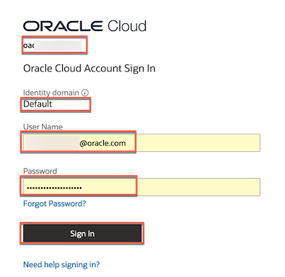
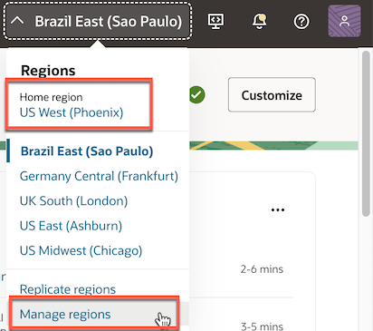
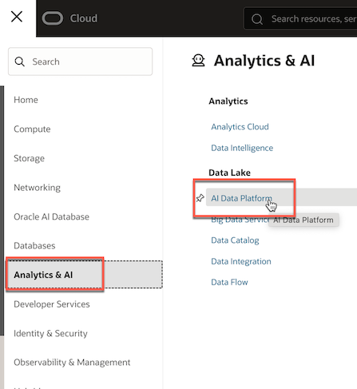
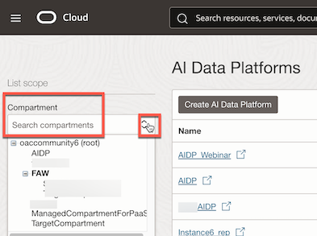
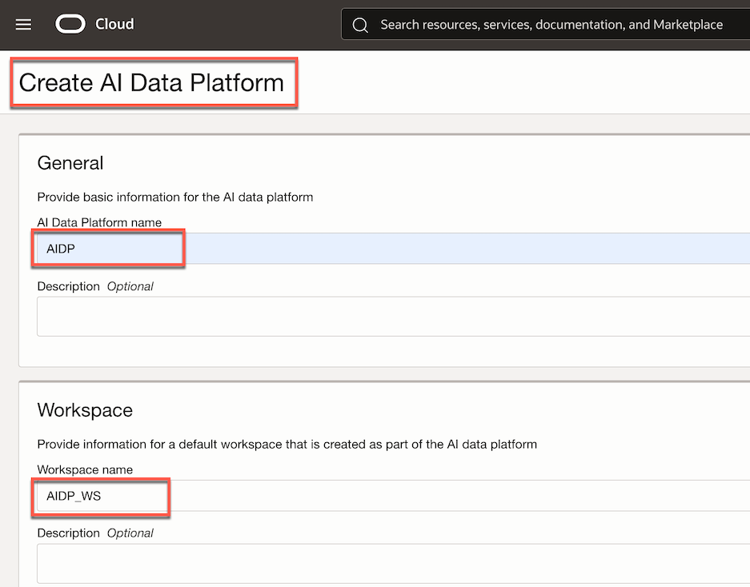
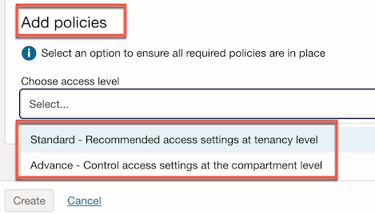
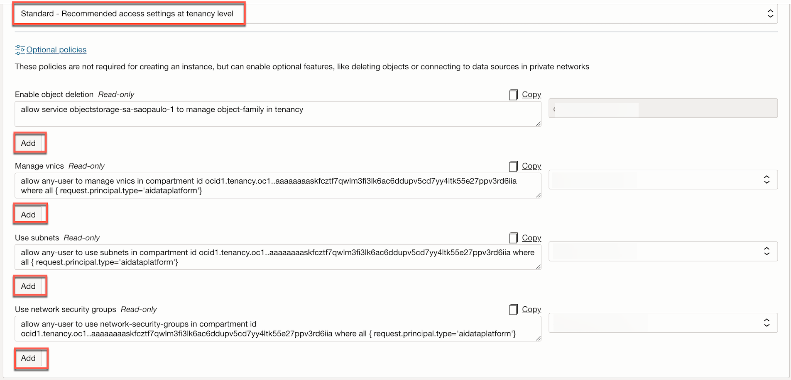

# How to create an AIDP Workbench instance.

Duration: 10 minutes

In this sprint, you'll **create a new Oracle AI Data Platform Workbench instance** to access a dedicated, secure workspace for your data and analytics projects. Each Workbench provides a dedicated environment where you can ingest data, run AI and analytics workflows, and manage resources without impacting other projects or data.

**Prerequisites**

- Access to Oracle Cloud Infrastructure (OCI) with appropriate permissions.
- Basic understanding of IAM concepts in OCI.

## Steps to Create an Oracle AI Data Platform Workbench Instance

1. **Access the Oracle Cloud Console.**

    - Log in to your Oracle Cloud Infrastructure (OCI) tenancy.  
        

2. **Select a Region.**

    - Choose a region that aligns with your operational requirements. Consider factors such as:
        - proximity to customers,
        - availability of OCI Generative AI services,
        - integration with other Oracle services like Oracle Fusion AI Data Platform.

    - If necessary, subscribe to a different region via the **Manage Regions** option.  
        

3. **Navigate to AI Data Platform.**

    - In the OCI Console, select the **Navigation Menu**.
    - Select **Analytics & AI**, then under **Data Lake**, select **AI Data Platform**.  
        

4. **Select a** **Compartment.**

    - Choose the appropriate compartment to organize and separate your resources
    

    > Compartments are similar to folders. They help manage related resources and enforce fine-grained policies.

    **Note**: avoid using the root compartment; create specialized compartments for better resource isolation and policy enforcement.

5. **Create a New AI Data Platform Workbench.**

    - Select the **Create AI Data Platform** button.  
        

    - If the **Create AI Data Platform** button is not enabled, you do not have the necessary IAM policies with at least manage ai-data-platforms in tenancy (root level) or compartment &lt;id&gt; permissions.

    - AIDP displays a message, “Checking required IAM policies. Please wait.”  
       

6. **Provide Basic Information:**

    - Once the platform is created, enter the **AI Data Platform Name**.
    - (Optional) Add a **Description**.
    - Specify the **Workspace Name**.

    > A workspace is a container that enables teams to efficiently organize workflows, notebooks, and libraries, facilitating efficient collaboration and governance.

    - (Optional) Add a Description.  
    

7. **Configure Policies:**

    - Determine the scope of access for the Oracle AI Data Platform:
    - **Standard**: Provides essential access with minimal customization at the tenancy level, suitable for straightforward use cases or proof-of-concept environments.
    - **Advanced**: Offers more granular access at the compartment level.  
            

    - If any required policies are missing, or if you want to add optional permissions, you can do so here.  
        

8. **Create the Instance:**

    - Select **Create**. 

    - AIDP displays a confirmation message, indicating that your request has been submitted successfully.  
       

Once the request is processed, you can access your new Oracle AI Data Platform Workbench instance. With this dedicated workspace, you can securely ingest data and develop AI-powered analytics projects.

**Congratulations!** You've successfully created your first Oracle AI Data Platform Workbench instance.

## Learn More

- [IAM Policies for Oracle AI Data Platform](https://docs.oracle.com/en/cloud/paas/ai-data-platform/aidug/iam-policies-oracle-ai-data-platform.html)

- [Create Your First AI Data Platform](https://docs.oracle.com/en/cloud/paas/ai-data-platform/aidug/get-started-oracle-ai-data-platform.html?utm_source=openai#GUID-86E22B67-44AB-4315-977E-354BD4C100D5)

- [How to Create an Instance in Oracle AI Data Platform Workbench: Demo](https://www.youtube.com/watch?v=KGsSn690ZDc)

## Acknowledgements

- **Author**- Lucian Dinescu
- **Reviewer**: - Candace Marles
- **Reviewer**: - Nagwang Gyamtso
- **Last Updated By/Date** – Lucian Dinescu, December 2025
