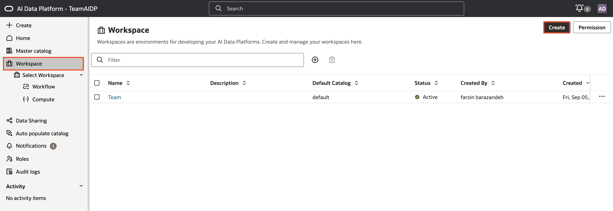
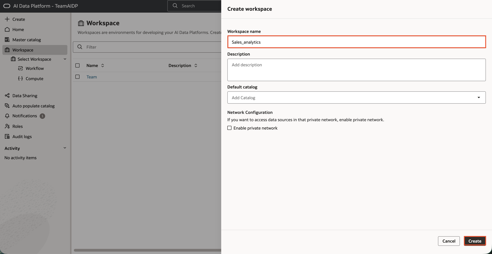
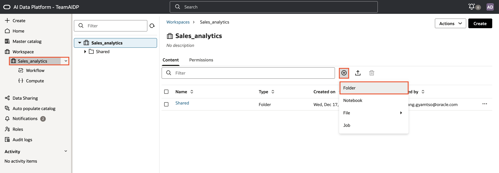
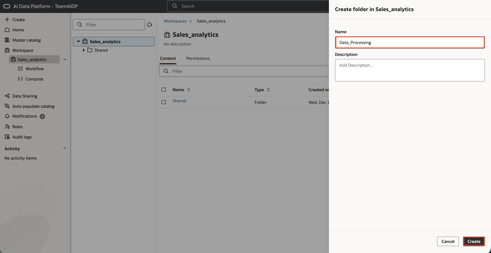
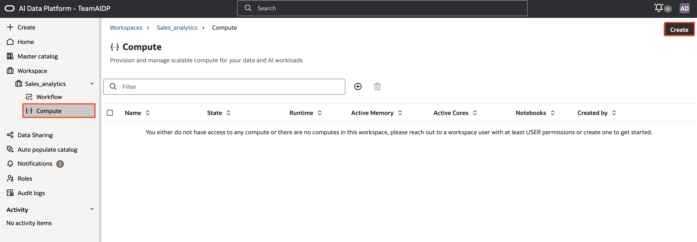
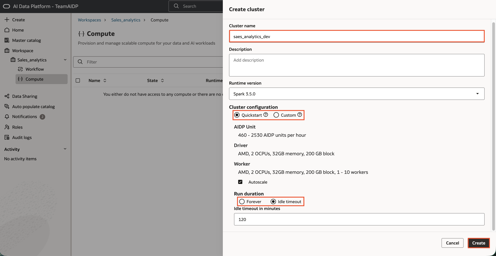
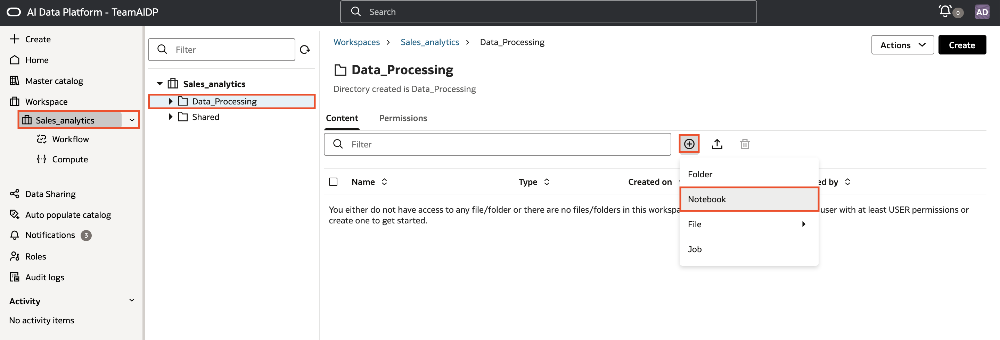
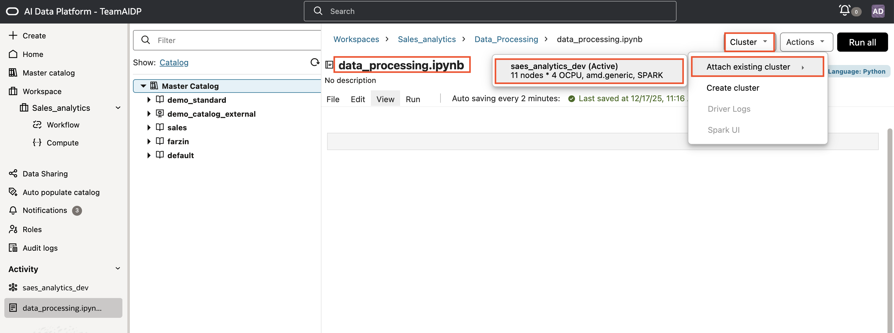
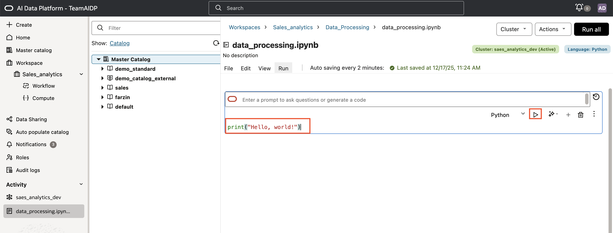

# How to Create a Workspace, Notebook, and Compute Cluster in Oracle AI Data Platform Workbench.

Duration: 8 minutes

This Sprint explains how to set up a workspace, configure a compute cluster, and create a notebook in Oracle AI Data Platform (AIDP) Workbench. Follow these instructions to prepare your environment, and streamline development.

**Prerequisites**

- Access to Oracle AIDP Workbench.
- Permission to create workspaces and clusters.

## **Create a Workspace, Notebook, and Compute Cluster**

1. Open Oracle AIDP Workbench in your web browser and sign in with your credentials.  

2. Create a workspace. From the AIDP Homepage, select **Workspace**. Then click **Create** to start a new workspace. Enter a workspace name and confirm your choices to finish workspace creation.  

    
   

3. Add a folder to your workspace to organize project files. Select your workspace from the list to open it. Click the plus (+) icon. Choose **Folder** from the options. Enter a name for the folder. Click **Create** to create the folder.  

   **Note:** Use descriptive folder names. Organize by project phase or data type to make permissions and navigation easier.

     
   
   

4. Before you create a notebook, you must first create a compute cluster to power your notebook.

5. Create a compute cluster. Compute clusters are computing resources available in the workspace that power notebooks, Python files, SQL files, and process workloads. In your Workspace, choose **Compute** from the navigation panel. Click **Create**. 

   

6. Enter a name for your cluster. Pick appropriate options for your cluster. You can create a quickstart cluster with default configurations or choose the custom option where you can specify details like the driver and worker shapes. Once you have selected your configurations, click **Create**. Your cluster will be created in a few minutes.

   **Note:** Check cluster resources regularly. Adjust settings if your workloads change over time.

     

7. Create a new notebook in your workspace. Click on your Workspace from the navigation panel and open the folder you created earlier. Click the plus (+) icon. Choose **Notebook**. 

   

8. Click on the notebook title to enter a name for your notebook. Then attach your compute cluster to the notebook by clicking the **Cluster** dropdown. Choose your compute cluster from the list. Wait for confirmation that it is attached.  

   

10. Run code in your notebook. Enter Python or SQL commands into a cell. Click **Run** or use the appropriate keyboard shortcut to execute your code.  

     **Note:** Break code into logical sections and add comments for clarity. Good organization supports collaboration and troubleshooting.

      

**Best Practices**

* Maintain your workspace as your project evolves. 
* Regularly organize files. 
* Update permissions to reflect team changes. 

Congratulations, you have learned how to create a workspace, notebook, and compute cluster in Oracle AI Data Platform Workbench!

## Learn More

* [Workspaces](https://docs.oracle.com/en/cloud/paas/ai-data-platform/aidug/workspaces.html#GUID-0ABE2F96-2F43-43B8-BC42-B8B0A3CB162C)
* [Notebooks](https://docs.oracle.com/en/cloud/paas/ai-data-platform/aidug/notebooks.html#GUID-F877C72C-D857-40C3-BD1E-056DCE9A7131)
* [Compute](https://docs.oracle.com/en/cloud/paas/ai-data-platform/aidug/compute.html#GUID-F877C72C-D857-40C3-BD1E-056DCE9A7131)

## Acknowledgements
* **Author** - Nagwang Gyamtso, Senior Product Manager, Analytics Service Excellence
* **Reviewers** - Lucian Dinescu, Miles Novotny
* **Last Updated By/Date** - Nagwang Gyamtso, December 2025
