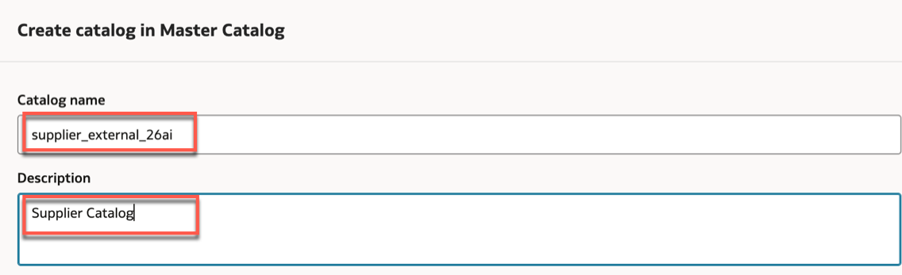
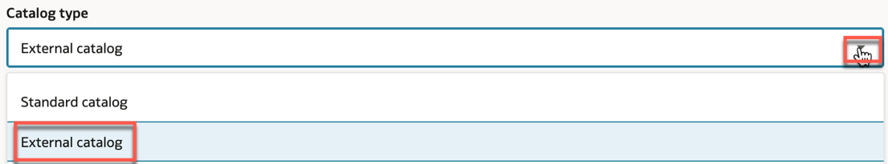
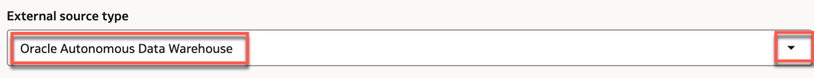
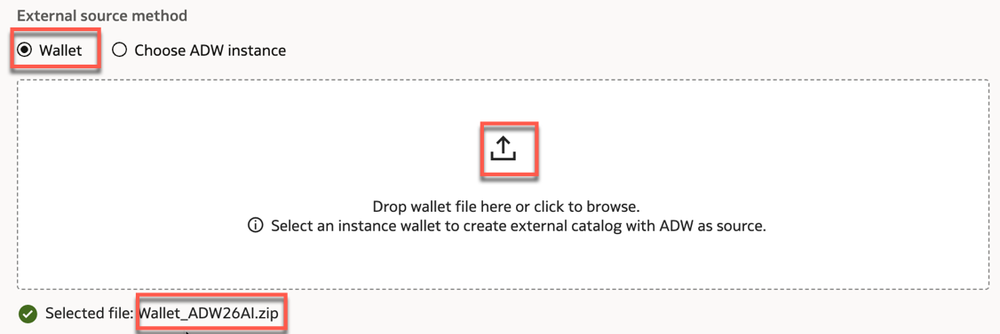
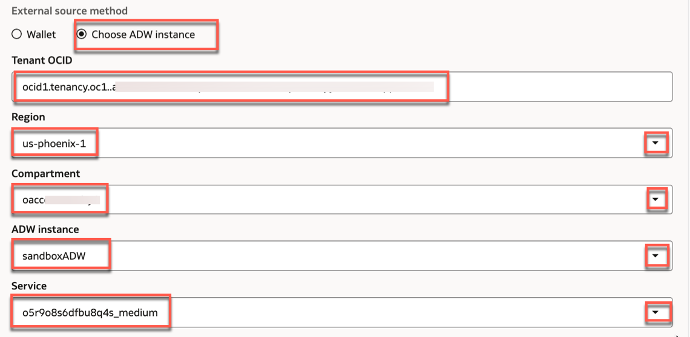
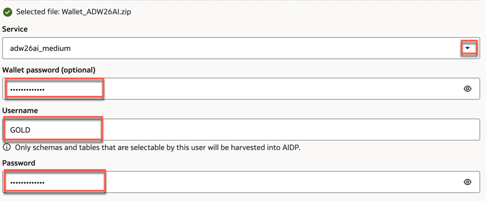
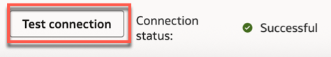
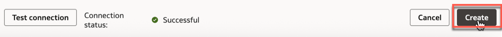
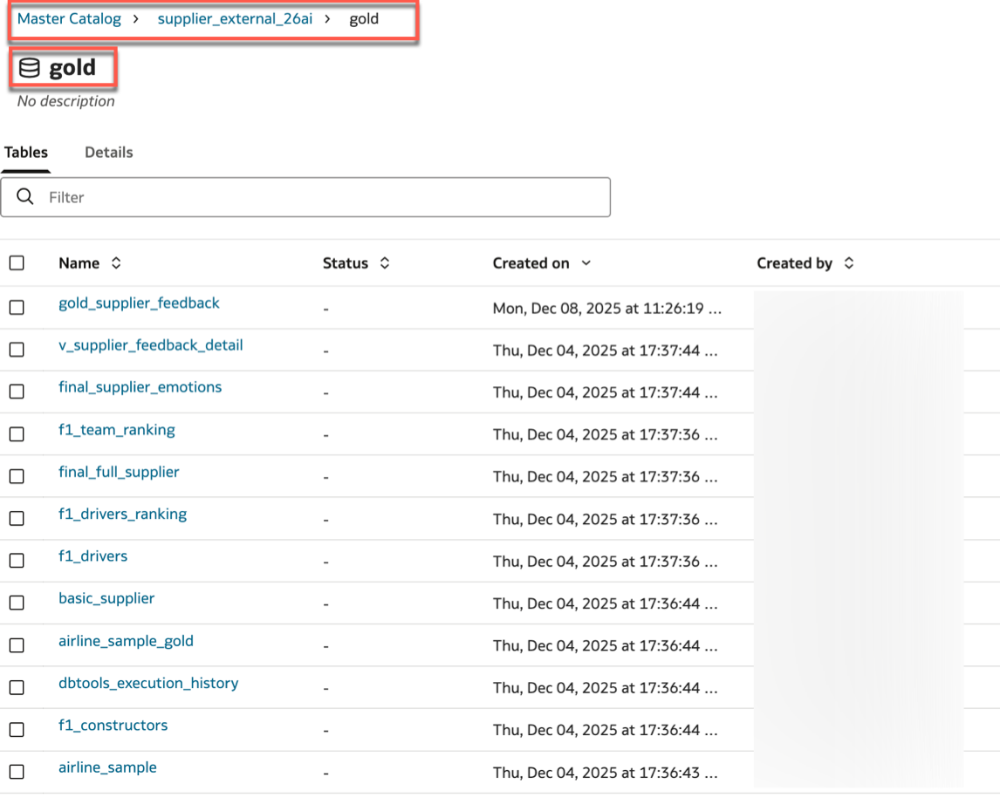

# How to Create an External Catalog in Oracle AI Data Platform Workbench

Duration: 10 minutes.

In this tutorial, you'll learn how to create an external catalog in Oracle AI Data Platform (AIDP) Workbench. An external catalog allows you to integrate and access data stored outside the AIDP platform, such as in Oracle Autonomous Data Warehouse (ADW). This enables direct querying of external systems from within AIDP without the need to move the data initially.

**Prerequisites**

- Access to an AIDP Workbench instance with the necessary permissions.
- Ensure that the Default Cluster is active before creating an external catalog.

## Create an External Catalog

1. Log in to your AIDP Workbench instance. Click on the **Master Catalog** in the left navigation pane.

   

2. Initiate catalog creation. On the **Master Catalog** page, click the **Create Catalog** button.

   

3. Enter catalog details.In the **Create Catalog** dialog, provide a meaningful **Name** and **Description** for your catalog.

   

4. Select catalog type. Choose **External Catalog** from the **Catalog Type** dropdown menu.

   

5. Choose external source type. Select the external source type. **Oracle Autonomous Data Warehouse**.

   

6. Configure external source connection. You have two options to configure the connection:

    a. Using a **Wallet File**:

    - Locate and import the wallet file associated with your ADW instance. Wallet files contain client credentials that enable secure connections to external databases.

       

    b. Using **Instance Configuration**, provide the following details:
      - **Tenant OCID**: Your Oracle Cloud Identifier.
      - **Region**: The region where your ADW instance is located.
      - **Compartment**: The compartment containing your ADW instance.
      - **ADW Instance:** Select your ADW instance from the list.
      - **Service:** Choose the appropriate service level:

         > **Note**:   **medium** is suited for everyday tasks.

        

7. Enter connection credentials. Provide the **Username** and **Password** for the connection.
     - Optionally, add a **Wallet Password** if your wallet file is password-protected.
   

8. Test the connection. Click the **Test Connection** button to verify that the credentials and connection details are correct.
    >**Note**: Ensure that the connection is successfully established before proceeding.

    

9. Create the catalog.Once the connection is verified, click the **Create** button to finalize the catalog setup.

     

10. Verify the external catalog. After creation, the external catalog will appear in the **Master Catalog**. You can select the schema and view the database tables from the external source.

     

**Congratulations!** You've successfully created an external catalog in Oracle AIDP Workbench.

## Learn More

- [External Catalogs in Oracle AIDP Workbench](https://docs.oracle.com/en/cloud/paas/ai-data-platform/)
- [Manage with Master Catalog](https://docs.oracle.com/en/cloud/paas/ai-data-platform/)

## Acknowledgements

- **Author**: Lucian Dinescu, Analytics Service Excellence Team
- **Reviewer**: Miles Novotny, Nagwang Gyamtso
- **Last Updated By/Date**: Lucian Dinescu, December 2025
