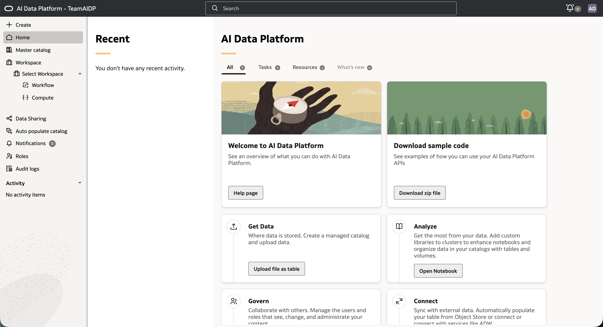
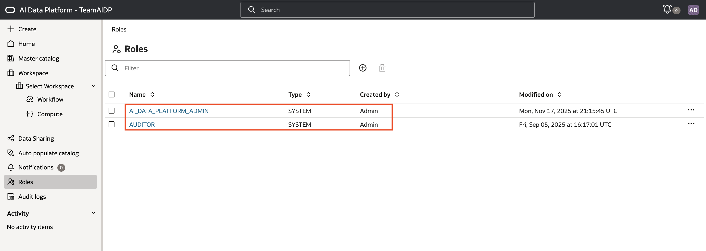
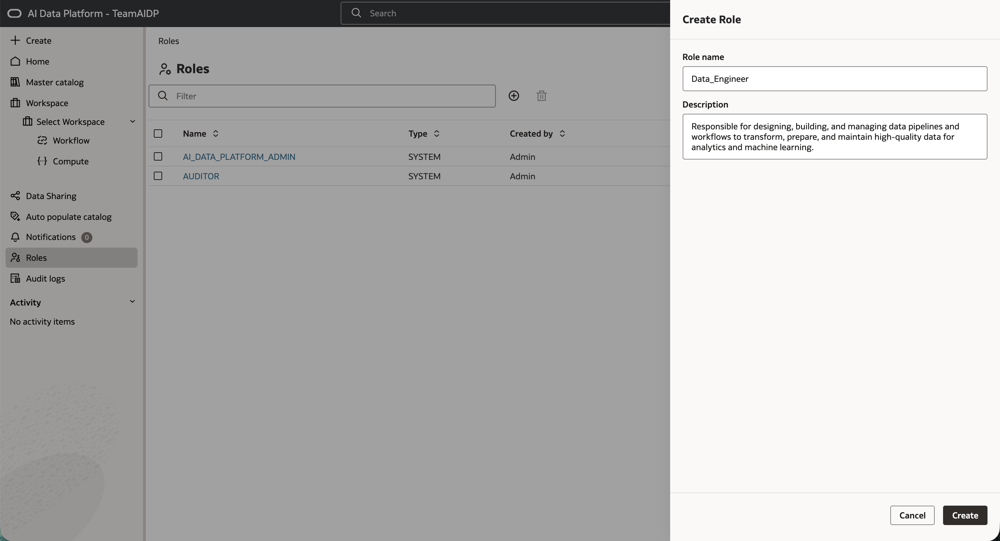
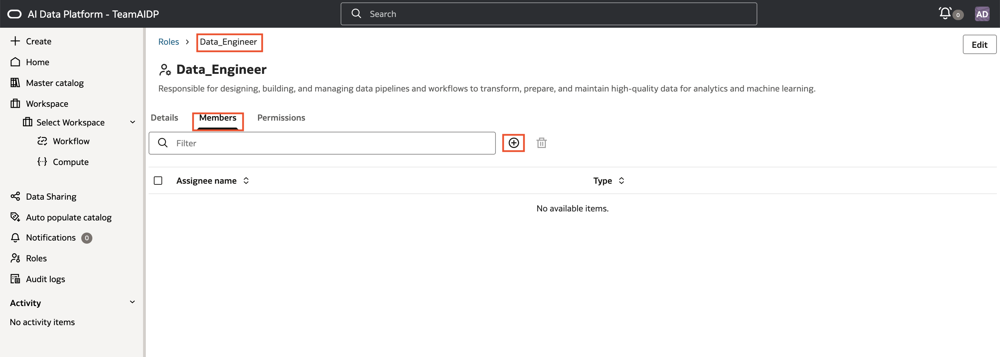
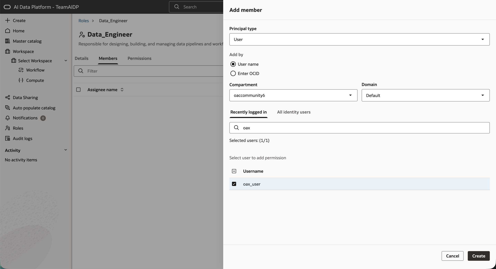
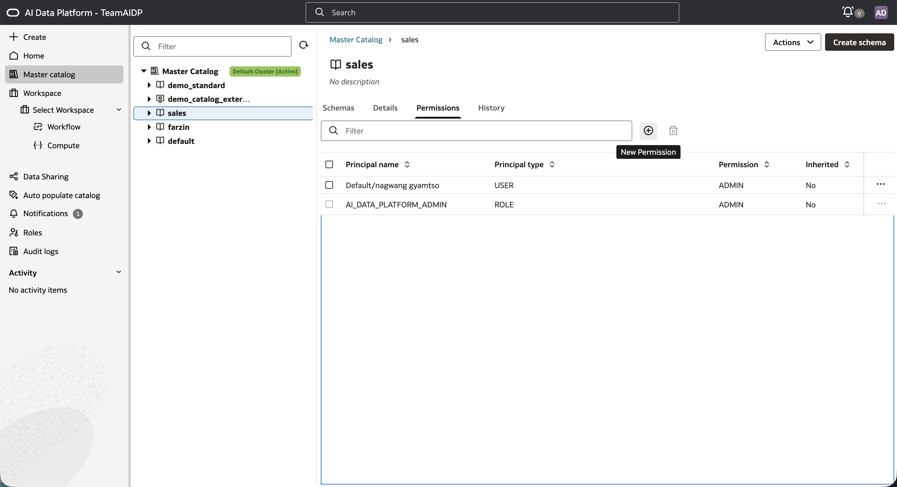
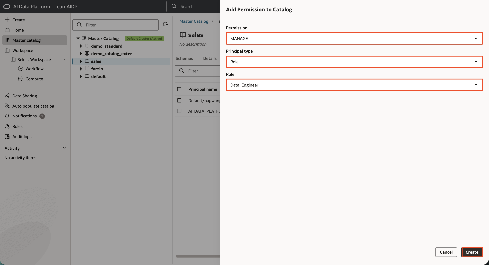

# How to control access permissions using Role Based Access Control (RBAC) in AIDP Workbench.

Duration: 4 minutes

**Controlling access with RBAC in Oracle AIDP Workbench** enables secure, scalable, and auditable data platform management. RBAC lets you precisely assign permissions by role rather than individually, supporting both operational efficiency and compliance.  

**Pre-requisites:**  
* Make sure you have administrative rights or have been assigned a role with sufficient permissions.  
* Plan your roles around real team responsibilities.  
* Apply the principle of least privilege.  
* Periodically review audit logs and assigned permissions.  

## Answer

1. **Click Roles.** From the AIDP Workbench home page, navigate to the **Roles** section.

    

2. **Two system roles will be available by default:**
    * **AI\_DATA\_PLATFORM\_ADMIN:** Assigned to the creator of your AIDP instance. This role has full rights to all resources and can grant/revoke permissions.
    * **AUDITOR:** Can view the entire audit trail for tracking and compliance. Every admin is automatically made an auditor; any new admin will be added to both roles.  

      **Note:** There can only be one system administrator role (AI\_DATA\_PLATFORM\_ADMIN) per instance. To transfer this, a user with IAM “MANAGE” permissions must do so from OCI settings. Review who holds admin privileges and transfer them deliberately when needed.

    

3. **Since I am an admin, I can create new roles and assign users to them.** Click the **plus (+) icon** to create a new role. Enter a clear, descriptive name and purpose for your role (e.g., “Data_Engineer”). Then click **Create**.

    **Best Practice:**
    * Use descriptive role names to help downstream audits and team clarity.
    * Keep role responsibilities aligned with actual job functions to avoid overly broad permissions.

    

4. **Add members to your custom role.** Select the role you just created. Go to the **Members** tab and click **Add member**. You can add:

    * **Individual users** (recommended: by username or OCID for precision)
    * **Other roles** (nesting for hierarchical control)

    **Tip:** Group users by function for easier long-term permission management.

    

    

5. **Assign permissions to the role on specific AIDP Workbench objects.** Go to the target object (e.g. the **Sales\_Data catalog**). Click the **Permissions** tab for that object. Click the **New Permission** icon. Choose the permission (e.g., **SELECT**, **MANAGE**, **CREATE_SCHEMA**, **ADMIN**), principal type as **Role**, and select your new role. Click **Create**.

    **Note:** Permissions assigned at a higher level (like Workspace or Master Catalog) automatically cascade to all contained objects such as schemas, volumes, and tables. Double-check before granting broad permissions to ensure you’re not exposing more than intended.

    

    

6. **Verify access and adjust as needed.** Test access by logging in as (or checking with) a user assigned to the new role. Confirm that users can see and do only what you expect. Update members and permissions as team needs change.

#### **Extra Best Practices & Pitfalls to Avoid**
* **Apply least-privilege:** Only grant permissions the role truly needs.  
* **Regularly review roles, members, and object permissions** to minimize stale or risky assignments.  
* **Leverage the Auditor role** to monitor for unapproved permission changes or unexpected access patterns.  
* **Avoid overprovisioning** at the catalog or workspace level, as this auto-grants access to all child resources.  
* **Document your RBAC design** and reasoning for future admins and auditors.  

By following these steps and best practices, you will maintain secure, scalable, and compliant access controls across your Oracle AIDP Workbench environment.

## Learn More

*(optional - include links to docs, white papers, blogs, etc)*

* [Roles](https://docs.oracle.com/en/cloud/paas/ai-data-platform/aidug/roles.html#GUID-1A453AE4-47B6-4F26-9B0F-1E45624273BE)
* [Permissions Model](https://docs.oracle.com/en/cloud/paas/ai-data-platform/aidug/permissions-model.html)

## Acknowledgements
* **Author** - Nagwang Gyamtso, Senior Product Manager, Analytics Service Excellence
* **Contributors** -  <Name, Group> -- optional
* **Last Updated By/Date** - <Name,  Month Year>
