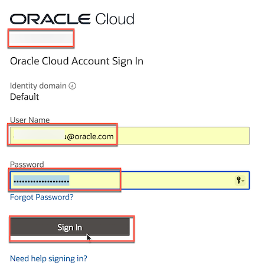
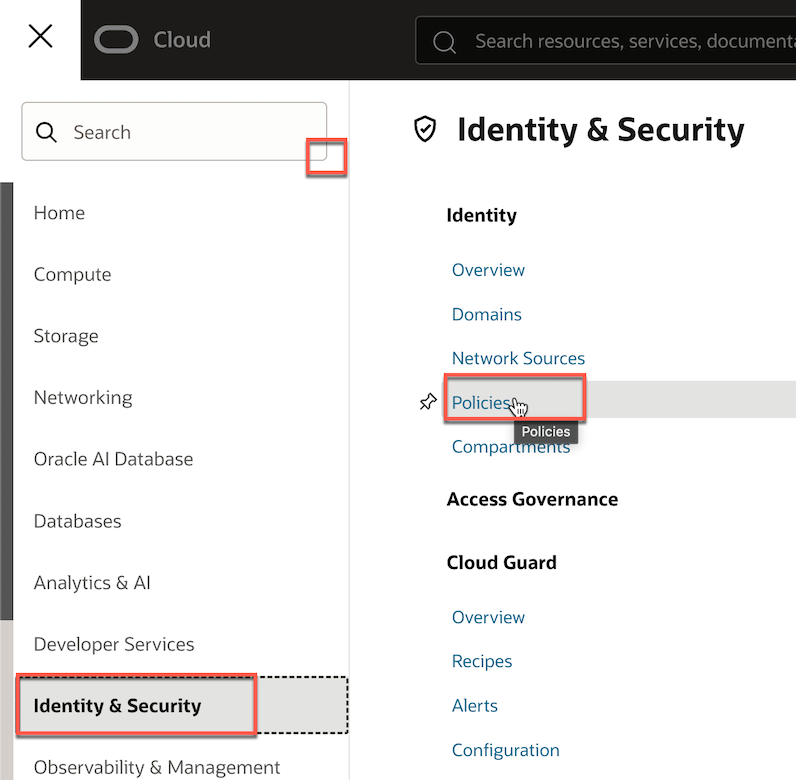
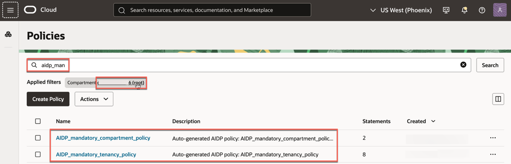
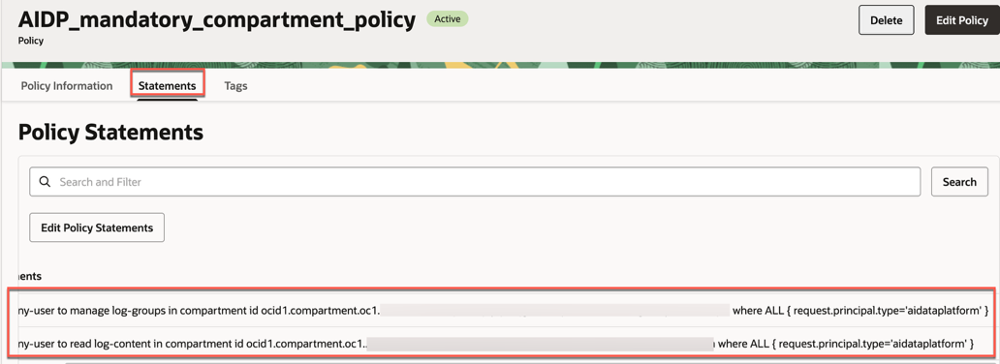
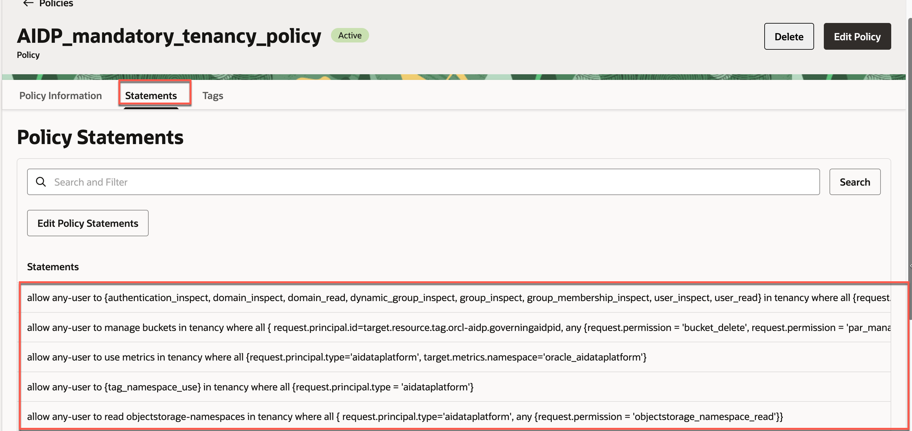
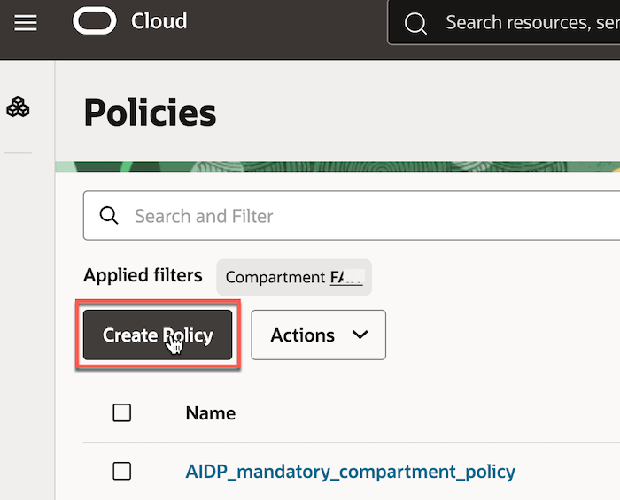
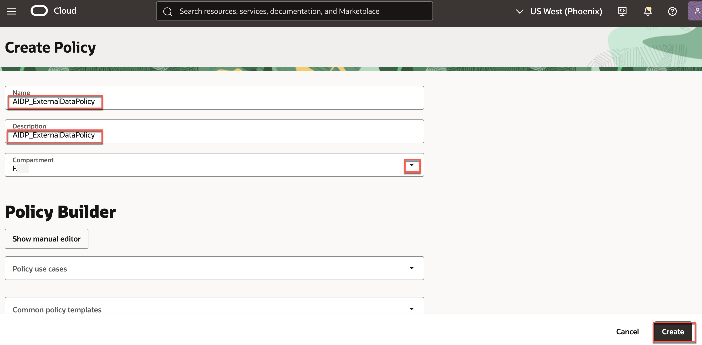
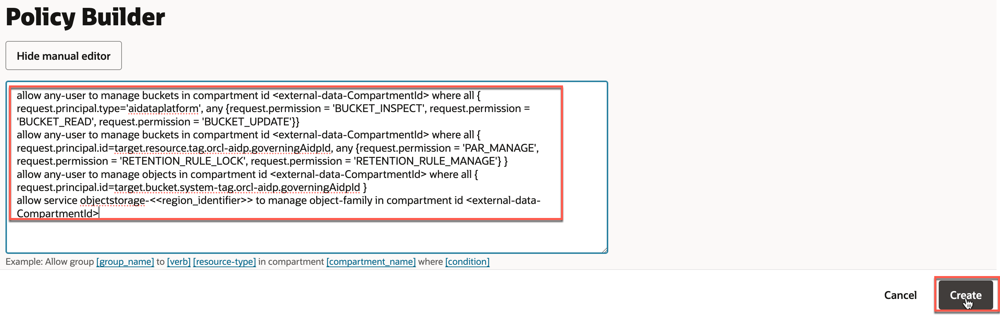
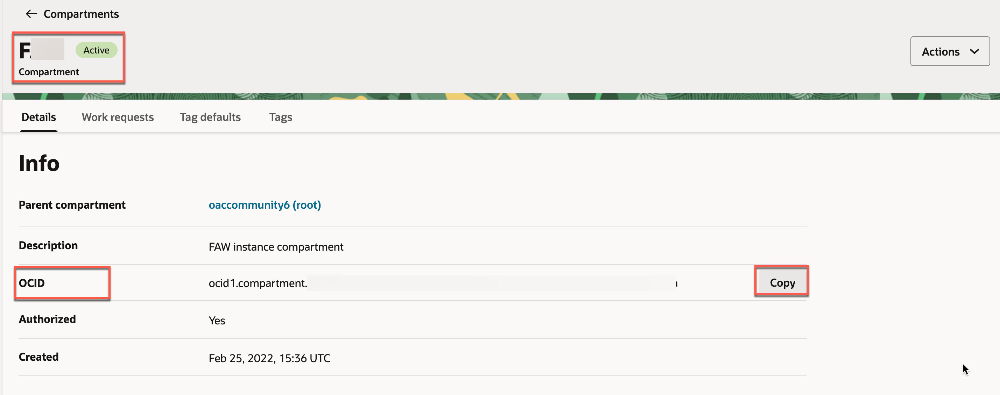
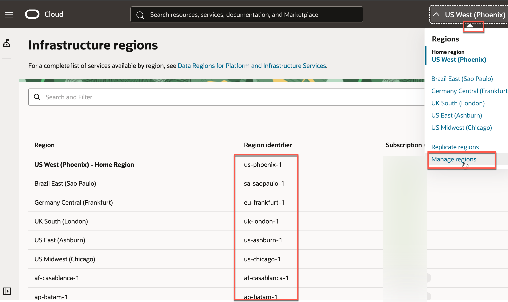

# How to Set Up Identity and Access Management (IAM) Policies for AIDP Workbench

Duration: 10 minutes.

## Summary

This sprint teaches you how to configure Identity and Access Management (IAM) policies to securely manage your Oracle AI Data Platform (AIDP) Workbench instance.

## Prerequisites

- Access to Oracle Cloud Infrastructure (OCI) with appropriate permissions.

- Basic understanding of IAM concepts in OCI.

> **Note:** You must be a member of the "OCI_Administrators" group in your tenancy to complete this sprint.

## IAM Policies Specific to AIDP

To create an AIDP instance, you must have at least the `MANAGE AI-DATA_PLATFORM` permission.

 When you start the process of creating an instance, AIDP Workbench checks that the required IAM policies are present. If a policy is missing, you'll be prompted to select it with the "Add Policies" option. Review the policies and apply them as needed to ensure that all required permissions are in place.

> **Note**: AIDP Workbench hides redundant policy options to prevent duplication.

   **Scope: You can choose between tenancy-level and compartment-level scope policies**:

   1. **Standard**: Provides essential access with minimal customization at the **tenancy level**, suitable for straightforward use cases or proof-of-concept environments.

   2. **Advanced**: Offers more granular access at the **compartment level**, allowing you to tailor access permissions to meet specific organizational requirements.  
   
      

   You can also select **optional Policies**:

   - **Enable Object Deletion**: Allows the Object Storage service in your region to manage Object Storage resources within the specified compartment, facilitating operations like lifecycle management and cross-region object copying.

    ```text
    allow service objectstorage-<region_identifier> to manage object-family in compartment id <CompartmentId>
    ```

   - **Network-Related Policies**: Essential when databases reside in private subnets to allow connection.

      - **Managing Virtual Network Interface Cards (VNICs)**: To configure compute clusters for private network access.

      ```text
      allow any-user to manage vnics in compartment id <selected compartment id> where all { request.principal.type='aidataplatform'}
      ```

      - **Allow AIDP Service to Use Subnets**

      ```text
      allow any-user to use subnets in compartment id <selected compartment id> where all { request.principal.type='aidataplatform'}
      ```

      - **Allow AIDP Service to Use Network Security Groups**: To control network traffic and enhance security.

      ```text
      allow any-user to use network-security-groups in compartment id <selected compartment id> where all { request.principal.type='aidataplatform'}
      ```

      > **Note**:  `<selected compartment id>` with your AIDP compartment.

## Task 1: Review Mandatory IAM Policies

Follow these steps to review the mandatory policies.

1. Navigate to the [OCI Console](https://cloud.oracle.com/) and enter your credentials to log in.

   

2. To access the Policies Section, in the OCI Console, select **Navigation Menu**.

3. Under **Identity & Security**, select **Policies**.

   

4. Select your root compartment and filter for AIDP.

   

5. Open the first mandatory (compartment) policy.

   

6. Open the second mandatory (tenancy) policy.

   

## Task 2: Create Additional IAM Policies for External Tables

If your AI Data Platform instance needs to access data stored in a different compartment, you must grant additional policies.

Follow these steps to create the specified OCI IAM policies.

1. Select **Create Policy**.

   

2. In the "Create Policy" window, provide the following details:

    - **Name**: Enter a unique name for the policy (e.g., AIDP ExternalDataPolicy).

    - **Description**: Provide a brief description of the policy's purpose.

    - **Compartment**: Select the compartment where you want to create the policy. This should be the compartment containing the resources you intend to manage.

      

3. In the "Policy Builder" section, select **Show manual editor** to input custom policy statements.

    - Enter the following policy statements, replacing `<external-data-CompartmentId>` with the actual OCID of your compartment and `<<region_identifier>>` with the appropriate region identifier:

      

    ```text
    allow any-user to manage buckets in compartment id <external-data-CompartmentId> where all { request.principal.type='aidataplatform', any {request.permission = 'BUCKET_INSPECT', request.permission = 'BUCKET_READ', request.permission = 'BUCKET_UPDATE'}}
    ```

    ```text
    allow any-user to manage buckets in compartment id <external-data-CompartmentId> where all { request.principal.id=target.resource.tag.orcl-aidp.governingAidpId, any {request.permission = 'PAR_MANAGE', request.permission = 'RETENTION_RULE_LOCK', request.permission = 'RETENTION_RULE_MANAGE'} }
    ```

    ```text
    allow any-user to manage objects in compartment id <external-data-CompartmentId> where all { request.principal.id=target.bucket.system-tag.orcl-aidp.governingAidpId }
    ```

    ```text
    allow service objectstorage-<<region_identifier>> to manage object-family in compartment id <external-data-CompartmentId>
    ```

4. Review the policy statements for accuracy.

5. Select **Create** to finalize and create the policy.

## Additional Considerations

- **Compartment OCID**: Ensure you have the correct OCID for the compartment where you want to apply these policies. You can find the OCID in the OCI Console under "Identity & Security" > "Compartments."

  

- **Region Identifier**: Replace `<<region_identifier>>` with the appropriate region identifier for your OCI region (e.g., us-phoenix-1).

  

- **Policy Validation**: After creating the policy, OCI will validate the statements. If there are any syntax errors, OCI will display an error message.

**Congratulations!** By following this sprint, you've successfully set up IAM policies to manage access to your Oracle AI Data Platform Workbench instance, ensuring secure and efficient collaboration within your team.

## Learn More

- [IAM Policies for Oracle AI Data Platform](https://docs.oracle.com/en/cloud/paas/ai-data-platform/aidug/iam-policies-oracle-ai-data-platform.html)

- [Working with Identity and Access Management (IAM) in Oracle Cloud Infrastructure](https://docs.oracle.com/en-us/iaas/Content/Identity/Concepts/overview.htm)

- [Managing Policies](https://docs.oracle.com/en-us/iaas/Content/Identity/Tasks/managingpolicies.htm)

## Acknowledgements

- **Author**: Lucian Dinescu, Analytics Service Excellence Team
- **Reviewer**: Candace Marles, Nagwang Gyamtso
- **Last Updated By/Date**: Lucian Dinescu, December 2025
