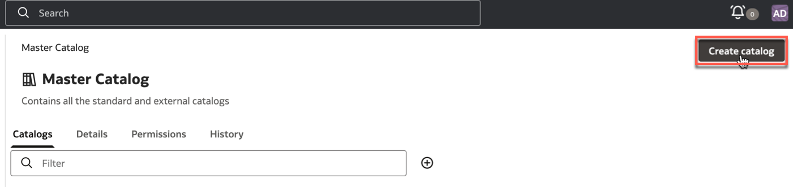
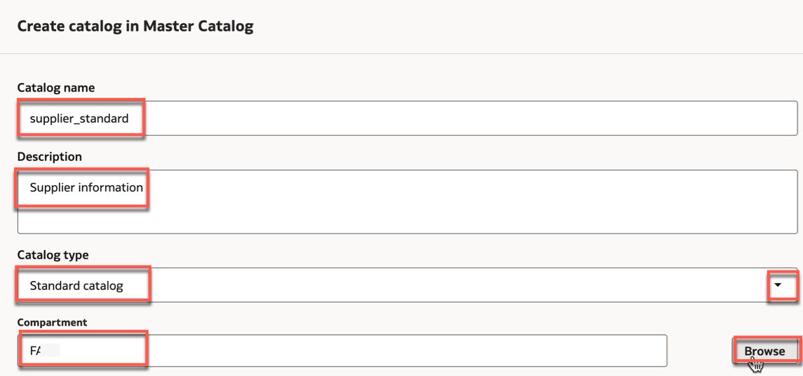
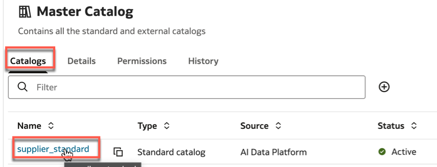
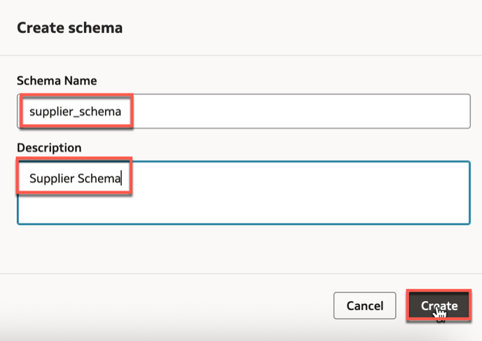

# How to Work with the Standard Catalog in Oracle AIDP Workbench

Duration: 4 minutes.

This guide provides step-by-step instructions on creating and managing standard catalog and its associated schema within the Oracle AI Data Platform (AIDP) Workbench. By following these steps, you can effectively organize and manage your data assets, both structured and unstructured, within the AIDP environment.

**Prerequisites**

- Access to Oracle AIDP Workbench.
- Appropriate permissions to create and manage catalogs and schemas.

## Create a Standard Catalog

1. Log in to the AIDP Workbench. On the **Master Catalog** page, click the **Create Catalog** button.

   

2. Provide a **Name** and **Description** for the new catalog.
3. Select **Standard Catalog** as the catalog type.
4. Choose the appropriate **Compartment** where the catalog data will be stored. The default is the compartment where the AIDP instance was created.

    

5. Click **Create** to finalize the catalog creation.

   

## Create a Schema within the Standard Catalog

1. From the list of catalogs, select the newly created standard catalog.

   

2. Click **Create Schema** .
3. Provide a **Name** and **Description** for the schema.
4. Click **Create** to add the schema to the catalog.

   

**Congratulations!** You've successfully created a  standard catalog and its associated schema in Oracle AIDP Workbench

## Learn More

- [Oracle AI Data Platform Workbench - Get Started](https://docs.oracle.com/en/cloud/paas/ai-data-platform/)
- [External Catalogs](https://docs.oracle.com/en/cloud/paas/ai-data-platform/aidug/external-catalogs.html)

## Acknowledgements

- **Author**: Lucian Dinescu, Analytics Service Excellence Team
- **Reviewer**: Miles Novotny, Nagwang Gyamtso
- **Last Updated By/Date**: Lucian Dinescu, December 2025
