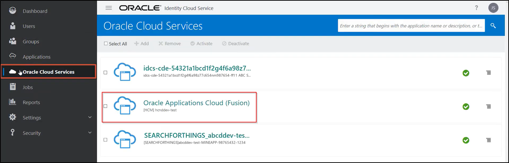
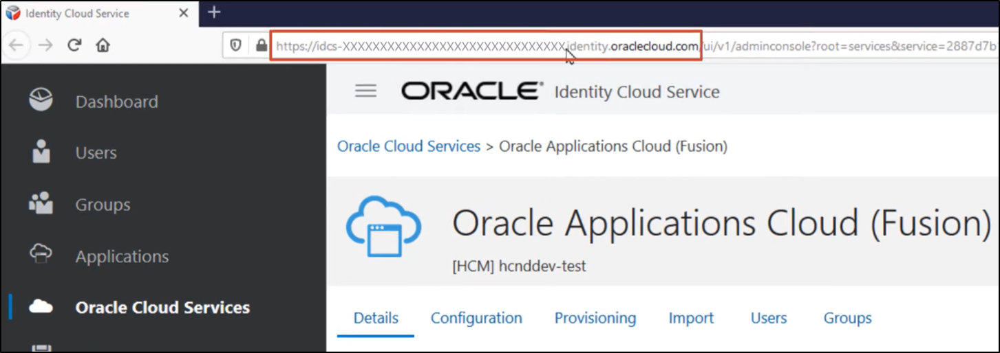
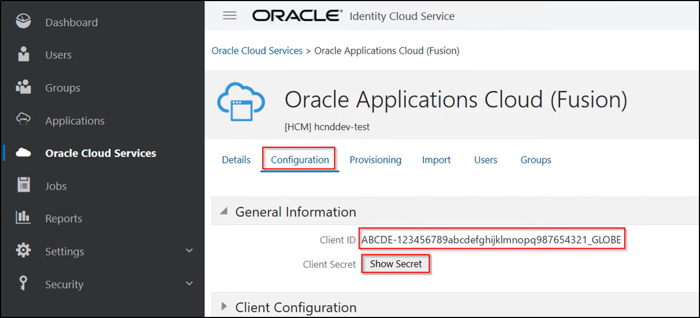
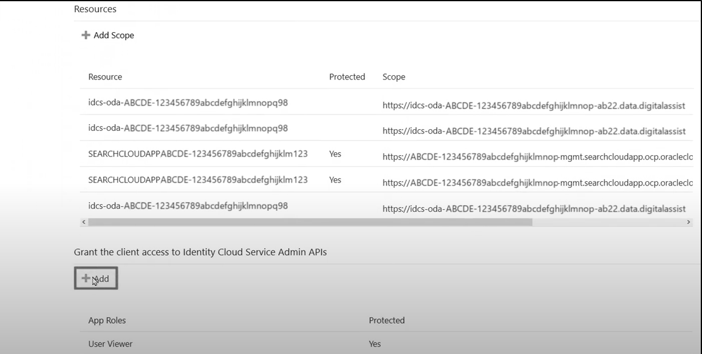
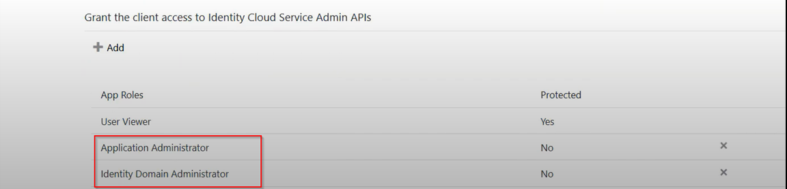

# How do I add the FA\_GSI\_Administrator role to a Fusion IDCS or IAM Domain user using IDCS REST APIs?

Duration: 4 minutes

To manage certain applications in FA IDCS sub-stripes, the FA IDCS user must have the FA_GSI_Administrator role on the FA IDCS sub-stripe in order to fully manage all aspects of the application. For example, the IDCS admin user should enable the provisioning in the Oracle Applications Cloud (Fusion) application to Sync Users and Roles from FA to IDCS. These steps need the admin user to grant roles like Identity Domain Administrator and Application Administrator however the options are greyed out to any user who does not have the FA_GSI_Administrator role. The IDCS user can be added to the required role using the IDCS REST APIs.

## Add FA\_GSI\_Administrator role to Fusion IDCS/IAM

You must be the **Identity Domain Administrator** to successfully complete the following steps.

1. Log in to Oracle Fusion Cloud Application’s IDCS admin console.

2. Navigate to **Oracle Cloud Services** and then select **Oracle Applications Cloud (Fusion)** application.

  

3. Copy the IDCS URL.

  

4. Copy the **Client ID** and **Client Secret**.

  

5. Scroll down and click on **Add** to grant roles. This is greyed out by default.

  

6. Run the IDCS REST API script with the information collected.

  [AddUser_2_FA_GSI_Administrator.sh](https://objectstorage.us-phoenix-1.oraclecloud.com/p/7THAOpuamL29E85kxCGZ-xZAXXNR9Cuu255L8V_790-o_w0l5thqNwUhAfdUlhRk/n/idbwmyplhk4t/b/LiveLabsFiles/o/AddUser_2_FA_GSI_Administrator.sh)

7. Add button can be clicked to add the below roles.

  

## Learn more
* Adding the FA IDCS admin user to the FA\_GSI\_Administrator role can also be done using the [My Services Cloud](https://docs.oracle.com/en/cloud/saas/applications-common/22d/fagda/how-to-add-fa-gsi-administrator-role-to-a-user.html) portal.

## Acknowledgements
* **Author** - Veera Raghavendra Rao Koka, Consulting Solutions Architect, Oracle Analytics
* **Last Updated By/Date** - May 2023
