# How do I apply a ML model from OML to OAC/OAS?
Duration: 7 minutes

From Oracle Machine Learning, a user can seamlessly apply models that they have built and use them in Oracle's analytics software, specifically Oracle Analytics Cloud and Oracle Analytics Server. Once the connection has been made from OML and OAC/OAS, users can integrate these models into visualizations, data flows, and multitude of other features. 

## Provision ADB 
**Note:** If you have already provisioned an ADB for OML, please skip steps 1-4. 
1. From the Oracle Cloud Infrastructure homepage, click on the **hamburger icon** to expand the navigation menu.

    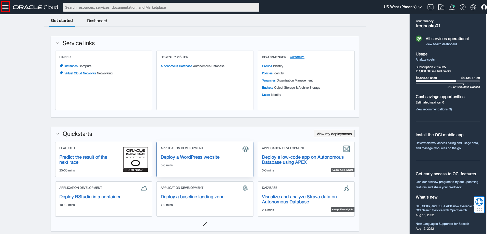

2. After clicking the hamburger, go to Oracle Database and click **Autonomous Database**.

    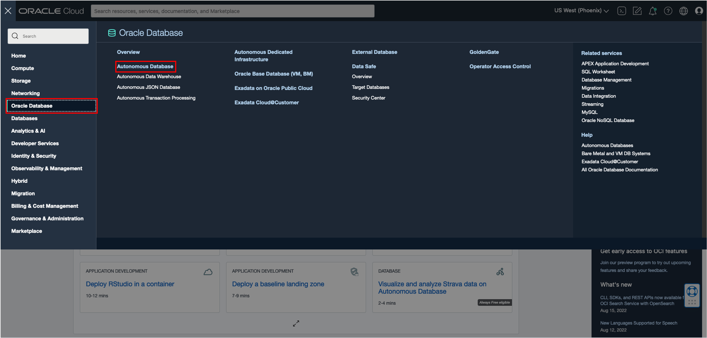

3. In the Autonomous Database homepage, navigate to the blue **Create Autonomous Database** button. 

    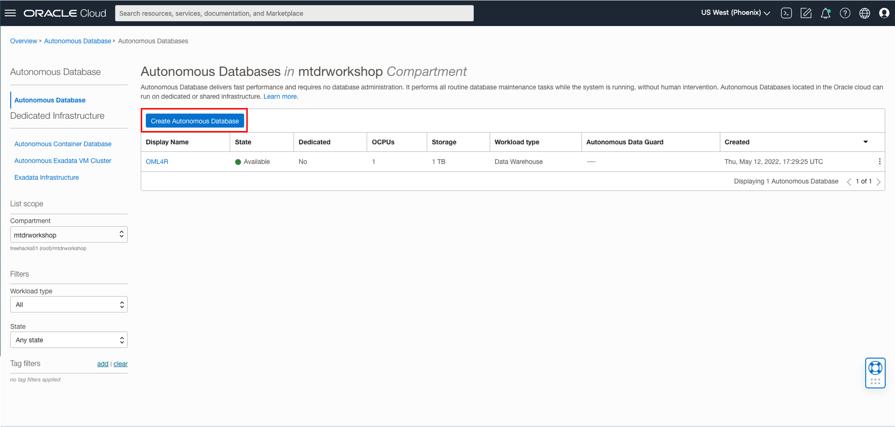

4. Give the ADB a display and database name. The rest of the settings will be left in the default setting. After that, click **Create Autonomous Database**.  
    
    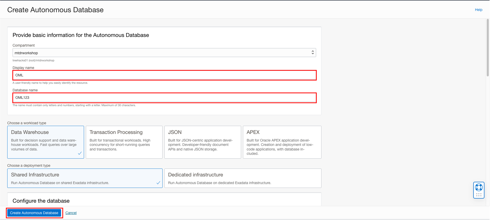

5. Once the ADB provisions and turns green, click on the **DB connection button**.

    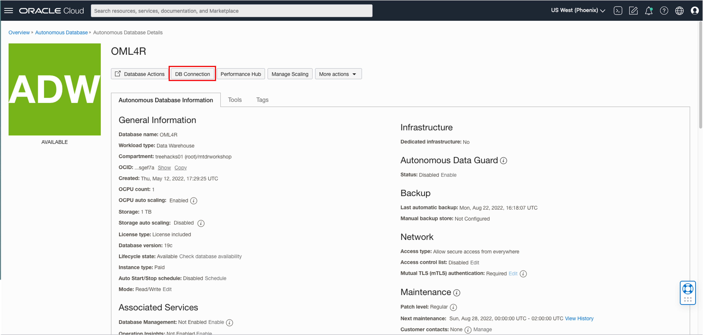

6. Once the right panel appears, click **download wallet** to download all the client credentials and create a unique password for the wallet. After that is completed, look down at connection strings and copy the connection string that is associated with the **medium** TNS Name. Make sure to paste and store that information in a place that is readily accessible. 

    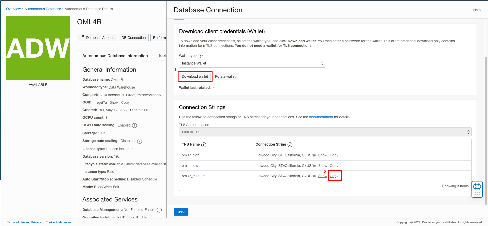

## Connect to OML Instance from OAS/OAC 

7. After completing step 6, open your OAS or OAC instance. In the top right corner of the homepage, click the button with three dots and select **Register ML Model**

    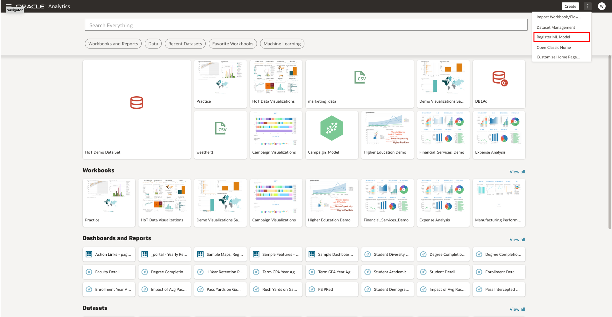

8.  In this step, a connection will be made from OML to the OAS/OAC interface. Click on **Create Connection** in the top right corner. 
    
    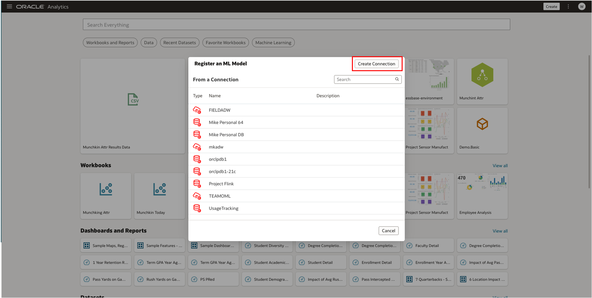

9.  Using the information from the connection string you copied, fill in the boxes with the corresponding information. For client wallet, make sure to use the wallet that you downloaded in step 6. For username and password, fill in the credentials used to sign into your OML instance. Then, click save. 

    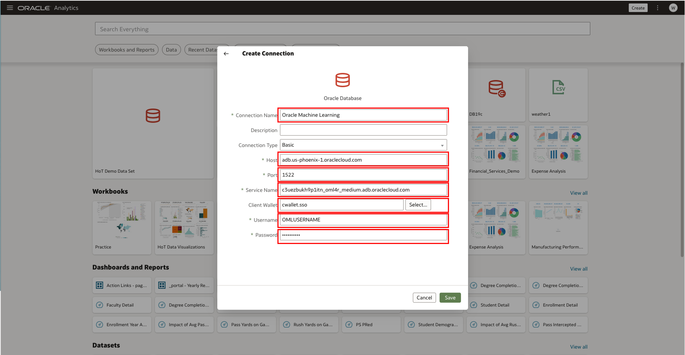

10. Once the connection has been made, you can choose the model that you would like to register from your OML instance. 

    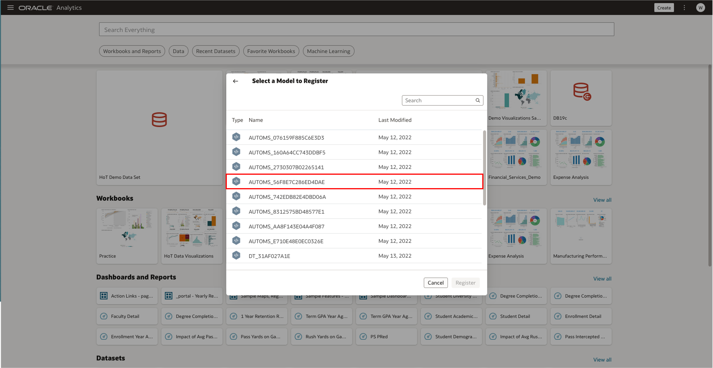

11. After clicking on the model, click the **Register** model button on the bottom right. 

    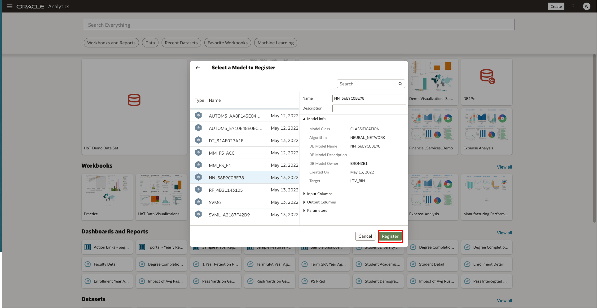

Congratulations! You have applied a ML model from OML to OAC/OAS!

## Learn More

* [Oracle Learning](https://www.youtube.com/watch?v=-tDUDMek7qA&ab_channel=OracleLearning)

## Acknowledgements
* **Author** - Bronze Martin, Solution Engineer, North America Specialist Hub
* **Last Updated By/Date** - Bronze Martin, August 2022