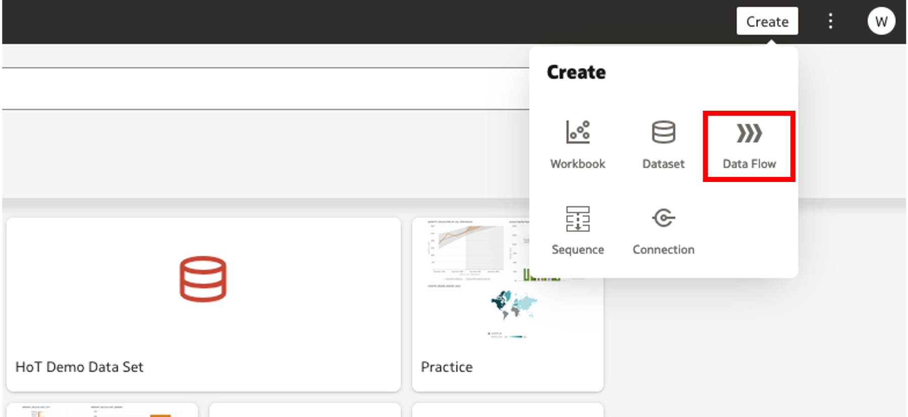
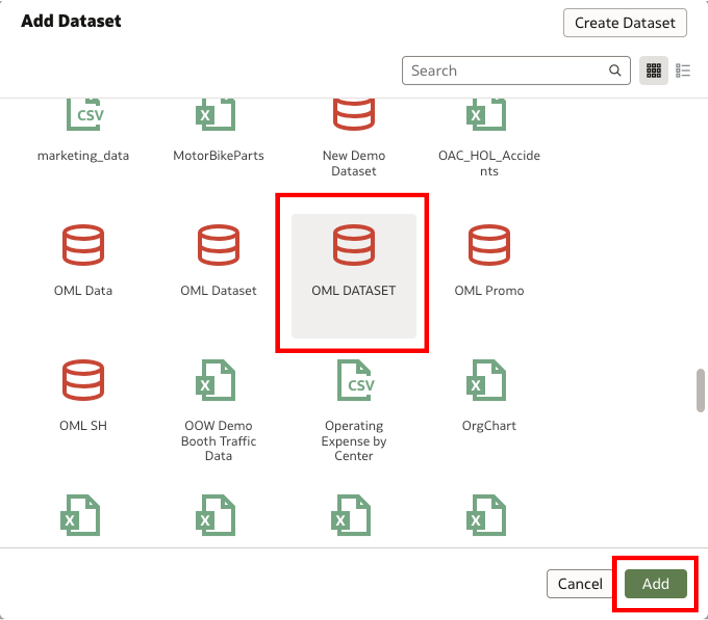
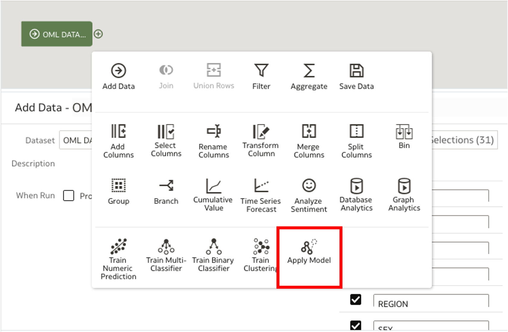
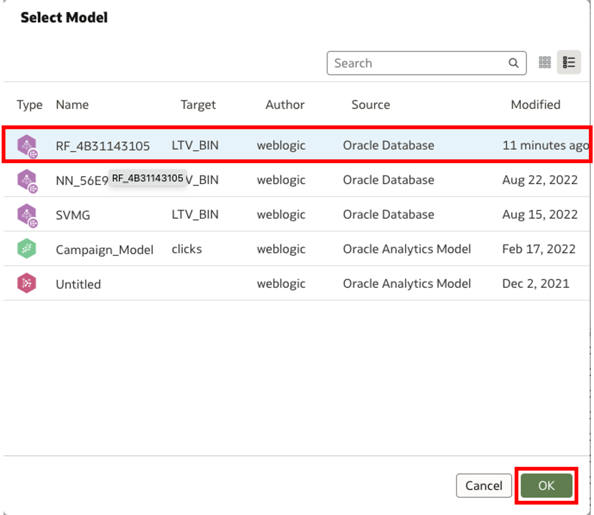
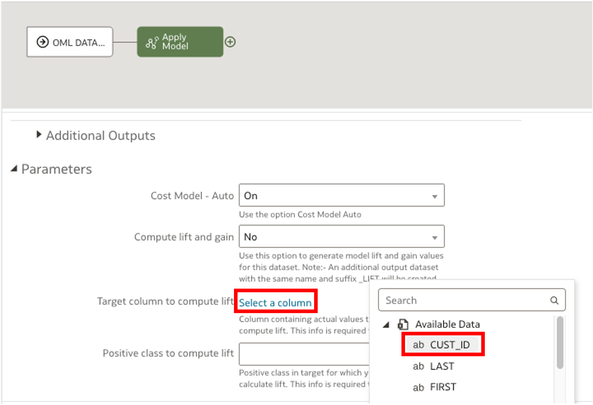
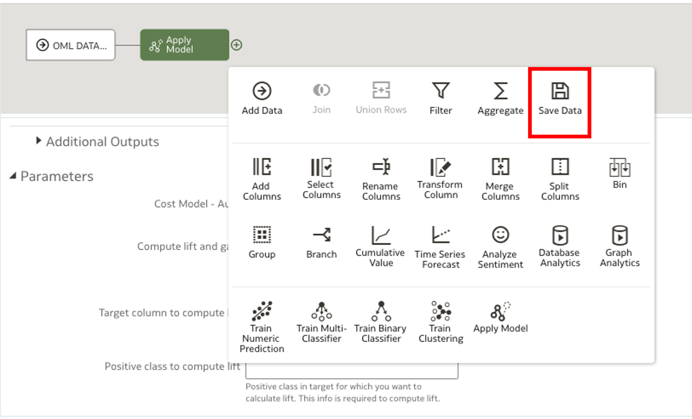
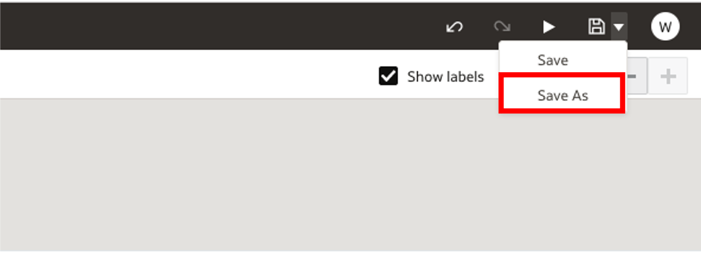
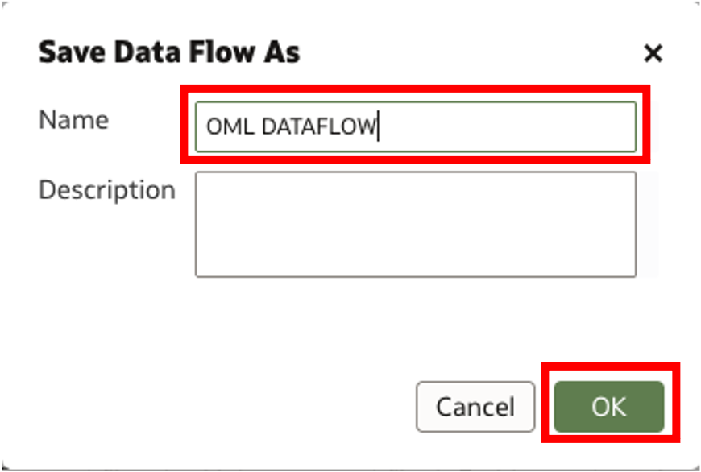

# How do I apply a ML model from OML to OAC/OAS?
Duration: 4 minutes

From Oracle Machine Learning, a user can seamlessly apply models that they have built and use them in Oracle's analytics software, specifically Oracle Analytics Cloud and Oracle Analytics Server. Once the connection has been made from OML and OAC/OAS, users can integrate these models into visualizations, data flows, and multitude of other features. 

**Note:** You must have the DV Content Author role in order to complete the following steps. 

## Create Data Flow and Apply Machine Learning Model from OML 

1. First, open your OAS or OAC instance. In the OAS or OAC homepage, click the **Create** button in the top right corner and select **Data Flow**. 

    

2.  Once clicked, you will be prompted to add a dataset to your data flow. Click the dataset that corresponds to the OML connection that has been previously made. If you do not click the right dataset, the models will not be made available to use.  
   
    

3.  Once the dataset has been uploaded, click the **+** icon right next to your dataset and choose the **Apply Model** button in the following menu.

    

4. Upon selection, you will be prompted to pick the model from OML that you would like to work with. Select the **model** and click **OK**

    

5. Once you have selected your model, it is required to select a target column. Click on **Select a column** and choose the **CUST_ID** column from the dropdown menu. 

    

6. Now, it is time to save our data. Click on the **+** icon next to the **Apply Model** segment of the data flow and click on **Save Data** from the menu. 

    

7. Before we can save the data flow, we have to change the table name that has been provided. Fill in the box with a name of your choice that satisifies the name requirements. 

    

8. After the table name has been changed, we can save the data flow. Select the save button in the top right corner of the screen and click **Save As**.

    

9.  Here, select a name for the data flow and click the **OK** button. 

    

Congratulations! You have applied a ML model from OML to OAC/OAS through a data flow!

## Learn More

* [Oracle Learning](https://www.youtube.com/watch?v=quIUPzcCaOw)

## Acknowledgements
* **Author** - Bronze Martin, Solution Engineer, North America Specialist Hub
* **Last Updated By/Date** - Bronze Martin, September 2022