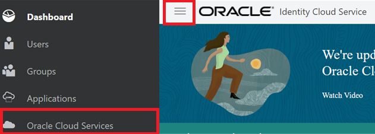
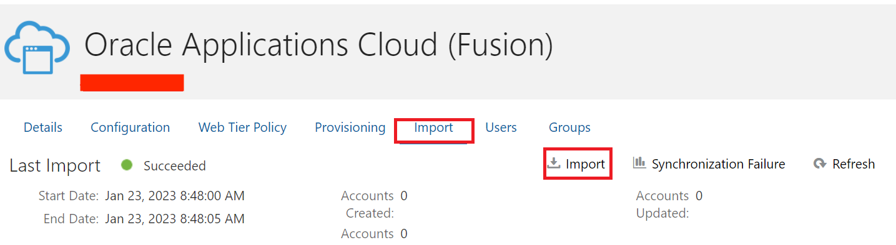
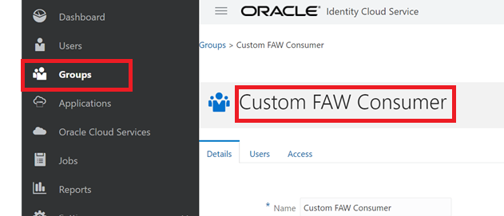
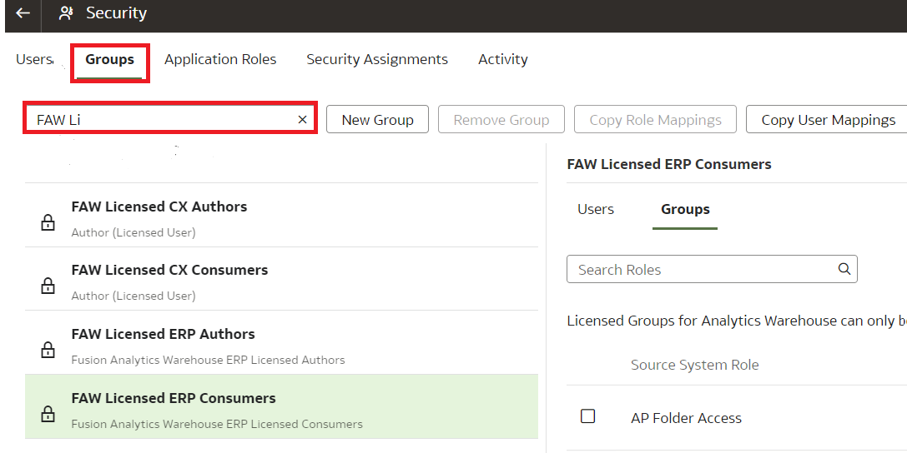
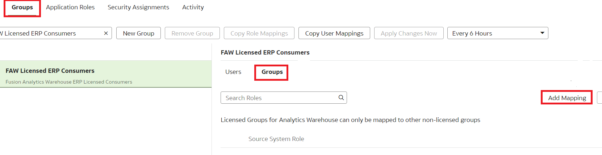
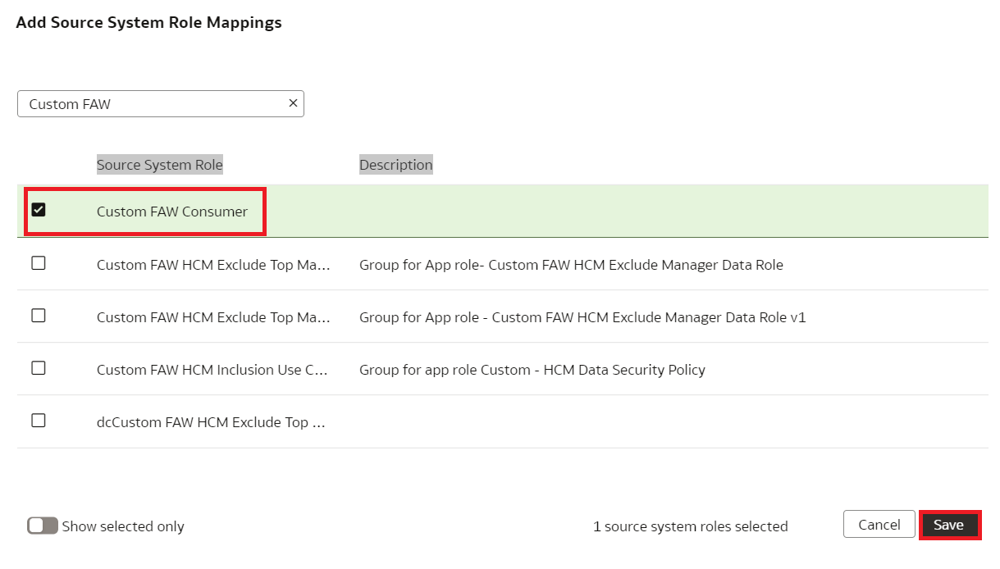
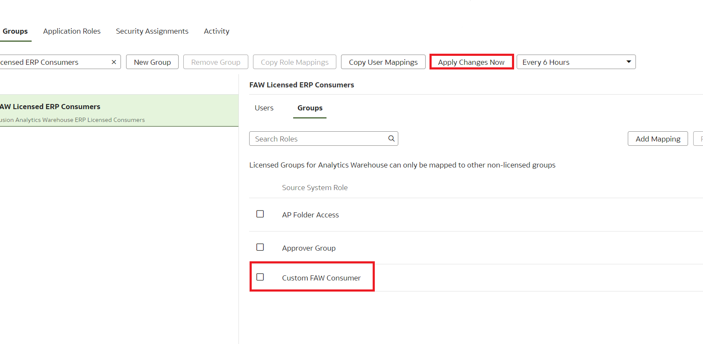
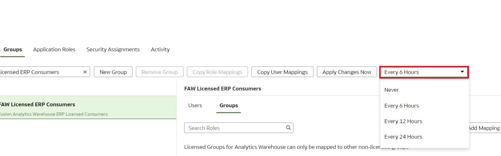

# How do I auto-assign Fusion Analytics Warehouse (FAW) licensed groups to Oracle Fusion Cloud Application (FA) users?

Duration: 2 minutes

FA users will get access to FAW once FAW licensed groups are assigned manually. However, you can automatically assign FAW licensed groups to FA users when they're synchronized from your Oracle Fusion Cloud Applications instance to the Oracle Identity Cloud Service instance to provide these users immediate access to Oracle Fusion Analytics Warehouse. This is a one-time setup and any new FA user that would require access to FAW will have the licensed groups auto assigned with the sync process.

## Migrate KPIs from test to production
You must have the **FA Administrator, IDCS Administrator and FAW Service Administrator** roles to successfully complete the following steps.

1. Identify users in Fusion Application that require access to FAW. Create a custom role in FA and associate the users that need access to FAW to the role. In this Sprint, we use a custom group called “Custom FAW Consumer” that was already created in FA to which the users that require FAW access are added.

2. Login to IDCS as an IDCS Administrator.

  

3. Click on the **Navigator** and select **Oracle Cloud Services**.

  

4. Double Click on Oracle Applications Cloud (Fusion). Then click the **Import** tab and click the **Import** icon.

  

5. Select the FAW group to import. In this example, we import a custom group called 'Custom FAW Consumer group'. Once the import is complete, Custom FAW Consumer group should be visible under **Groups**.

  

6. Login to your FAW URL using the **Oracle Application Cloud (Fusion)** option at the bottom.

  

7. Click on the **Navigator** and select **Console**. > Security

  

8. Under **Security and Administration**, select **Security**.

  

9. Click on the **Groups** tab and search for **FAW licensed** groups.

  

10. Identify the licensed group that you wish to associate the custom group with. In this example, we choose the FAW Licensed ERP Consumers group and click **Add Mapping**.

  

11. Select the custom group with all the FA users that need access to FAW and click **Save**.

  

12. Click on **Apply Changes Now**. This will consider all the groups which you have mapped to licensed groups.

  

13. Make sure to set the FAW background sync process to run either 6, 12, or 24 hrs. This would map all the new users associated with custom FA group to FAW System Licensed groups.

  

## Acknowledgements
* **Author** - Bindu Goparaju, CEAL
* **Last Updated By/Date** - Nagwang Gyamtso, January 2022
