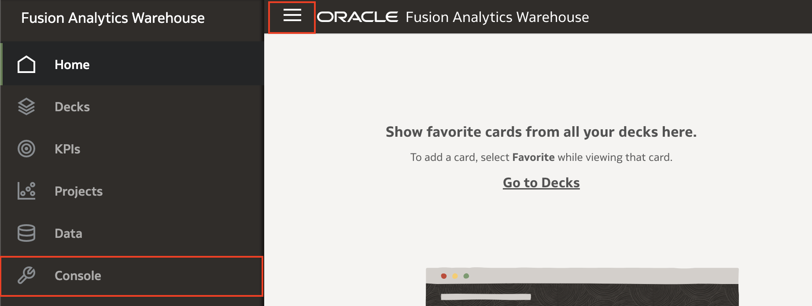
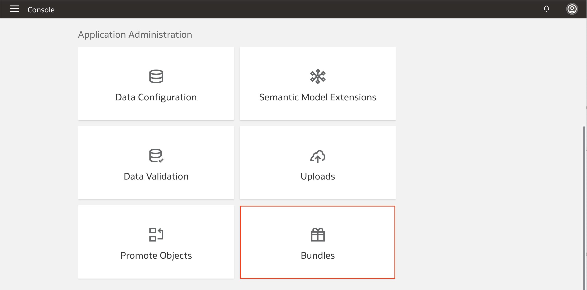
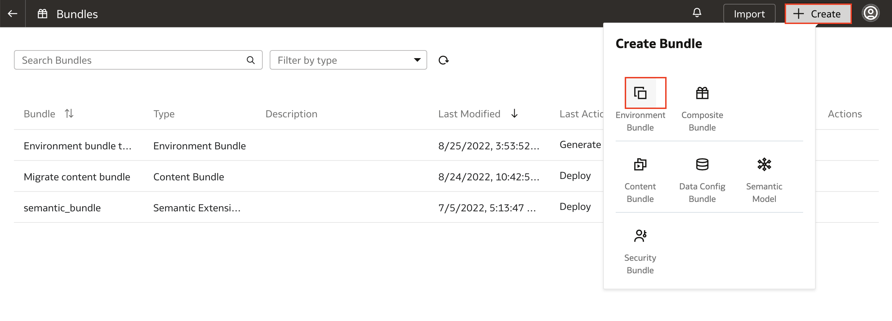
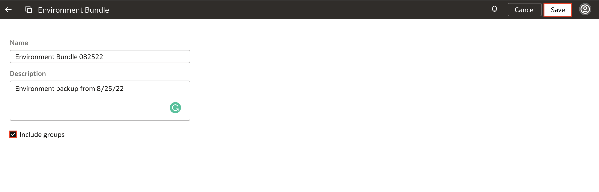
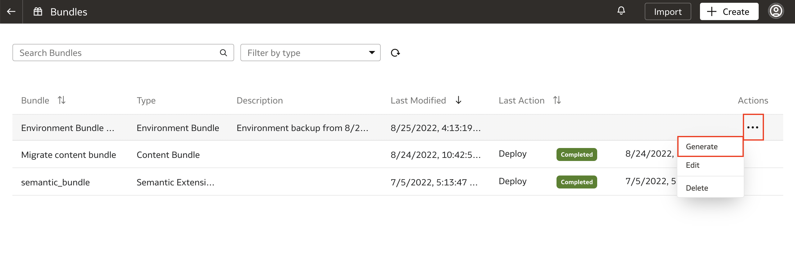
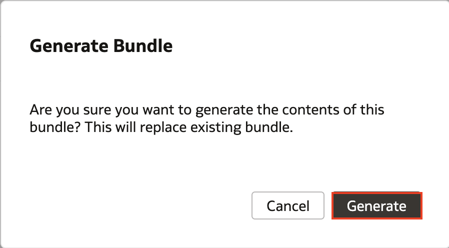
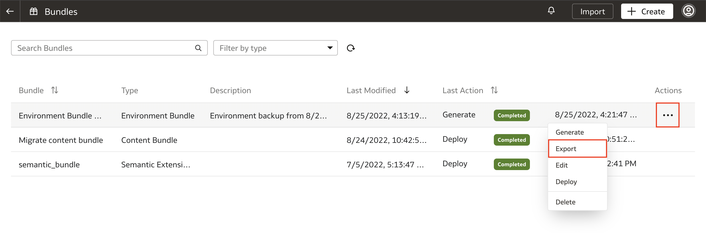
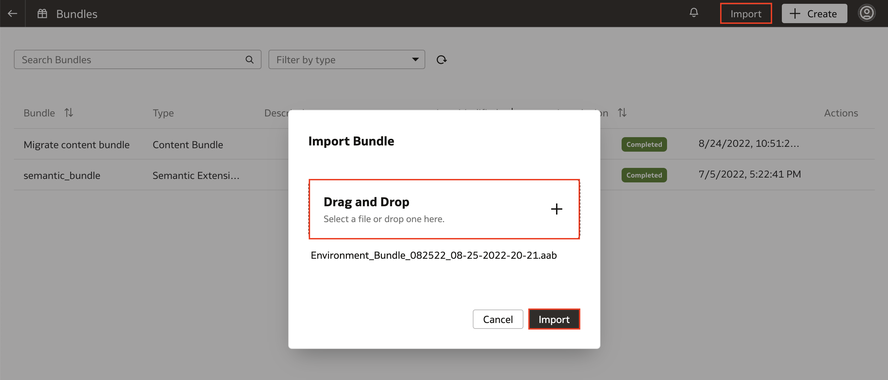
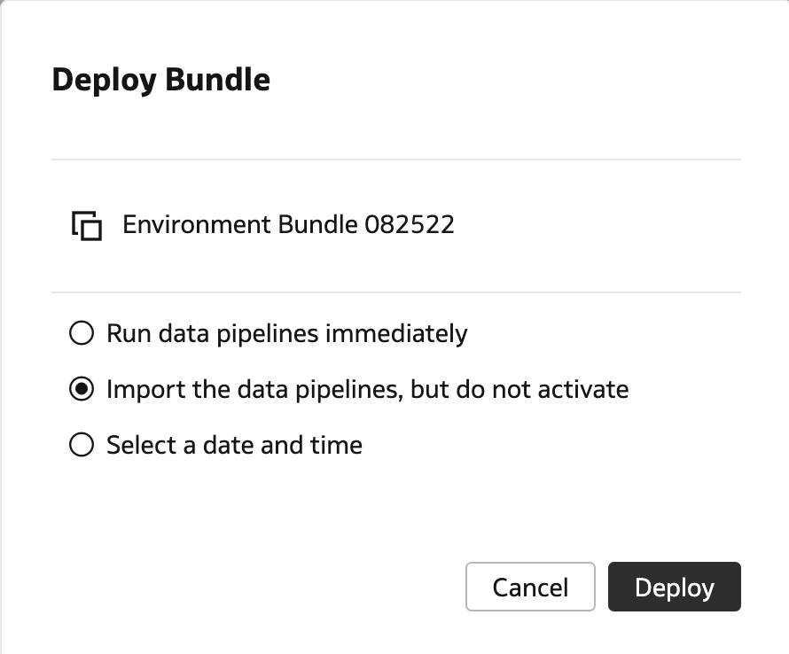

# How do I backup and restore my environment using bundles in Fusion Analytics Warehouse (FAW)?
Duration: 2 minutes

The bundles feature in FAW allows you to package your application artifacts and migrate them to other environments or to save snapshots of your environment for backup and restore. This is especially useful when your environment encounters a failure.

## Backup and restore environment using bundles

>**Note:** You must have the **Service Administrator** role to successfully complete this Sprint.

1. In your Fusion Analytics Warehouse instance, click the **Navigation** menu and select **Console**.

  

2. Within the console, click **Bundles** under **Application Administration**.

  

3. Click **Create** to view the different types of bundles available and select **Environment Bundle**.

  

4. Enter a name for the bundle and as a best practice, include the date that the bundle is created so that you know when the snapshot of your environment is from. Check the **Include groups** box and click **Save**.

  

5. Click the **Actions** menu for the environment bundle we just created and select **Generate**. When the dialogue box appears asking if you are sure you want to generate the contents of the bundle, select **Generate**.

  

  

6. Once your environment bundle is generated and shows a completed status, click the **Actions** menu and select **Export**. This will download an .aab file to your local machine. This file is the backup of your environment.

  

7. To restore the backup of your environment, login to the environment where you want to restore and navigate to **Bundles**. Then click **Import**. Drag and drop the .aab file and select **Import**.

  

8. Once the import has completed, click the **Actions** menu and select **Deploy**.
    >**Note:** Before deploying the environment bundle, you must first deploy the data configuration bundle or manually activate your data pipeline. For more information on this, please refer to the document listed in the Learn More section below.

  

9. In the dialogue box, you have three option for deploying your environment bundle. Select the option appropriate for your situation and click **Deploy**.

    >**Note:** **Run data pipelines immediately** will disturb/overwrite the existing setup for your environment.

  

## Learn More

* [Bundle Your Application Artifacts](https://docs.oracle.com/en/cloud/saas/analytics/22r2/fawag/bundle-your-application-artifacts.html#GUID-596E4D3E-9E23-4A7C-ACF2-A57D8B4FB41C)

## Acknowledgements
* **Author** - Nagwang Gyamtso, Product Manager, Product Strategy
* **Last Updated By/Date** - Nagwang Gyamtso,  August 2022
