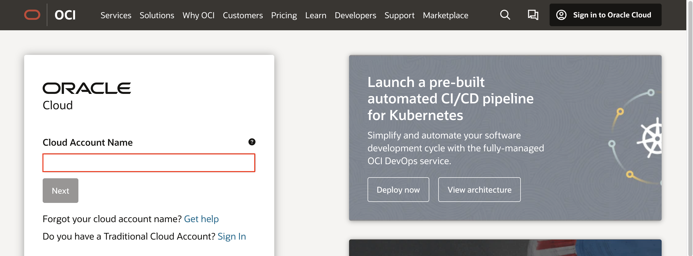
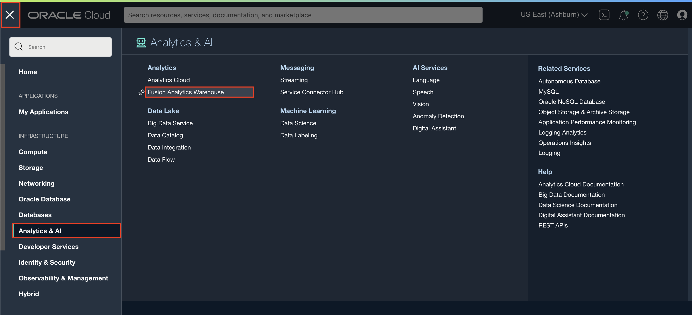
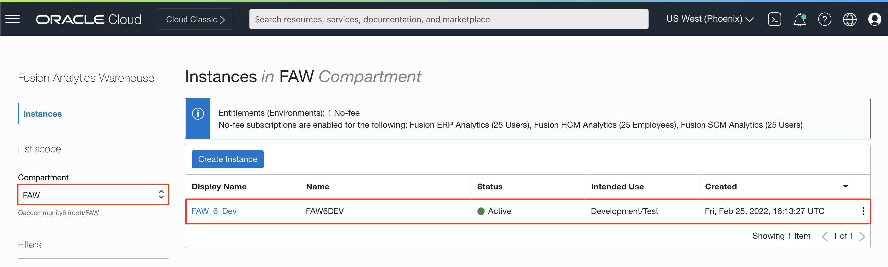
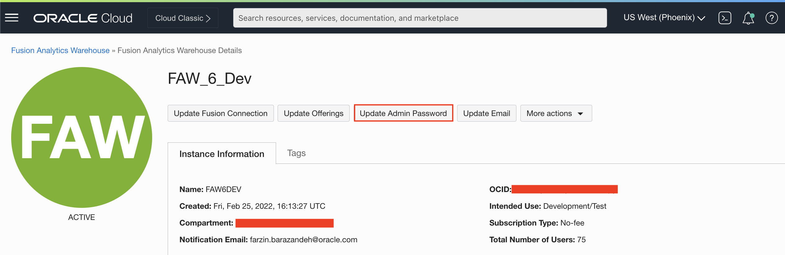
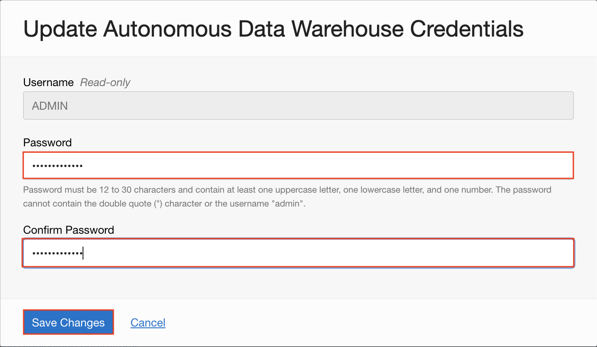

# How do I change the ADW Admin password in Fusion Analytics Warehouse (FAW)?
Duration: 1 minute

By default, the person who creates the Fusion Analytics Warehouse (FAW) instance is granted the Administrator role and is responsible for providing the ADW password. When users have left your organization or switched roles, you may want to update your ADW credentials.

As a best practice, if your organization requires someone other than the person who created the FAW instance to handle ADW passwords -- e.g. a DBA, then that person should be granted the ability to change or update the ADW password.

## Change the ADW Admin password for Fusion Analytics Warehouse

1. Sign in to your [Oracle Cloud Infrastructure Console](https://cloud.oracle.com/).

    

2. Within the Oracle Cloud Infrastructure console, click the **Navigation menu** and select **Analytics & AI**. Then under Analytics, select **Fusion Analytics Warehouse**.

    

3. Here, you will see a list of Fusion Analytics Warehouse instances you have provisioned. Select the FAW instance you want to update the Admin password for.

    >**Note:** You may need to navigate to the relevant compartment to find your FAW instances.

    

4. Under the instance details page, click **Update Admin Password**.

    

5. In the **Update Autonomous Datawarehouse Credentials** dialog, enter and confirm the new password. Click **Save Changes**.

    

Congratulations, you have learned how to change the ADW Admin password for FAW and a best practice when inputting an email address.

## Learn More

* [Update the Administrator Password for Oracle Autonomous Data Warehouse](https://docs.oracle.com/en/cloud/saas/analytics/22r2/fawag/update-administrator-password-oracle-autonomous-data-warehouse.html)

## Acknowledgements
* **Author** - Nagwang Gyamtso, Product Manager, Product Strategy
* **Last Updated By/Date** - Nagwang Gyamtso,  July 2022
