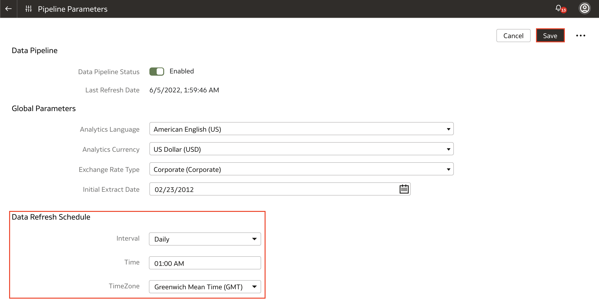
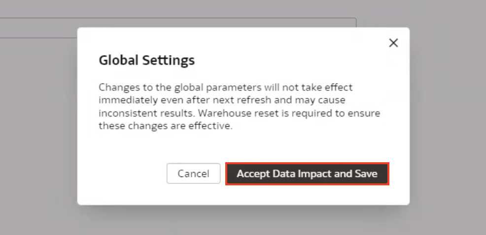
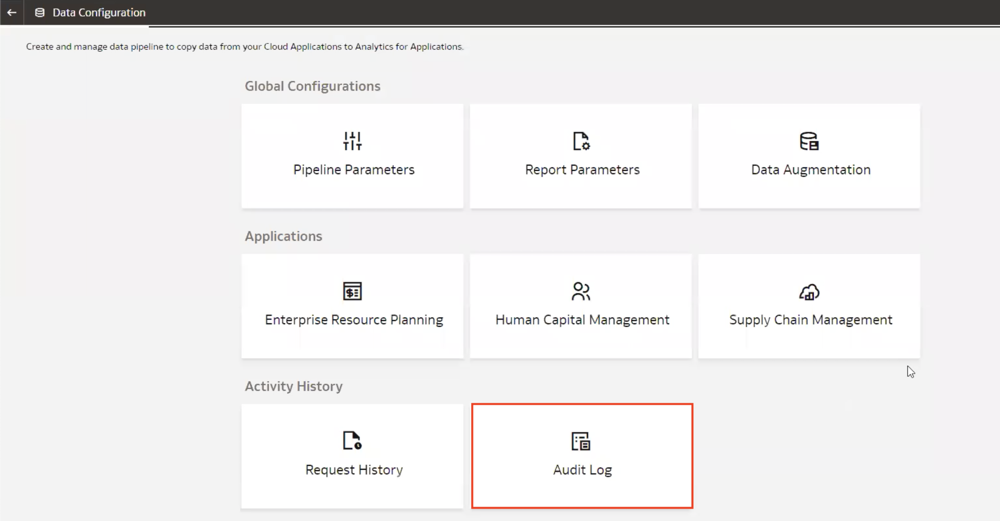
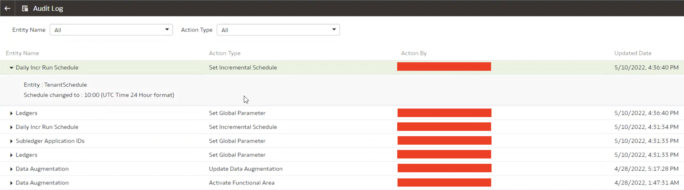

# How do I change the Data Refresh Schedule in Fusion Analytics Warehouse (FAW)?

Duration: 3 minutes

Data Refresh Schedule in Fusion Analytics Warehouse allows you to automatically refresh your data source so that your FAW environment has the most current data. You have the option to set a recurring schedule to run this data load which occurs once every 24 hours.

The best practice when setting your Data Refresh Schedule is to set it to a time during non-business hours when your transaction volumes are very low. This will ensure that your business operations run without interruption during high traffic hours.

## Change Data Refresh Schedule
> **Note:** You must have Service Admin role to be able to complete the following steps.

1. In your FAW instance, navigate to the **Console** tab using the navigator menu.

  

2. Within the console, select **Data Configuration**.

  

3. Within Data Configuration, click on **Pipeline Parameters**.

  

4. In the Pipeline Parameters, you have three sets of options: Data Pipeline, Global Parameters and Data Refresh Schedule. In this Sprint, we focus on the **Data Refresh Schedule** which allows us to pick the interval for our data refresh from Daily all the way up to Yearly. We also have the option to select the Time and Timezone for the refresh. Go ahead and input when you want the Data Refresh to occur, considering you want it to be during non-business hours as a best practice and click **Save**.

  

5. A confirmation window will appear, asking if you want to accept the data impact and save your change. Any changes to the global parameters will take effect only when you reset your warehouse. For the Data Refresh Schedule, changes will take effect when the next refresh is run. Click **Accept Data Impact and Save**.

  

6. To verify that the change has occurred, navigate back to Data Configuration using the back button and click **Audit Log** under Activity History.

  

7. Here, you will be able to see a history of all the changes that have been made. The first entry will reflect the change you have just made to your Data Refresh Schedule.

  

Congratulations! You have successfully learned how to change the Data Refresh Schedule in Fusion Analytics Warehouse (FAW) and some best practices around it.

## Learn more
* [Set Up the Pipeline Parameters](https://docs.oracle.com/en/cloud/saas/analytics/23r2/fawag/set-pipeline-parameters.html)

## Acknowledgements
* **Author** - Nagwang Gyamtso, Product Manager, Product Strategy
* **Last Updated By/Date** - Nagwang Gyamtso,  May 2022
