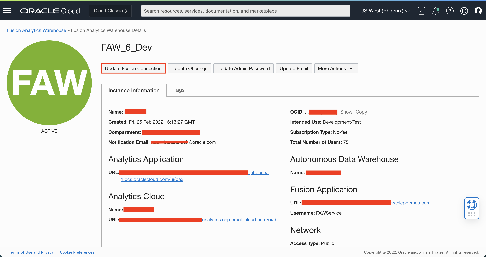
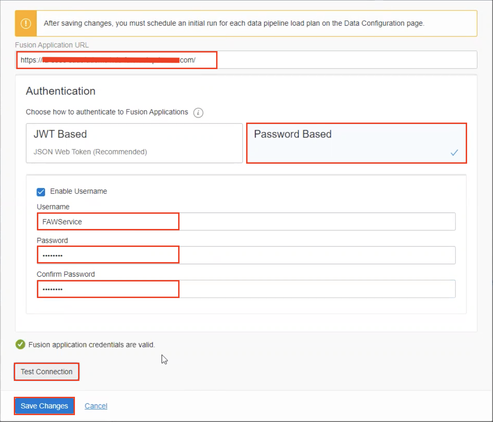
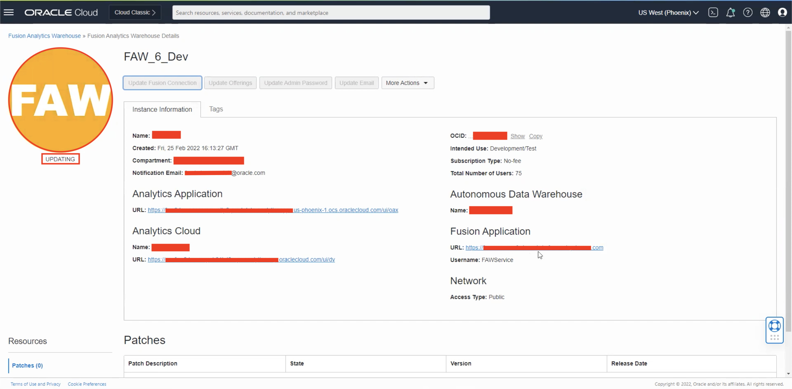
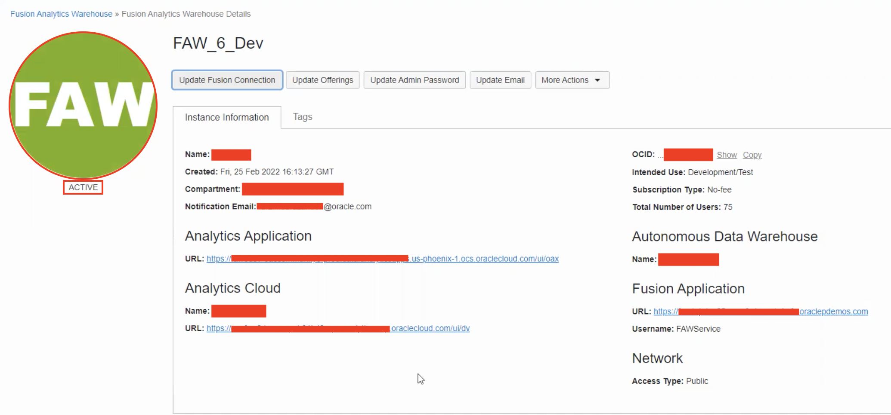

# How can I change my Fusion Application connection in Fusion Analytics Warehouse (FAW)?

Duration: 5 minutes

## Update Fusion Connection

1. Navigate to your Fusion Analytics Warehouse instance and in your instance details, click 'Update Fusion Connection'.

    

2. Enter the new Fusion Application URL and the authentication credentials. Then, test the connection and once the connection is validated, save changes.

    

3. Your FAW instance will now start updating, indicated by the orange status. This should take only a few minutes.

    

4. Once the FAW status turns green, you Fusion Application URL will

    

You have now successfully learned how to update your Fusion Application connection in Fusion Analytics Warehouse.

## Learn More

* [Update Data Source Connection Details](https://docs.oracle.com/en/cloud/saas/analytics/21r3/fawag/update-data-source-connection-details.html)
