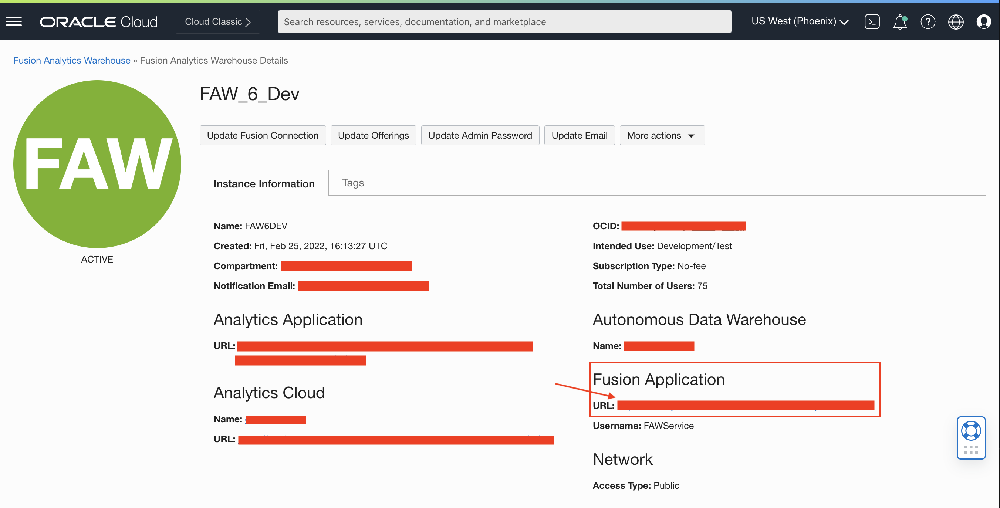
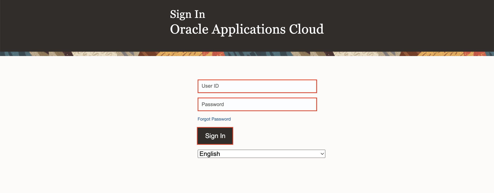
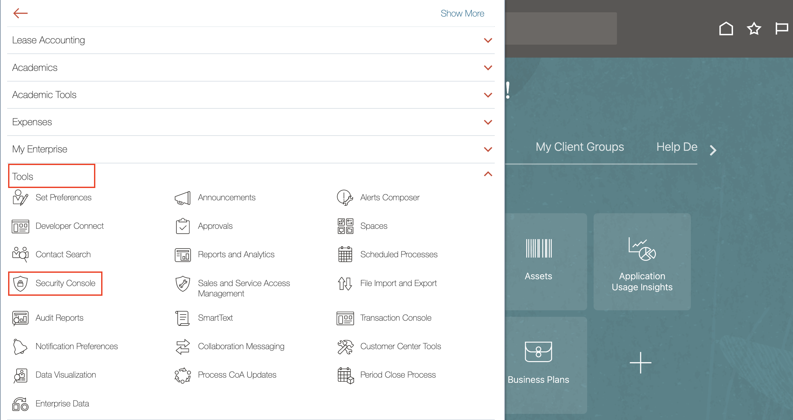
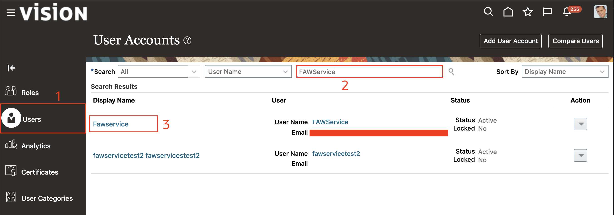
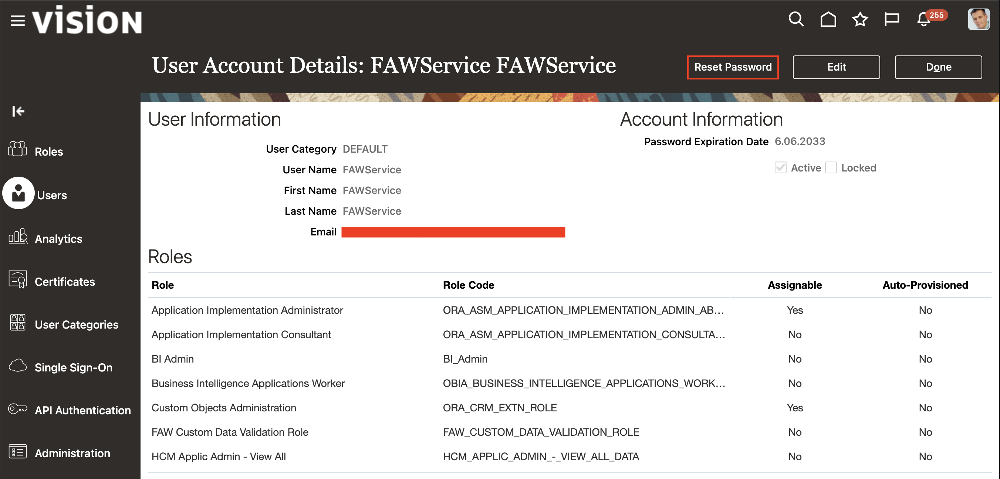
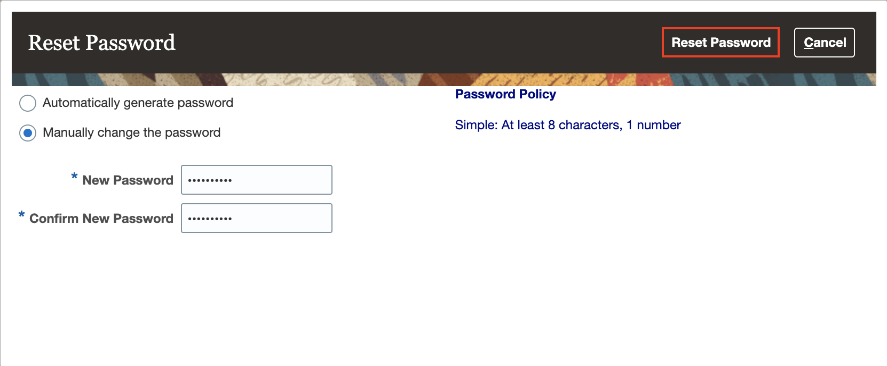
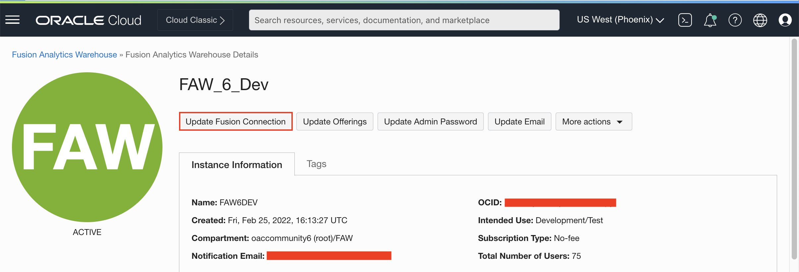
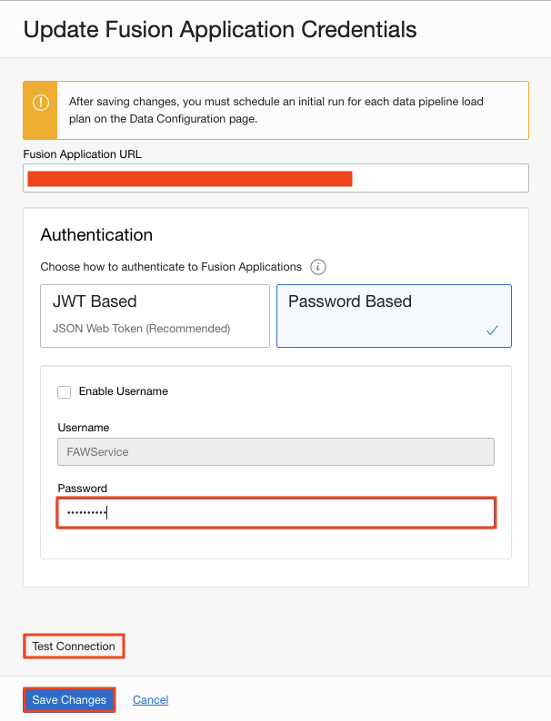

# How do I change the FAWService User's password in Fusion Analytics Warehouse (FAW)?

Duration: 2 minutes

When you get your Oracle Applications Cloud instance provisioned, you'll see a predefined user named FAWService. This user has the appropriate data security privileges on the Oracle Applications Cloud view objects to bulk extract data from Oracle Applications Cloud into the data warehouse.

You'll want to update the default password into something that is unique, ensuring it meets all of your company's password policy. This password is required if you decide to update the data source connection details or if you want to create a new FAW instance.

## Update the FAWService user's password

You **must** have access to the **security console** in Fusion Applications to successfully complete this Sprint.

1. From the OCI console, navigate to your **Fusion Application** URL.

    

2. **Sign In** to your Fusion Applications instance with a user who has access to the security console.

    

3. Click the **Navigator** menu on the top left and click **Tools**. Then select **Security Console**.

    

4. Within the security console, click **Users**. Then search for the user you want to update the password for. In this case, we'll search for **FAWService** and select the Fawservice user.

    

5. Here, we see the user's information and the roles that are assigned to this particular user. Click **Reset Password** on the top right.

    

6. You have two options, auto generate the password or manually change the password. Regardless of which option you choose, make sure that the new password follows your organization's password policies. Click **Reset Password** to save your changes and an email will be sent to the user with the new password.

    

7. Once the password has been updated, navigate back to your FAW instance details page within the OCI console. Click **Update Fusion Connection**.

    

8. Make sure the authentication method is Password Based. Enter the new FAWService user password in the password field and test your connection. Once the test is successful, click **Save Changes**.  

    

Congratulations, you have successfully learned how to change a Fusion Application user's password

## Learn More
* [Reset Passwords](https://docs.oracle.com/en/cloud/saas/applications-common/22c/facsa/Chunk1801397472.html#s20058155)

## Acknowledgements
* **Author** - Nagwang Gyamtso, Product Manager, Product Strategy
* **Last Updated By/Date** - Nagwang Gyamtso,  July 2022
