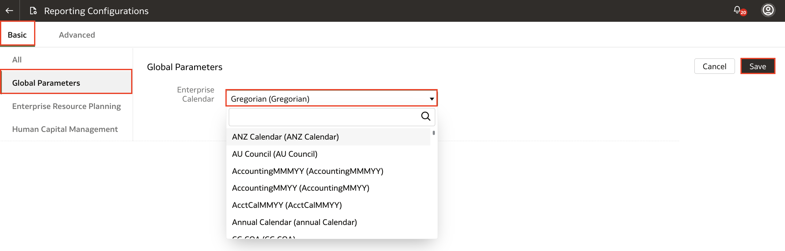

# How do I configure the global reporting parameters in Fusion Analytics Warehouse (FAW)?

Duration: 1 minute

The global parameters in Reporting Configurations allows you to specify the Enterprise Calendar, which is the reporting calendar used in Oracle Fusion Analytics Warehouse. This Sprint will guide you through specifying the Enterprise Calendar used in reporting.

## Global Report Parameters
>**Note:** You must have the **Functional Administrator** or **System Administrator** application role to successfully execute the following steps.

1. In your Fusion Analytics Warehouse homepage, click the **Navigation menu** and click **Console**.

    

2. Under Application Administration, click **Data Configuration**.

    

3. Within Data Configuration, click **Reporting Configurations**.

    

4. Withtin the Basic configurations, click **Global Parameters**. Select the **Enterprise Calendar** using the drop down. This will be the reporting calendar used in your Fusion Analytics Warehouse. Click **Save**.

    >**Note:** The time options seen in the reporting layer are based off the calendar that you select in this parameter.

    

Congratulations, you have just learned how to configure the Enterprise Calendar for your global reporting parameters!

## Learn More

* [Set Up the Global Report Parameters](https://docs.oracle.com/en/cloud/saas/analytics/22r2/fawag/set-global-report-parameters.html)

* [About Global Parameters](https://docs.oracle.com/en/cloud/saas/analytics/22r2/fawag/global-parameters.html)

## Acknowledgements
* **Author** - Nagwang Gyamtso, Product Manager, Product Strategy
* **Last Updated By/Date** - Nagwang Gyamtso,  July 2022
