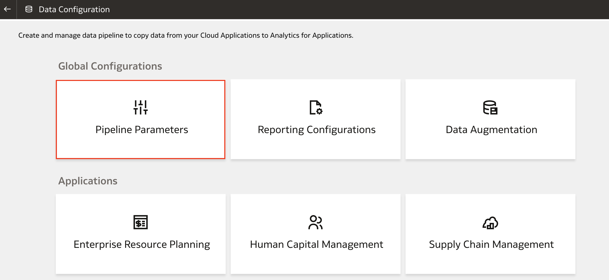
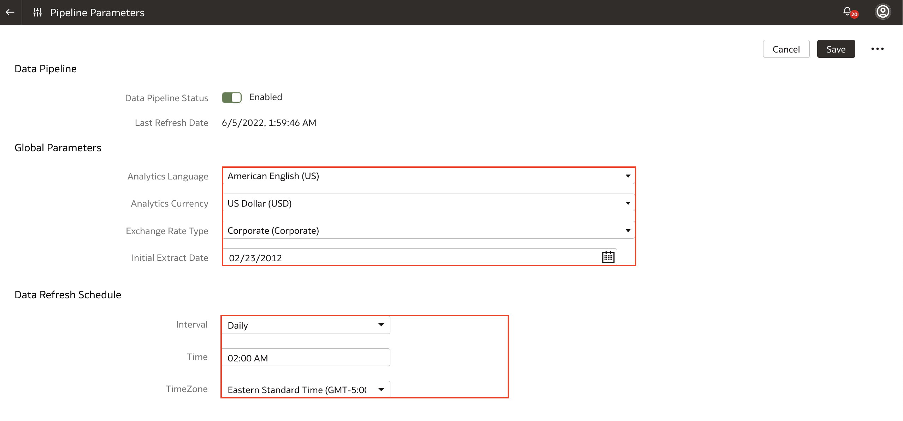
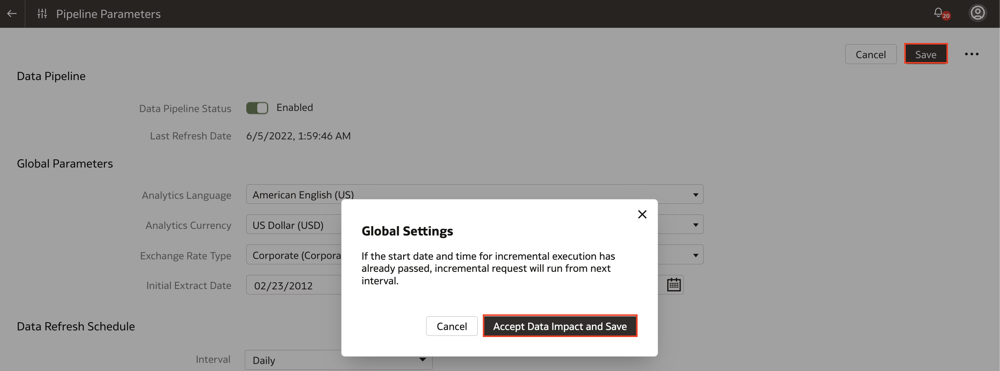

# How do I configure the Pipeline Parameters in Fusion Analytics Warehouse (FAW)?
Duration: 2 minutes

Before running your data pipelines for the functional areas in Fusion Analytics Warehouse, you must set up the pipeline parameters for your data model file. This Sprint will guide you on how to configure your pipeline parameters for your data model.

## Configure Pipeline Parameters
>**Note:** You must have the **Functional Administrator** or **System Administrator** application role to successfully execute the following steps.

1. In your Fusion Analytics Warehouse instance, click the **Navigation menu** and click **Console**.

    

2. Under **Application Administration**, click **Data Configuration.**

    

3. Under **Global Configuration**, click **Pipeline Parameters**.

    

4. Here, you will be able to configure the Data Pipeline, Global Parameters, and the Data Refresh Schedule. For the Global Parameters, configure the following:

    * Analytics Language: Specify the language you want the data to be extracted in.
        >**Note:** You must reset the warehouse to ensure that the changes are effective.

    * Analytics Currency: Specify the currency of the transaction data. A common currency helps to create meaningful enterprise-wide analysis and you may want to choose the currency based on where your headquarters is based.

    * Exchange Rate Type: Specify the exchange rate that you want to use when converting transactions amounts to the Analytics Currency.

    * Initial Extract Date: This is used when you extract data for a full load. If you need to change the initial extract date, make sure to reset the data warehouse and reactivate the functional area.

    For the Data Refresh Schedule, configure the following:

    * Interval, Time, TimeZone: Specify the frequency, time and timezone for when to schedule the data refresh.

    >**Note:** For more information about changing the Data Refresh Schedule, read [this Sprint](https://apexapps.oracle.com/pls/apex/dbpm/r/livelabs/run-workshop?p210_wid=3213&session=106134135621032).

    

5. Click **Save** and **Accept Data Impact and Save**.

    

Congratulations, you just learned how to configure the pipeline parameters for your data model file before running the data pipeline for the functional areas in Fusion Analytics Warehouse.

## Learn More
* [About Pipeline Parameters](https://docs.oracle.com/en/cloud/saas/analytics/22r2/fawag/pipeline-parameters.html)
* [Set Up the Pipeline Parameters](https://docs.oracle.com/en/cloud/saas/analytics/22r2/fawag/set-pipeline-parameters.html)
