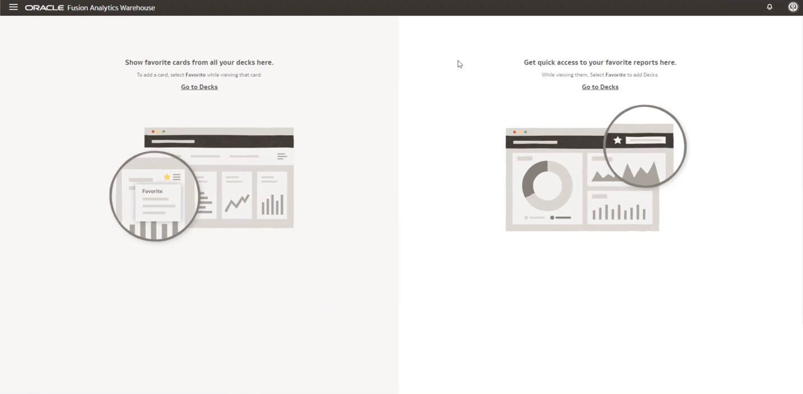
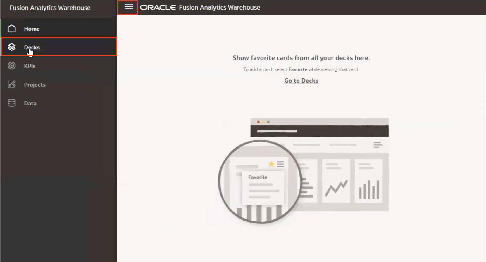
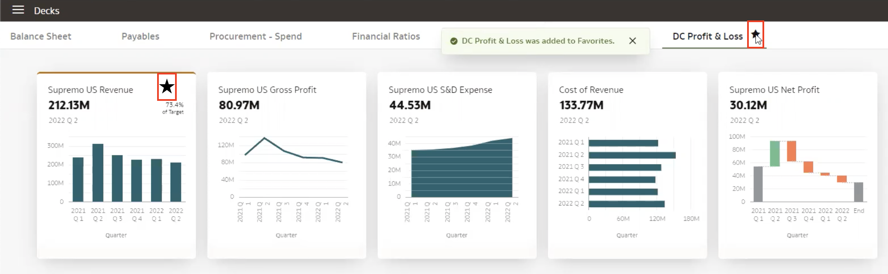
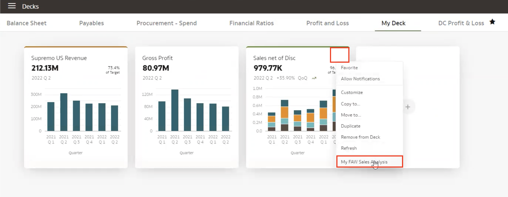
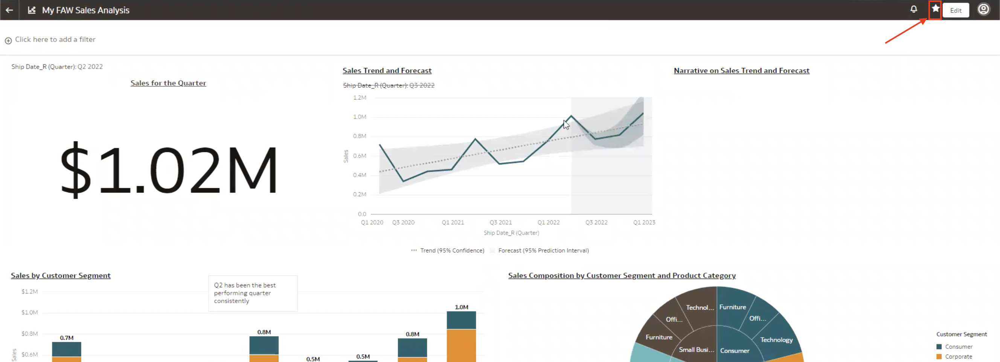
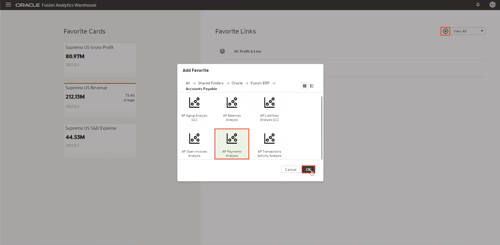

# How do I configure my homepage in Fusion Analytics Warehose (FAW)?
Duration: 2 minutes

When logging into your FAW instance for the first time, you will need to configure your homepage. You can personalize your homepage with your favorite cards and your favorite reports and this allows you to access your most used objects easily within the homepage. There are two sections of the homepage:
* Left side: Keep all key KPIs that you monitor on the left side of the homepage
* Right side: Keep links to access your favorite or frequently used reports on the right side of the homepage
    
    

The following steps will show you how to configure your homepage in FAW:

## Configure homepage
1. Using the **Navigator menu**, click on **Decks**. This will direct you to  all your decks and cards.

    

2. Once in your decks section, hover over the deck and/or cards and select **Add to Favorites** represented by the star to add your favorite decks to your homepage.

    

3. To add links to your favorite analyses' to the homepage, click on the actions menu for the card you want and click **My Analysis**. This will direct you to your analysis.

    

4. Within your analysis, click the **Add to Favorites** represented by the star on the top right corner of your page. This will add a link to this analysis on the homepage.

    

5. Navigate back to your homepage and your favorite cards and links will be displayed. To add more links to your favorite analysis', click the **+** button, find the analysis to add, and click **OK** to add this to the list of favorite links. 

    

    >**Tip:** If you want to remove a favorite card or link, hover over the object and click the **Remove from Favorites**, represented by the start icon.

Congratulations, you have now learned how to configure your homepage in Fusion Analytics Warehouse!

