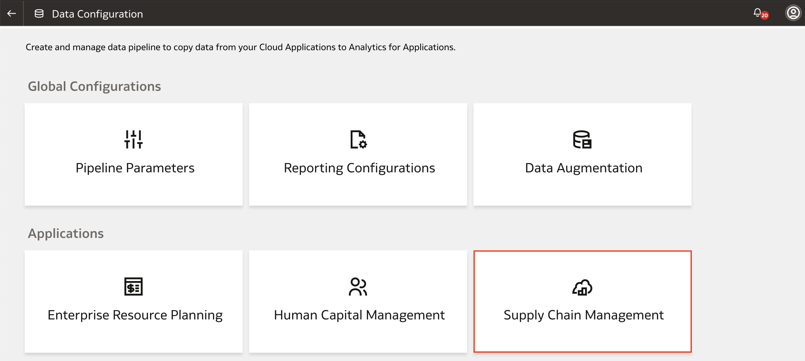

# How do I create a data pipeline for a functional area in Fusion Analytics Warehouse (FAW)?

Duration: 3 minutes

Creating a data pipeline for a functional area copies data from the functional area into the data warehouse. You can choose to activate the data pipeline immediately or schedule an execution date. Before you begin, make sure you have set up the pipeline parameters and report configurations. To learn how to do this, refer to the related Sprints menu bar.

## Activate new functional areas
You must have the Functional Administrator or Service Administrator role to successfully complete this Sprint.

1. In your Fusion Analytics Warehouse instance, click the **Navigation menu** and select **Console**.

  

2. Within the console, click **Data Configuration** under **Application Administration**.

  

3. Under **Applications** select the application that you want to create a data pipeline for. In this example, let's assume we want to activate the Inventory Balances functional area for our SCM Analytics offering. Click **Supply Chain Management**.

  

4. Click **Create** to create the data pipeline.

  

5. Select the Offering and Functional Area. For this example, select **Supply Chain Management Analytics** for the offering and **Inventory Balances** for the functional area. Click **Next**.

  

6. On step 3 of the process, review your selections and the global parameters. From here, you can **Cancel**, **Save**, or **Activate** the data pipeline. Clicking **Save** will save the data pipeline for the functional area but it will not activate it. Click **Activate** to determine when to initiate the activation.

  

7. You can either schedule an execution date for running the data pipeline for the functional area or have it run immediately. For this example, let's select **Run Immediately** and click **Finish**.

  

8. You will be directed to the list of functional areas for your application. Scroll to the right and you will find that the functional area you have created has been scheduled for activation.  

  

## Learn More

* [Create a Data Pipeline for a Functional Area](https://docs.oracle.com/en/cloud/saas/analytics/22r2/fawag/create-data-pipeline-functional-area.html)
* [Fusion Analytics Warehouse (HCM) - Enabling Talent Acquisition](https://community.oracle.com/customerconnect/discussion/566252/fusion-analytics-warehouse-hcm-enabling-talent-acquisition)

## Acknowledgements
* **Author** - Nagwang Gyamtso, Product Manager, Product Strategy
* **Last Updated By/Date** - Nagwang Gyamtso, August 2022
