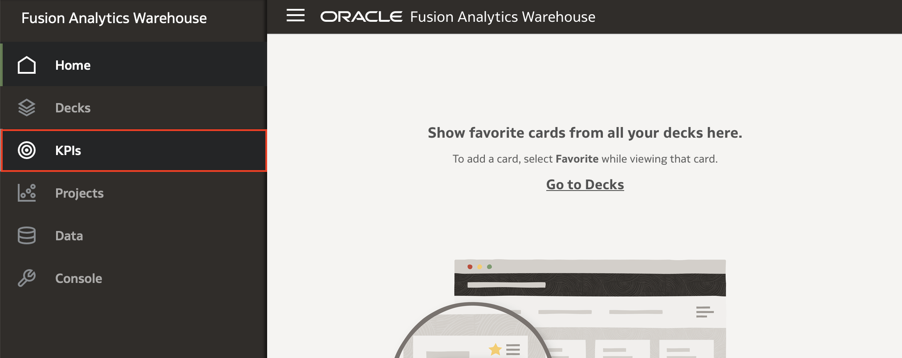
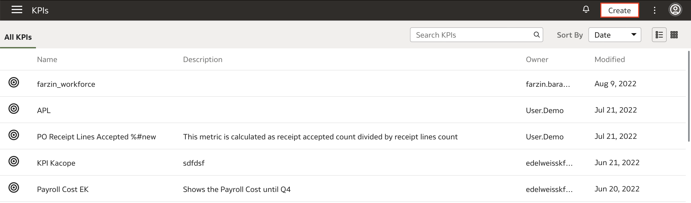
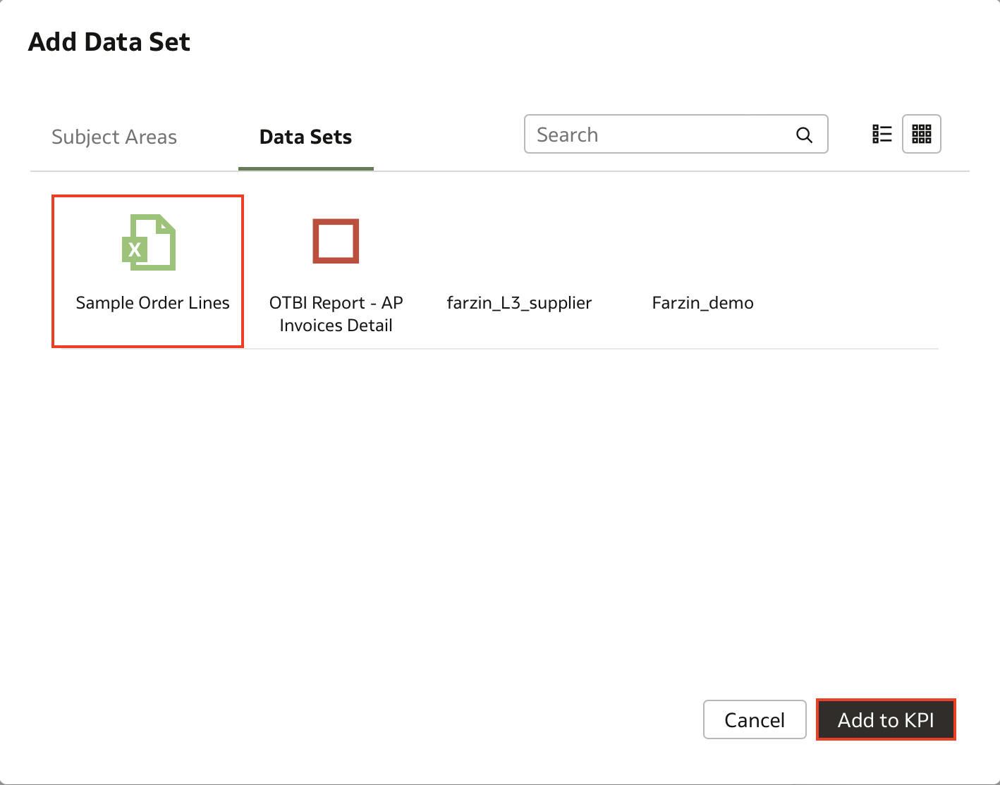
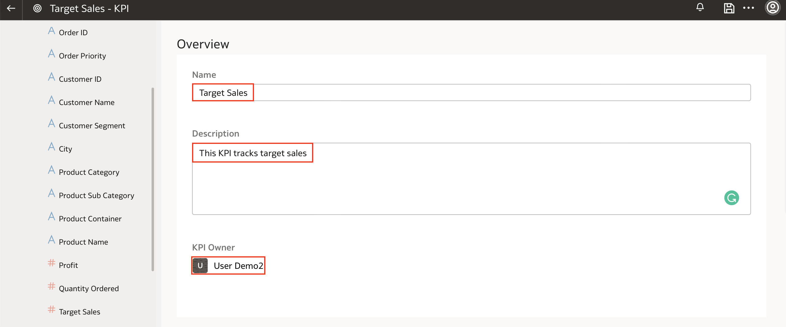
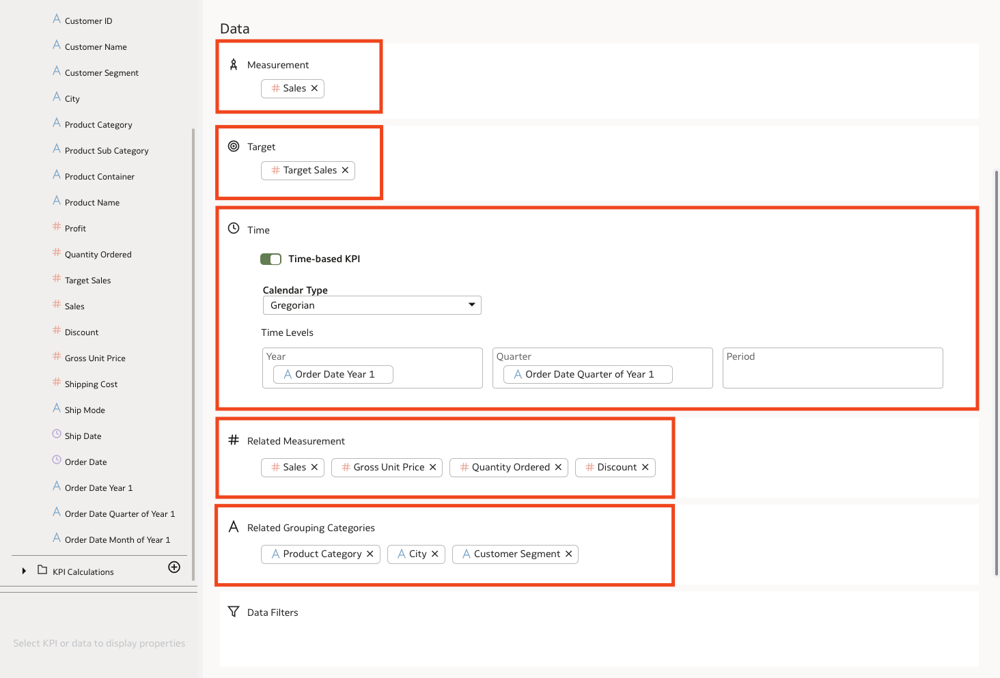
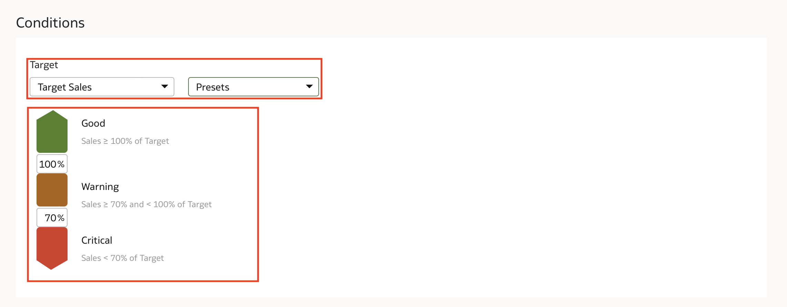
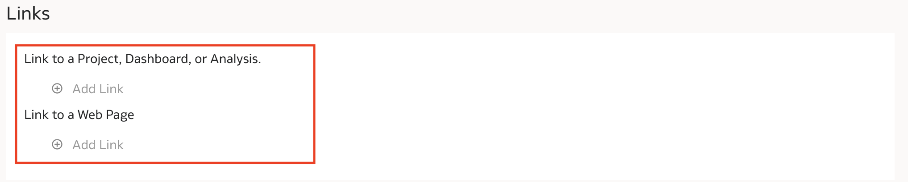
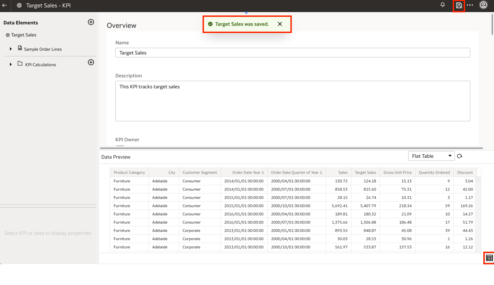
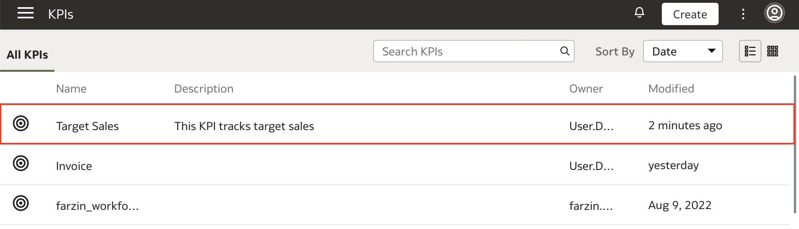

# How do I create a KPI in Fusion Analytics Warehouse (FAW)?
Duration: 2 minutes

Key Performance Indicators (KPIs) represent a comprehensive view of performance against a specific organizational goal and are used to track a measure or metric against a target.

## Create a KPI

>**Note:** You must have the **Author** system role to successfully complete this Sprint.

1. In your Fusion Analytics Warehouse instance, click the **Navigation** menu and select **KPIs**.

  

2. On the upper right hand corner, click **Create**.

  

3. In the **Add Data Set** box, select the **Subject Area(s)** or **Dataset(s)** you want to use. In this example, we'll select **Sample Order Lines** from the Datasets tab.

  

4. Enter the **Name**, **Description**, and **Owner** of the KPI in the **Overview** section.

  

5. In the **Data** section, drag and drop the column being measured in **Measurement**. If this KPI tracks a target, drag the target column that the KPI is measured against in **Target**. If you are comparing your KPI performance over time, enable the **Time-based KPI** option. If your KPI uses a dataset, select **Gregorian** or **Enterprise** and drag and drop the appropriate time levels from your dataset. If you are using a subject area, select column-driven and choose the appropriate column that the calendar is based on. For **Related Measurement** and **Related Grouping Categories** drag and drop the measurements and categories related to the KPI. If you have a filter you'd like to apply, drag and drop that into the **Data Filters** option.

  

6. If you had a measure in the target section, the **Conditions** section will have a chosen a target by default. The target defines the desired goals for the KPI such as Hit Target, Stay Above Target or Stay Below Target. In this example, we see that Sales is in good standing if it hits or exceeds the target, in warning status when its between 70% and 100% of the target, and in critical state when it's below 70% of the target. You can change these percentages and the presets to your business needs.

  

7. In the **Links** section, you have the ability to add links to Projects, Dashboards, or Analysis and to external Web Pages.

  

8. Once your desired configurations are set, hit **Save** on the upper right corner. You have the option to preview your data by clicking the **Show Data Preview** option on the bottom right corner.

  

9. Navigate back to the KPIs page and you will see the KPI you just created on the list.

  

Congratulations! You just learned how to create a KPI in Fusion Analytics Warehouse!

## Learn More

* [Create a KPI](https://docs.oracle.com/en/cloud/saas/analytics/22r2/fawug/create-kpi.html)
* [About KPIs](https://docs.oracle.com/en/cloud/saas/analytics/22r2/fawug/kpis.html)

## Acknowledgements
* **Author** - Nagwang Gyamtso, Product Manager, Product Strategy
* **Last Updated By/Date** - Nagwang Gyamtso,  October 2022
