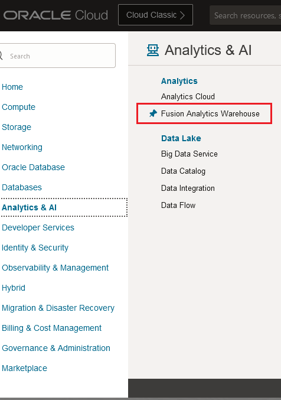
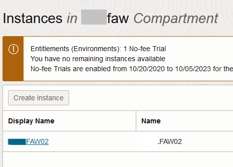
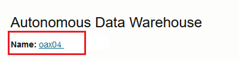
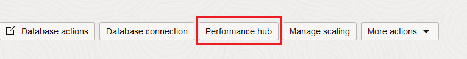
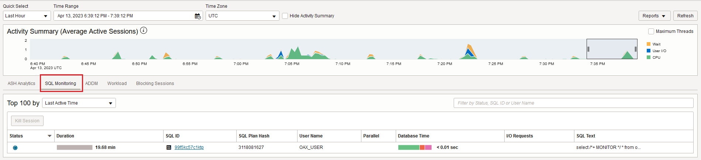
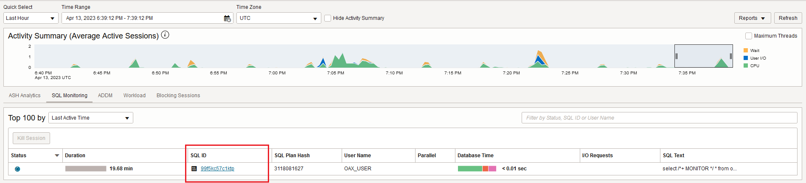
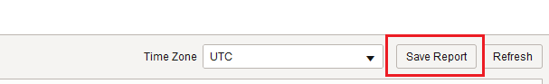
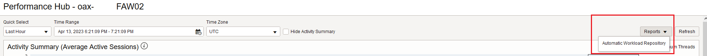
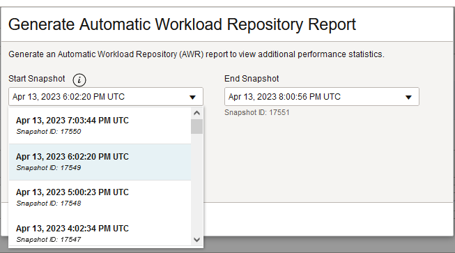

# How do I download SQL Monitor and AWR Reports for my FAW database?
Duration: 5 minutes

FAW customers with ADMIN access can download SQL monitor or AWR reports to gather performance information on their FAW reports and database.

## Download SQL Monitor and AWR Reports

>**Note:** You must have access to the **ADMIN** password in ADW to complete this Sprint.

1. In OCI, click the **Navigation** menu and select **Fusion Analytics Warehouse**.

  

2. Click the name of your **FAW instance**.

  

3. Within your FAW Instance, click on **Autonomous Data Warehouse link**.

  

4. Within Autonomous Data Warehouse, click **Performance Hub**.

  

5. Within Performance Hub, choose **SQL Monitor** tab.

  

6. In the SQL Monitor Tab, choose the **SQL ID** of interest.

  

7. Choose **Save Report**.

  

8. In Performance Hub, **Select Reports, Automatic Workload Repository**.

  

9. Select Choose Snapshot Range.

  

10. Select **Download** to download the AWR Report.

  

##Learn More
* [Autonomous Database Performance Hub](https://docs.oracle.com/en/cloud/paas/autonomous-database/adbsa/autonomous-monitor-perf-hub.html)

## Acknowledgements
* **Author** - Lisa Garczynski
* **Last Updated By/Date** - Lisa Garczynski, April 2023
