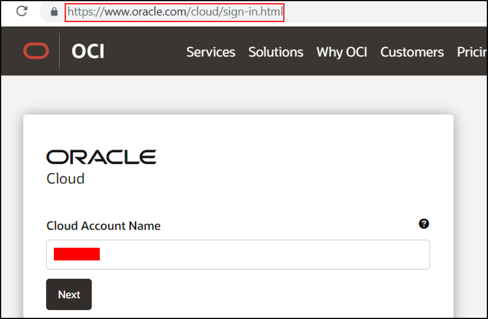
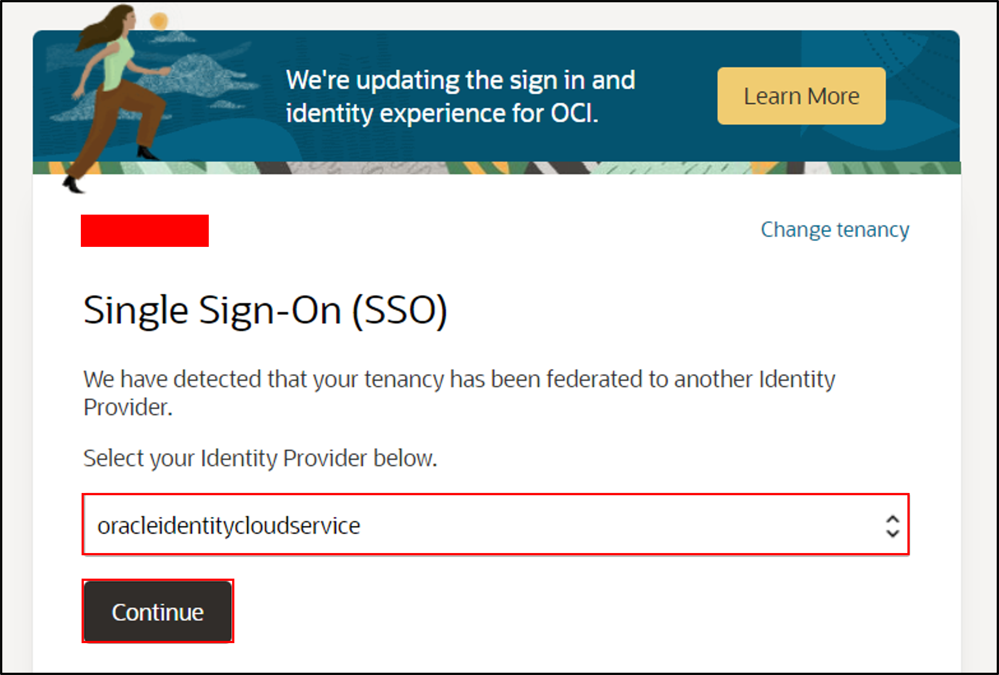
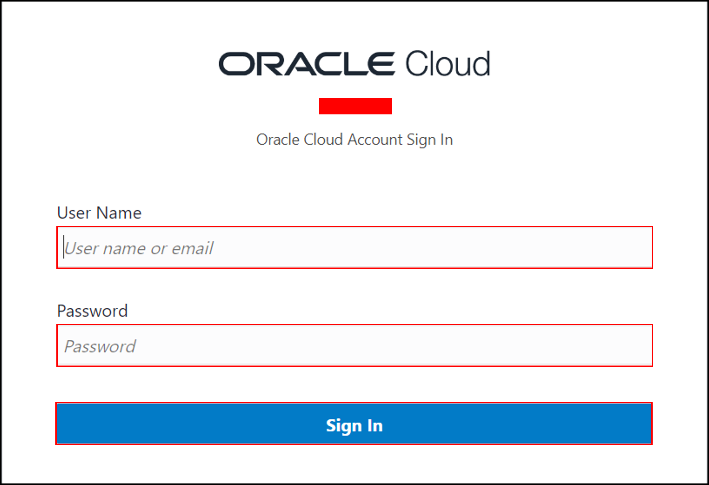
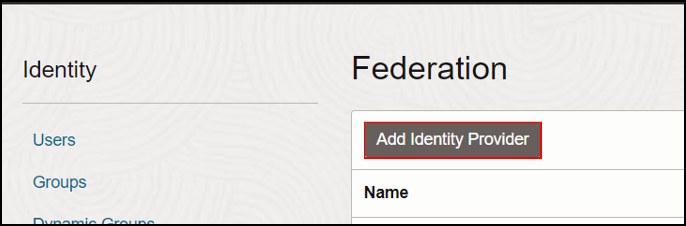
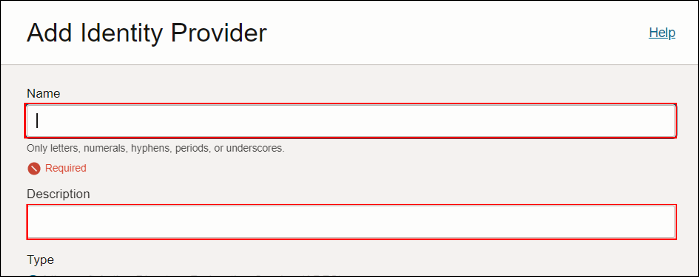
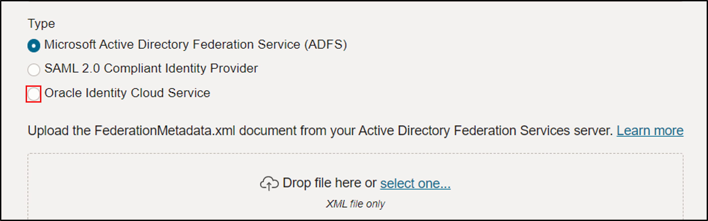
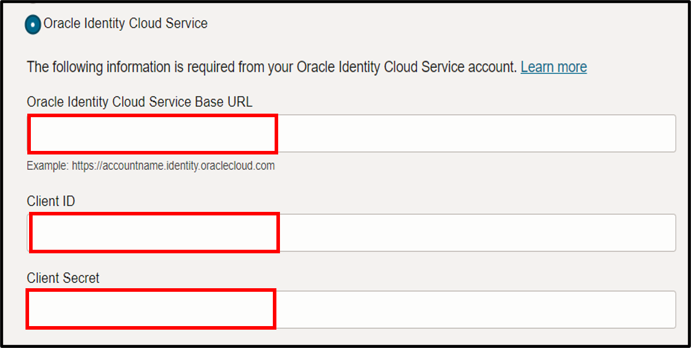
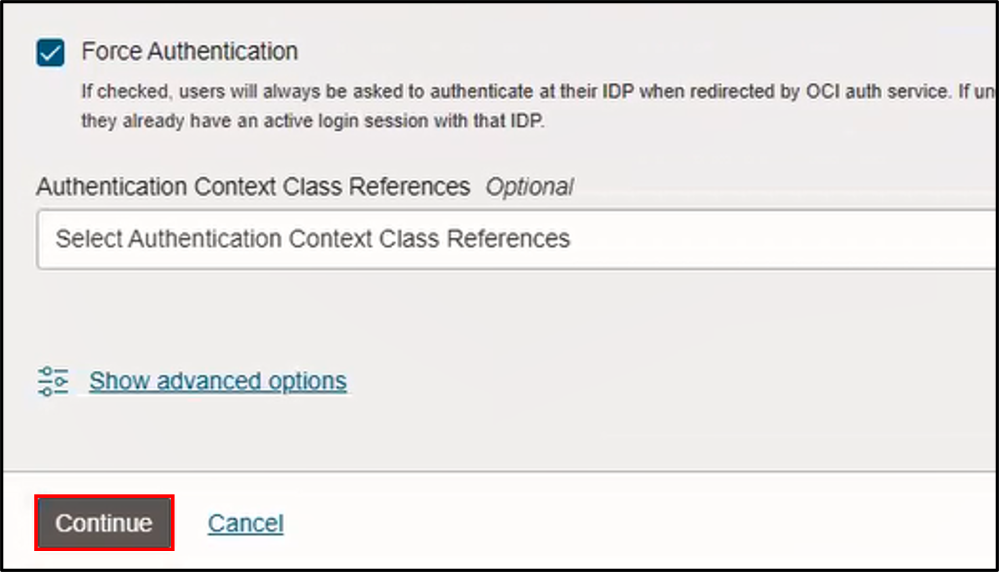
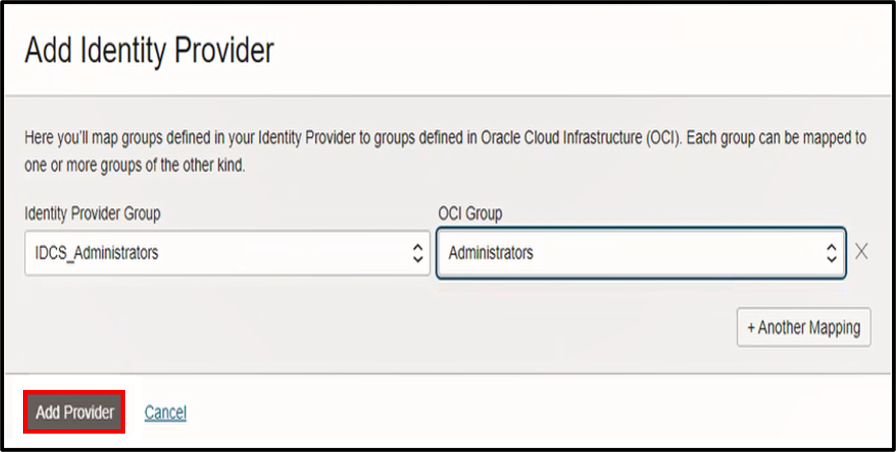
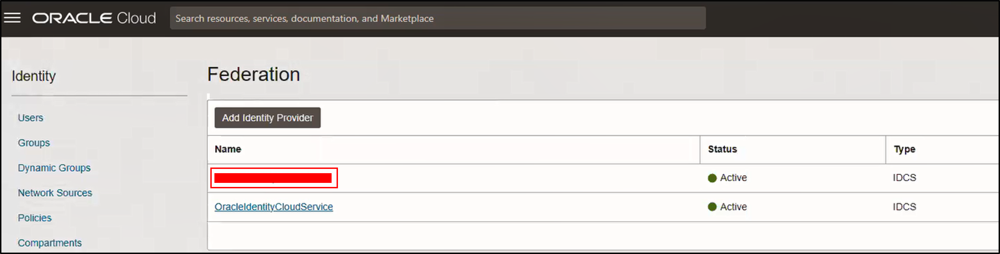

# How do I federate the Oracle Identity Cloud Service (IDCS) for Fusion Analytics Warehouse (FAW)?

Duration: 5 minutes

Before provisioning a Fusion Analytics (FA) instance, you may need to: 1. Set up synchronization of Oracle Fusion Cloud Applications with Oracle Identity Cloud Service and 2. Federate the Oracle Identity Cloud Service Instance to your Oracle cloud infrastructure tenancy. This is the second of the three live labs series in the provisioning of FA instance. It is assumed that you have completed the first live lab (How do I Synchronize Oracle Applications with Oracle Identity Cloud Service (IDCS)?)  in this series. This live lab will help you with the steps to federate Oracle Identity Cloud Service.

## Federate IDCS

>**Note:** You must be the **OCI Cloud Account Administrator** to successfully complete this Sprint.

1. Open a web browser and navigate to the [Oracle Cloud](https://www.oracle.com/cloud/sign-in.html). Enter the **Cloud Account Name** and click **Next**.

  

    >**Note**:This is the cloud account where FA will be provisioned.

3. Select **oracleidentitycloudservice** as the Identity Provider and click **Continue**.

  

4. Enter the **User Name**, **Password** and click on **Sign In**.

  

5. Click the **Navigator menu** and select **Identity & Security**. Within Identity, select **Federation**.

  

6. Within Federation, click **Add Identity Provider**.

  

7. Within **Add Identity Provider**, enter the **Name**, **Description**.

  

8. Under **Type**, select the **Oracle Identity Cloud Service** radio button.

  

9. Enter the **Oracle Identity Cloud Service Base URL**, **Client ID** and **Client Secret**.

    >**Note**: For the values of Oracle Identity Cloud Service Base URL, Client ID and Client Secret, refer to the text file that was saved as part of first Live Lab in this series.

  

10. Within **Add Identity Provider**, select **Force Authentication** and click **Continue**.

  

11. Map Identity Provider Group to OCI Group by selecting **IDCS_Administrators** within Identity Provider Group to **Administrators** within OCI Group. Click **Add Provider**.

  

12. You should see the Identity Provider listed under Name.

    >**Note**: You will use this Identity Provider to sign in to cloud account to provision the FA instance.

  

## Learn More

* [Federate the Oracle Identity Cloud Service Instance to Your Oracle Cloud Infrastructure Tenancy](https://docs.oracle.com/en/cloud/saas/analytics/23r1/fawag/set-user-access-oracle-fusion-analytics-warehouse-using-single-sign.html#GUID-660B82C3-679F-4B8D-82DE-629E6DB1708C)

## Acknowledgements
* **Author** - Sandeep Bade, CEAL
* **Last Updated By/Date** - Sandeep Bade, April 2023
