# How do I generate content bundles in Fusion Analytics Warehouse (FAW)?
Duration: 3 minutes

There may be scenarios where you want to backup or migrate content between Fusion Analytic Warehouse instances. A content bundle includes snapshots of Oracle Analytics Cloud folders, workbooks, dataset definitions, KPIs, decks and duty roles for content. This can then be exported and then deployed across different FAW instances.

## Generate content bundles

>**Note:** You must have the **Service Administrator** role and access to the **Security Console** to successfully complete this Sprint.

1. In your Fusion Analytics Warehouse instance, click the **Navigation** menu and select **Console**.

  

2. Within the console, click **Bundles** under **Application Administration**.

  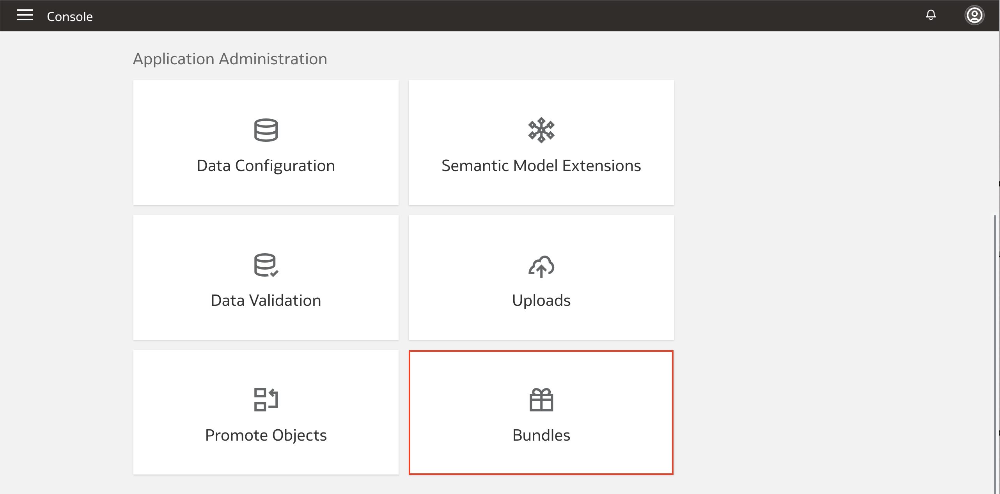

3. Click **Create** to view the different types of bundles available and select **Content Bundle**.

  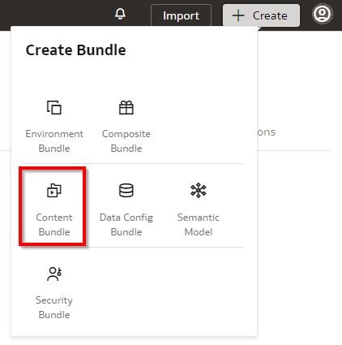

4. Enter a **Name** and **Description** for the bundle. It is possible to include all custom OAC content, Decks and KPIs in the bundle, or you can select specific custom objects to include in the bundle. To include all custom content in the bundle, select **Include All Content**. This removes the options to select OAC Content, Decks and KPIs as these will all be included automatically in the content bundle.

  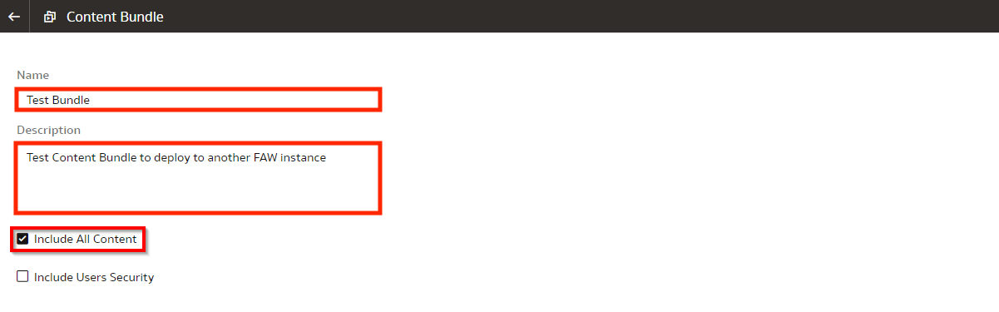

5. To select specific custom OAC Content, uncheck **Include All Content** and  click **Select OAC Content**.

  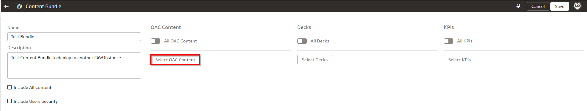

6. Navigate to the OAC Content you wish to include in the content bundle under **Shared Folders** and select the check box and click **OK**.

  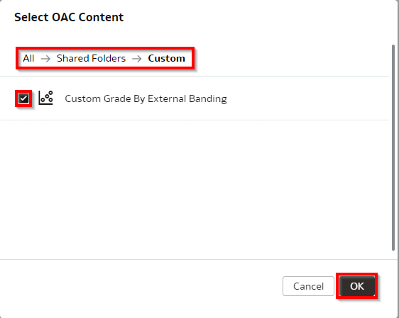

7. To include All custom Decks in the content bundle, enable the **All Decks** option.

  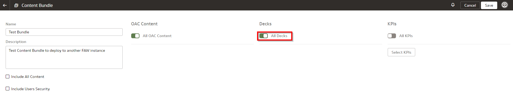

8. To select specific custom Decks in the content bundle click **Select Decks**.

  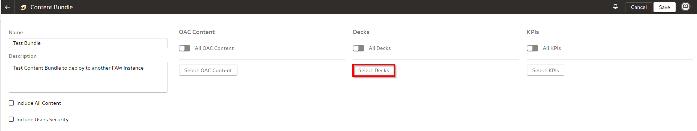

9. Select the check box next to the custom Decks you wish to include in the content bundle and click **Done**.

  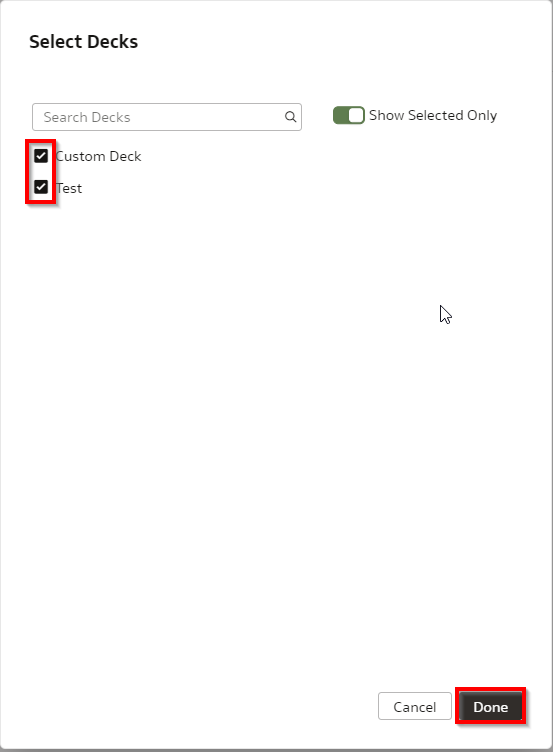

10. To include All custom KPIs in the content bundle enable the **All KPIs** option.

  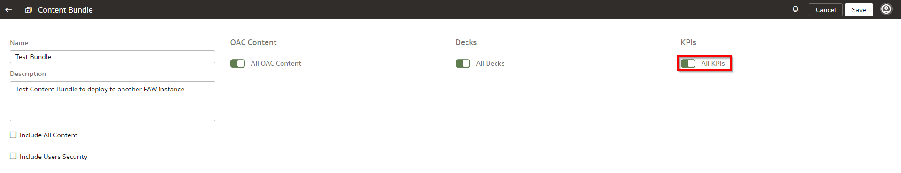

11. To select specific custom KPIs in the content bundle click **Select KPIs**.

  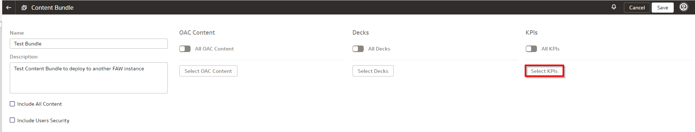

12. Select the check box next to the custom KPIs you wish to include in the content bundle and click **Done**.

  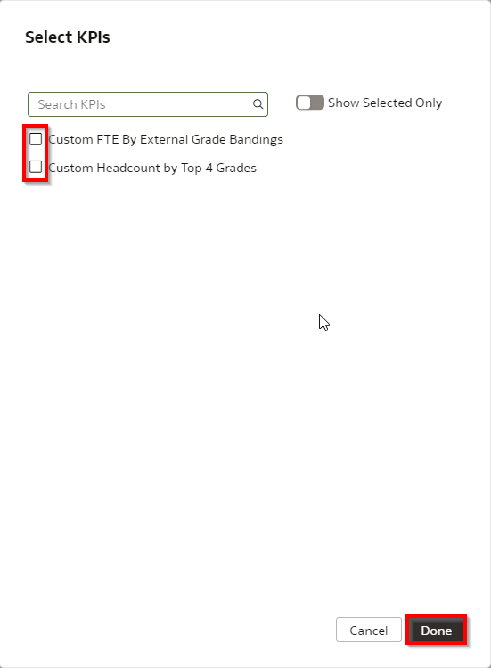

13. To include user security content in the bundle, select **Include Users Security**. N.B Group security is automatically included in the bundle. Click **Save**.

  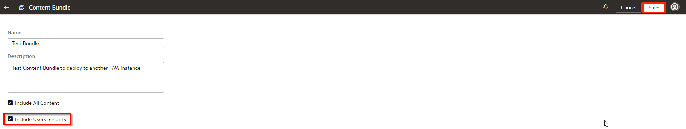

14. Once the content bundle is saved, we must generate the content bundle. Click the **Actions** button and select **Generate**.

  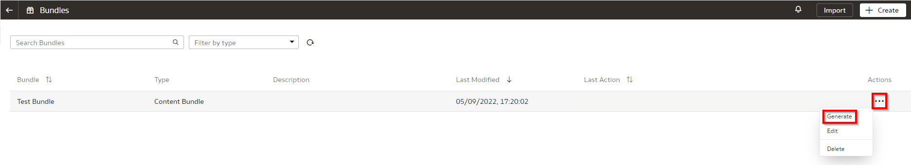

15. Click **Generate** to confirm that you want to generate the bundle.

  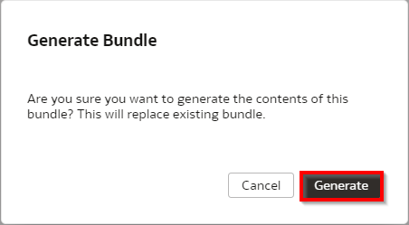

16. Verify the bundle generation has been **Scheduled**.

  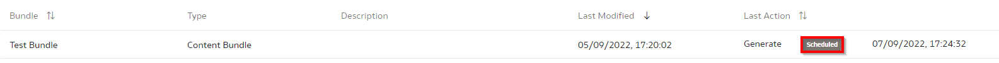

17. After some time, verify the bundle generation has **Completed**.

  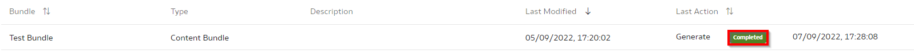

Congratulations, you have just learned how to generate content bundles to export and deploy across different Fusion Analytics Warehouse instances!

## Learn More

* [Bundle Your Application Artifacts](https://docs.oracle.com/en/cloud/saas/analytics/22r2/fawag/bundle-your-application-artifacts.html#GUID-596E4D3E-9E23-4A7C-ACF2-A57D8B4FB41C)

## Acknowledgements
* **Author** - Craig Andrews, CEAL
* **Last Updated By/Date** - Nagwang Gyamtso,  October 2022
