# How do I create and deploy security bundles in Fusion Analytics Warehouse (FAW)?
Duration: 4 minutes

There may be scenarios where you want to backup or migrate security between Fusion Analytic Warehouse instances. A security bundle includes groups and application roles that are synced or have been created in Fusion Analytics Warehouse. This can be exported and then deployed across different FAW instances.

## Create and deploy a security bundle

>**Note:** You must have access to the **security console** to successfully complete this Sprint.

1. In your Fusion Analytics Warehouse instance, click the **Navigation** menu and select **Console**.

  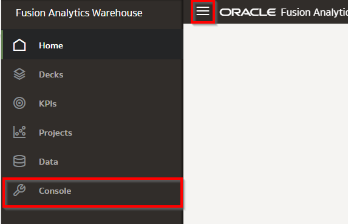

2. Within the console, click **Bundles** under **Application Administration**.

  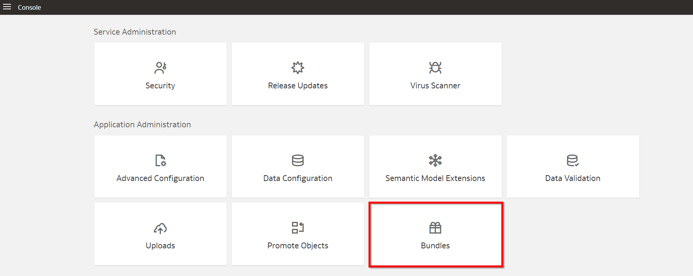

3. Click **Create** to view the different types of bundles available and select **Security Bundle**.

  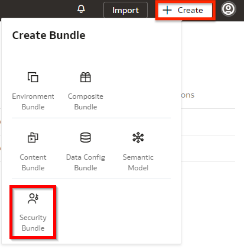

4. Enter a name and a description for the bundle.

  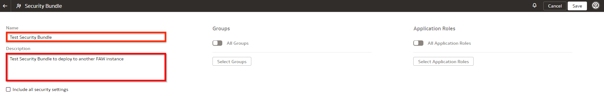

5. To include All Groups in the Security bundle, enable the **All Groups** option.

  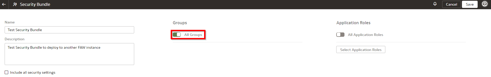

6. To select specific Groups in the security bundle click **Select Groups**.

  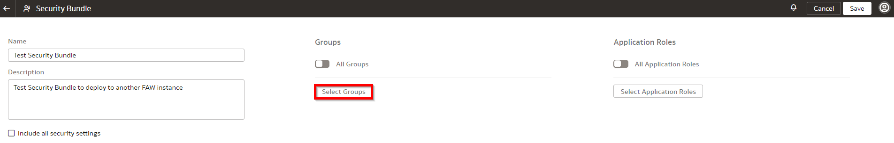

7. Select the checkbox next to each of the groups you wish to include in the security bundle and click **Done**.

  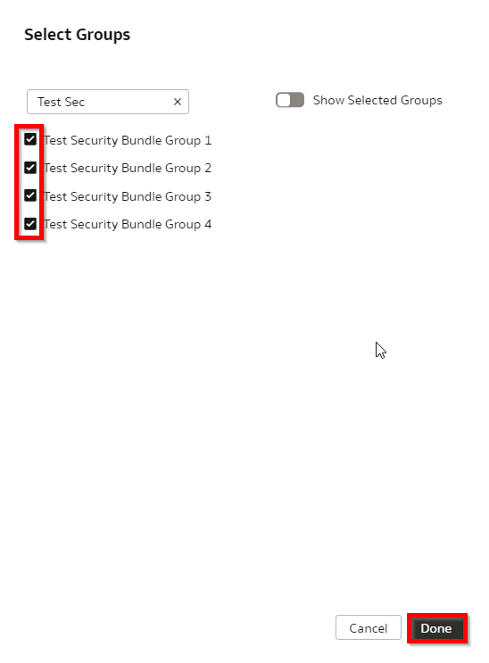

8. To include All Application Roles in the security bundle, enable the **All Application Role** option.

  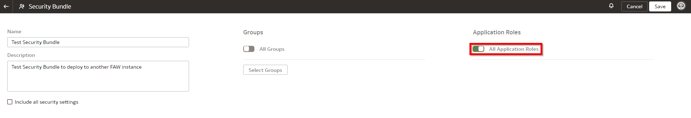

9. To select specific Application Roles in the security bundle click **Select Application Roles**.

  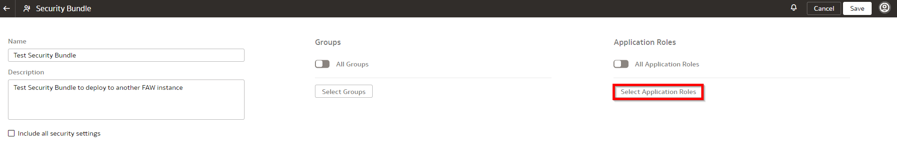

10. Select the checkbox next to each of the Application Roles you wish to include in the security bundle and click **Done**.

  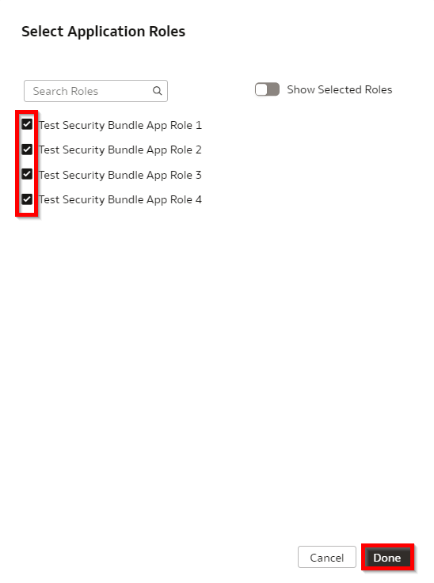

11. To include all security settings in the security bundle, select **Include all Security Settings**.

  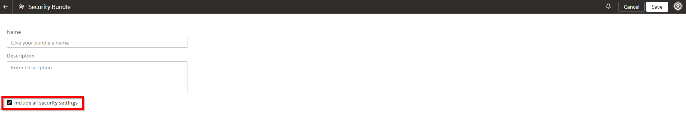

12. Save the security bundle by clicking **Save**.

  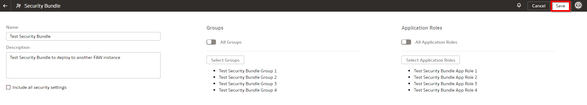

13. From the bundles page, generate the Security Bundle by clicking the **Actions** button and selecting **Generate**.

  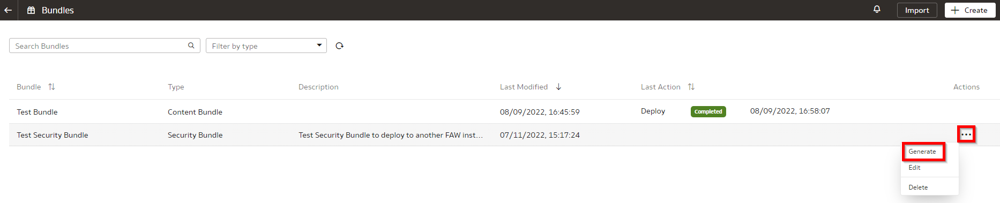

14. Click **Generate** to confirm that you want to generate the bundle.

  

15. The status for your bundle will be **Scheduled** and after some time, it will update to **Completed**.

  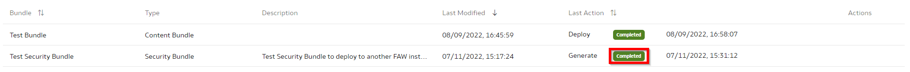

16. To migrate the semantic model to another environment, select the **Action** button and choose **Export**.

  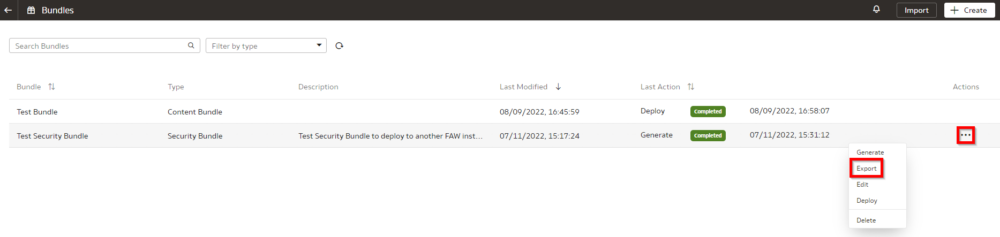

17. Click **import** to import the previously exported semantic extension bundle to the new environment.

  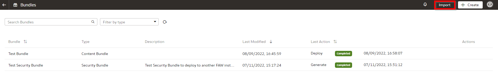

18. Drag the semantic extension bundle file from the local directory and click **Import**.

  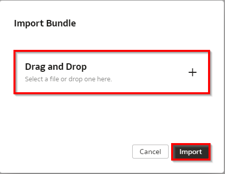

19. Verify that the imported bundle has been **Completed** successfully.

  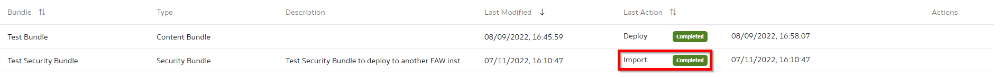

20. Click on the **Actions** menu and then **Deploy** to deploy the security bundle.

  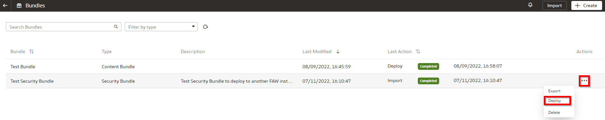

21. Confirm deployment of the bundle by clicking **Deploy**.

  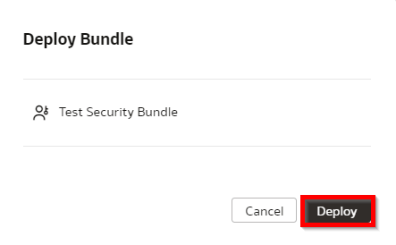

22. The status for your deployment will change to **Scheduled** and then **Completed** after some time. Verify that the deployment has Completed.

  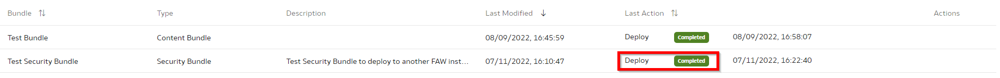

## Learn More
* [Bundle Your Application Artifacts](https://docs.oracle.com/en/cloud/saas/analytics/22r3/fawag/bundle-your-application-artifacts.html)

## Acknowledgements
* **Author** - Craig Andrews, CEAL
* **Last Updated By/Date** - Nagwang Gyamtso, November 2022
