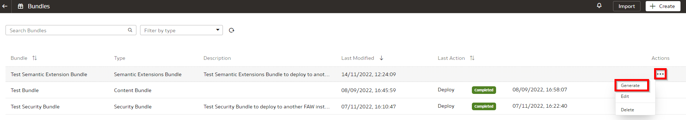

# How do I create and deploy semantic model bundles in Fusion Analytics Warehouse (FAW)?
Duration: 4 minutes

There may be scenarios where you want to back up or migrate semantic model extensions between Fusion Analytic Warehouse instances.  A semantic model bundle allows you to bundle extensions where they have been tagged as part of the main branch or are defined in branches that are yet to be merged into the main branch.  These can be exported and then deployed across different FAW instances.

## Backup and restore environment using bundles

>**Note:** You must have the **Service Administrator** role to successfully complete this Sprint.

1. In your Fusion Analytics Warehouse instance, click the **Navigation** menu and select **Console**.

  

2. Within the console, click **Bundles** under **Application Administration**.

  

3. Click **Create** to view the different types of bundles available and select **Semantic Bundle**.

  

4. Enter a name and a description for the bundle.

  

5. It is possible to include all semantic extensions, or you can select specific tags or branches to include in the bundle. To include ALL semantic extensions in the bundle, select **Include all semantic extensions**. This removes the options to select specific tags or branches as these will all be included automatically in the semantic extension bundle.

  

6. To include all security configurations as part of the semantic extensions bundle, which includes the definitions of any duty or data roles defined in semantic extensions, select **Include security configurations**.

  

7. To include a specific branch or tag in the semantic model extension bundle, you can select the branch or tag from the drop down list. Once selected, the branch or tag and any dependencies are automatically selected under the Main Branch Tags section or the Customizations Branches section.

  

8. To include All Tags in the Semantic Extension bundle, enable the **All Tags** option.

  

9. To select specific Tags in the semantic extension bundle click **Select Tags**.

  

10. Select the checkbox next to each of the tags you wish to include in the semantic extension bundle and click **Done**.

  

11. To include All Branches in the semantic extensions bundle, enable the **All Branches** option.

  

12. To select specific Branches in the semantic extensions bundle click **Select Branches**.

  

13. Select the checkbox next to each of the Branches you wish to include in the semantic extension bundle and click **Done**.

  

14. Save the semantic extension bundle by clicking **Save**.

  

15. From the bundles page, generate the Semantic Extension Bundle by clicking the **Actions** button and selecting **Generate**.

  

16. Click **Generate** to confirm that you want to generate the bundle.

  

17. The status for your bundle will be **Scheduled** and after some time, it will update to **Completed**.

  

18. To migrate the semantic model to another environment, select the **Action** button and choose **Export**.

  

19. Click **import** to import the previously exported semantic extension bundle to the new environment.

  

20. Drag the semantic extension bundle file from the local directory and click **Import**.

  

21. Verify that the imported bundle has been **Completed** successfully.

  

22. Click on the **Actions** menu and then **Deploy** to deploy the semantic extension bundle.

  

23. Confirm deployment of the bundle by clicking **Deploy**.

  

24. The status for your deployment will change to **Scheduled** and then **Completed** after some time. Verify that the deployment has Completed.

  

## Learn More
* [Bundle Your Application Artifacts](https://docs.oracle.com/en/cloud/saas/analytics/22r3/fawag/bundle-your-application-artifacts.html)

## Acknowledgements
* **Author** - Craig Andrews, CEAL
* **Last Updated By/Date** - Nagwang Gyamtso,  November 2022
