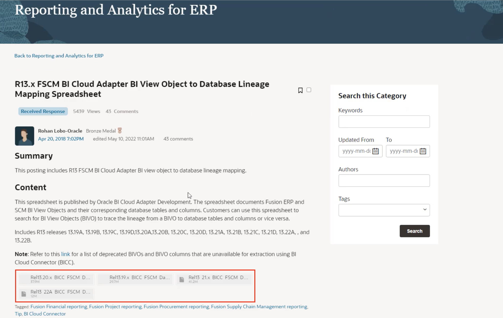
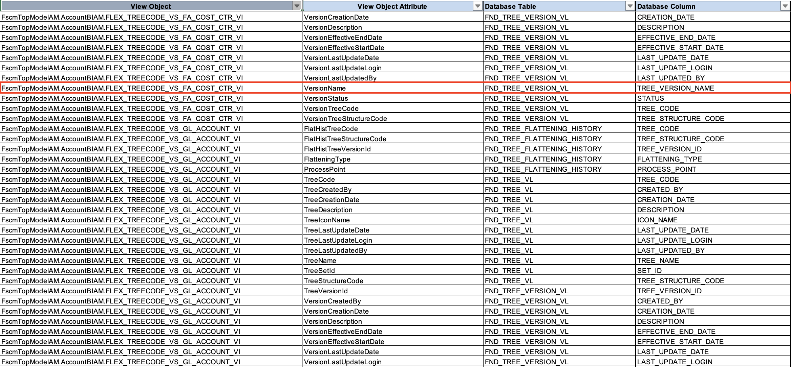
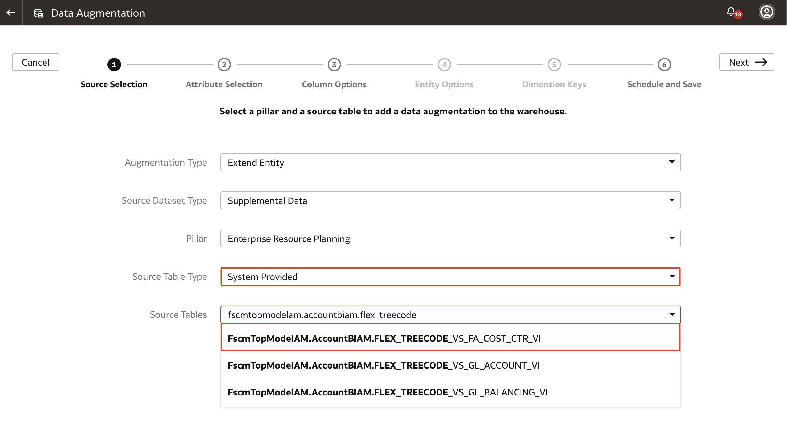

# How do I locate which View Object I should use in my Data Augmentation for Fusion Analytics Warehouse (FAW)?
Duration: 3 minutes

Data Augmentation is the process of modifying a dataset with additional data to improve the accuracy of your data. In Fusion Analytics Warehouse, Data Augmentation allows you to enrich your datasets by extending an existing entity or group of facts, by adding a new dimension in the target instance, and by adding a new fact in the target instance. In this Sprint, we will learn how to locate which View Object we should use in our Data Augmentation in FAW.

## Locate view objects

1. Navigate to the Cloud customer connect webpage by clicking this [link](https://community.oracle.com/customerconnect/discussion/47652/r13-x-fscm-bi-cloud-adapter-bi-view-object-to-database-lineage-mapping-spreadsheet/p1). You must be signed into your Oracle account. 

2. Scroll down to the **Note** section and you will find four excel sheets that are available for download. Locate and download the approriate excel file related to your fusion application. 

    

3. Open the downloaded excel sheet and look for the **Database Column** or **Database Table** you have used in your BI Publisher. Once you have found the specific column and the table, locate the corresponding **View Object** value.
    
    

4. Enter the View Object in the **Source Table** of your Data Augmentation. If you are not able to find the View Object in Data Augmentation, open an SR and you will be whitelisted. 

    

Congratulations, you have just learned how to locate which View Object to use in your Data Augmentation for Fusion Analytics Warehouse! If you are curious to learn more about Data Augmentation, find the links below!

## Learn More
* [About Augmenting Your Data](https://docs.oracle.com/en/cloud/saas/analytics/22r1/fawag/augmenting-your-data.html#GUID-9629669C-3DCF-451D-BDA3-187366350973)

* [Enrich FAW Data and Visualizations Using Data Augmentation](https://blogs.oracle.com/analytics/post/enrich-fusion-analytics-warehouse-data-and-visualizations-using-data-augmentation#:~:text=Data%20Augmentation%20is%20an%20amazing,by%20adding%20a%20new%20fact.)

* [Using FAW Data Augmentation and Analytics Cloud Data Replication To Extend FAW Data Layer](https://www.ateam-oracle.com/post/using-faw-data-augmentation-and-analytics-cloud-data-replication-features)

