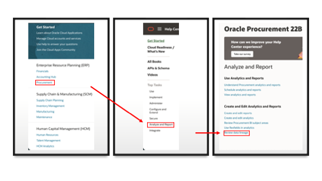

# How do I locate which View Object I should use in my Data Augmentation for Fusion Analytics Warehouse (FAW)?

Duration: 3 minutes

In Fusion Analytics Warehouse, Data Augmentation helps you to add data to your reports from various data stores (Business Intelligence view objects) of the Oracle Applications Cloud data sources. You can augment your reports with datasets created by extending an existing entity or group of facts, by adding a new dimension in the target instance, and by adding a new fact in the target instance. In this Sprint, we will learn how to locate which View Object we should use in our Data Augmentation in FAW.

## Locate view objects
>**Note:** You must have the **Service Administrator** application role to successfully complete the following steps. 

1. Locate OTBI subject area to database lineage mapping spreadsheets. You can find references to them in the Fusion Applications Suite page by clicking this [link](https://docs.oracle.com/en/cloud/saas/index.html). Select the application you want the mapping spreadsheet for and click **Analyze and Report** under **Top Tasks**. Then click **Review data lineage**. You must be signed in to your Oracle account.
    >**Note:** Once you sign in, click back to the tab where you clicked **Analyze and Report** and click the link again. It should now direct you to the page with the spreadsheets.

  

2. Scroll down towards the end of the post and you will find excel sheets that are available for download. Locate and download the appropriate excel file related to your fusion application.

    

3. Open the downloaded excel sheet and look for the **Database Column** or **Database Table** you have used in your BI Publisher. Once you have found the specific column and the table, locate the corresponding **View Object** value.

    

4. Enter the View Object in the **Source Table** of your Data Augmentation. If you cannot find the View Object in Data Augmentation with the option **System Provided** for **Source Table Type**, open an SR and request to whitelist that View Object. The other option is to enter **Customer Provided** for **Source Table Type**.

    

Congratulations, you have just learned how to locate which View Object to use in your Data Augmentation for Fusion Analytics Warehouse! If you are curious to learn more about Data Augmentation, find the links below!

## Learn More
* [About Augmenting Your Data](https://docs.oracle.com/en/cloud/saas/analytics/22r1/fawag/augmenting-your-data.html#GUID-9629669C-3DCF-451D-BDA3-187366350973)

* [Enrich FAW Data and Visualizations Using Data Augmentation](https://blogs.oracle.com/analytics/post/enrich-fusion-analytics-warehouse-data-and-visualizations-using-data-augmentation#:~:text=Data%20Augmentation%20is%20an%20amazing,by%20adding%20a%20new%20fact.)

* [Using FAW Data Augmentation and Analytics Cloud Data Replication To Extend FAW Data Layer](https://www.ateam-oracle.com/post/using-faw-data-augmentation-and-analytics-cloud-data-replication-features)

## Acknowledgements
* **Author** - Nagwang Gyamtso, Product Manager, Product Strategy
* **Last Updated By/Date** - Nagwang Gyamtso,  June 2022
