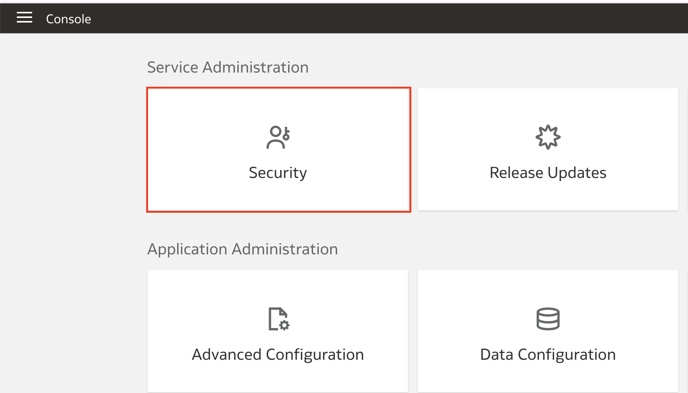
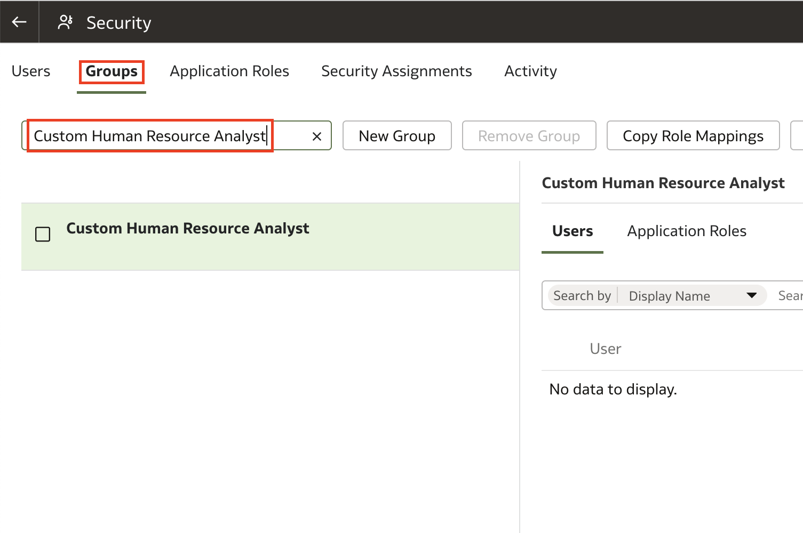
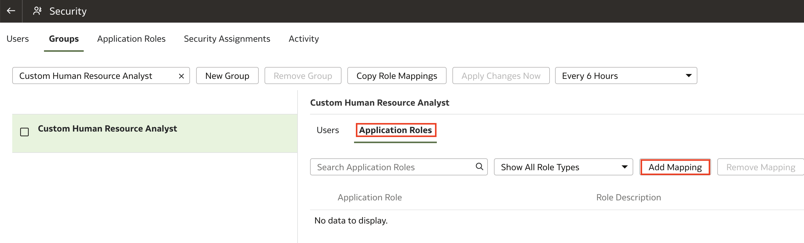
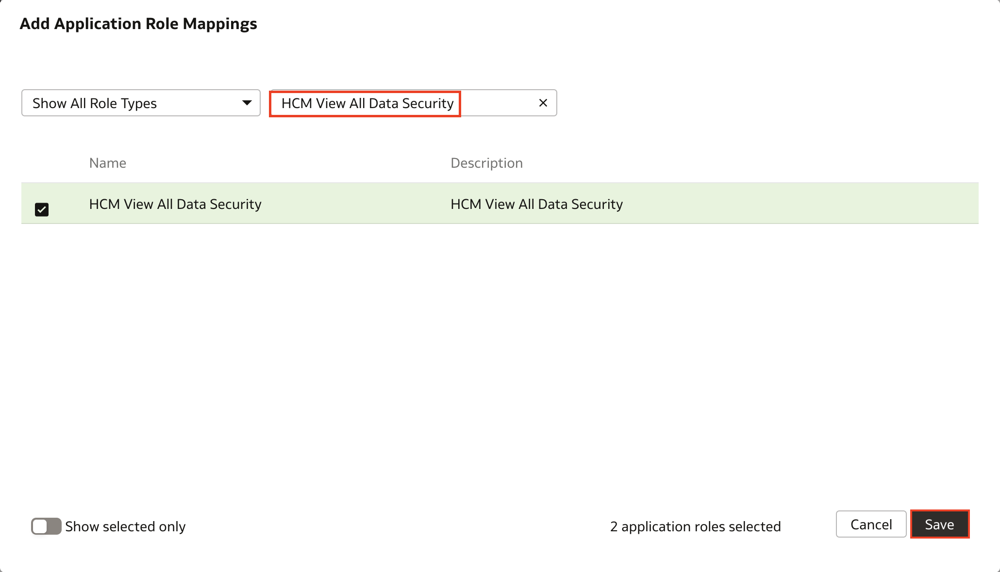
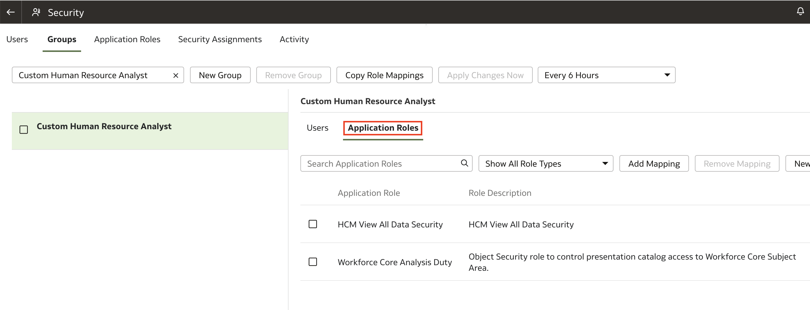

# How do I map data and duty roles to custom groups in Fusion Analytics Warehouse (FAW)?

Duration: 1 minutes

If you have created a custom group in FAW or a custom group is synced from Fusion Application, then application (duty or data) roles available in FAW need to be mapped with these custom groups. It enables users who are assigned to this group to inherit the security setup at each application role level.

## Map Data and Duty Roles to Custom Groups
> **Note:** You must have the Service Administrator and Security Administrator roles to be able to complete the following steps.

1. In your FAW instance, navigate to the **Console** tab using the navigator menu.

  

2. Within the console, select **Security**.

  

3. Click on the **Groups** tab and search for any custom group. In this case, we select the **Custom Human Resource Analyst** group.

  

4. In the group details region, click the **Application Roles** tab. As you can see, this group does not have any application roles mapped to it. Click **Add Mapping**.

  

5. In **Add Application Role Mappings**, search for a Duty Role or select a Duty Role from the displayed list of duty roles. In this example, we search for **Workforce Core Analysis Duty** and select it.

  

6. In the same window, search for a Data Role and select it. In this case, we select the **HCM View All Data Security** data role. Click **Save** after you have selected all other data & duty roles.

  

7. Your duty & data roles have now been mapped to your group. You can see the mapped duty & data roles in the group details region in the **Application Roles** tab.

  

Congratulations! You have successfully learned how to map Data and Duty roles to Custom Groups in Fusion Analytics Warehouse.

## Learn More
* [Manage Groups](https://docs.oracle.com/en/cloud/saas/analytics/22r3/fawag/manage-groups.html)

## Acknowledgements
* **Author** - Avinash Marathi Bheemalinga, Principal Solution Architect, Oracle Analytics
* **Last Updated By/Date** - Avinash Marathi Bheemalinga, September 2022
