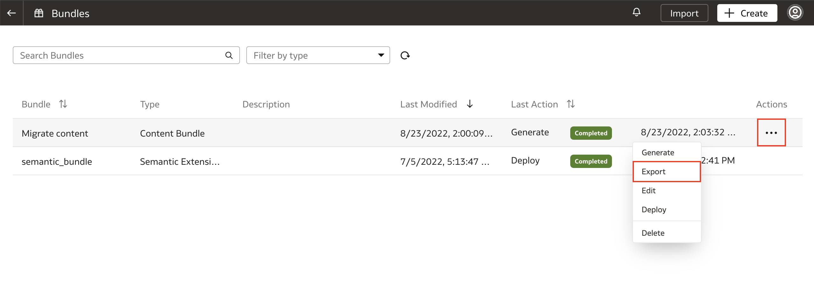
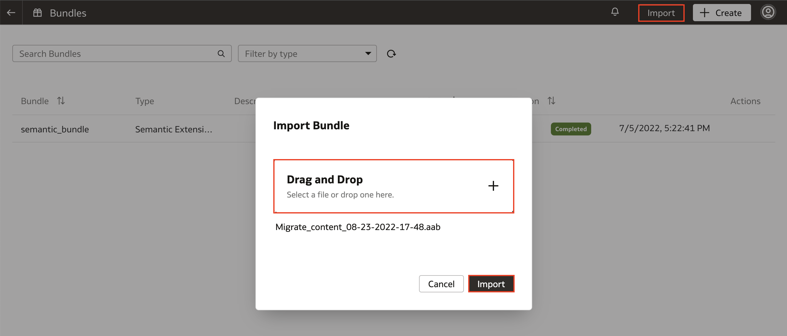
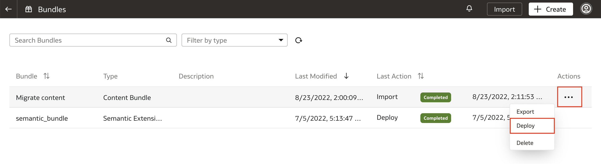
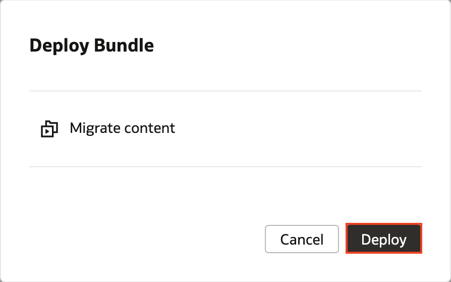
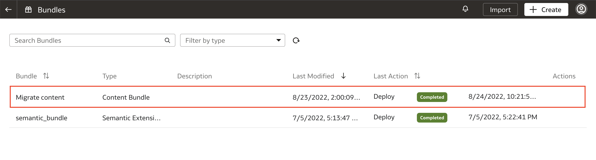

# How do I migrate content using the bundles feature in Fusion Analytics Warehouse (FAW)?

Duration: 1 minute

The bundles feature allows you to package your content in FAW and migrate it to other FAW environments. For example, you can migrate snapshots of OAC folders, projects, dataset definitions, KPIs, decks, and duty roles from your development environment to your test or production environments in a simple and packaged way.

## Migrate content using bundles
>**Note:** You must have the **Service Administrator** role to successfully complete this Sprint.

1. In your Fusion Analytics Warehouse instance, click the **Navigation menu** and select **Console**.

  

2. Within the console, click **Bundles** under **Application Administration**.

  

3. If you already have content bundles ready to migrate, click the **Actions** menu for that bundle and select **Export**. This will download an .aab file to your local desktop.
    >**Note:** If you do not have content bundles, refer to the related Sprint "How do I create content bundles in Fusion Analytics Warehouse (FAW)?".

  

4. Login to the FAW environment that you want to migrate the content to and navigate to **Bundles**. Click **Import**. Drag and drop the file you just downloaded and click **Import**.

  

5. Once your bundle is imported into the new environment, click the **Actions menu** and select **Deploy**.

  

6. Verify the content bundle to deploy and click **Deploy**. This will schedule your bundle deployment.

  

7. Your content bundle deployment should be completed in a few minutes.

  

## Learn More

* [Export a Bundle](https://docs.oracle.com/en/cloud/saas/analytics/22r2/fawag/bundle-your-application-artifacts.html#GUID-25128E54-3964-4B52-9C40-E9D56168CB3A)

* [Use Bundles to Migrate Application Artifacts](https://blogs.oracle.com/analytics/post/fusion-analytics-warehouse-best-practice-series---administering-faw)

## Acknowledgements
* **Author** - Nagwang Gyamtso, Product Manager, Product Strategy
* **Last Updated By/Date** - Nagwang Gyamtso, August 2022
