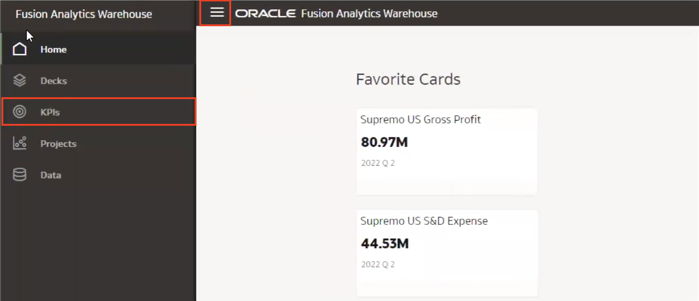
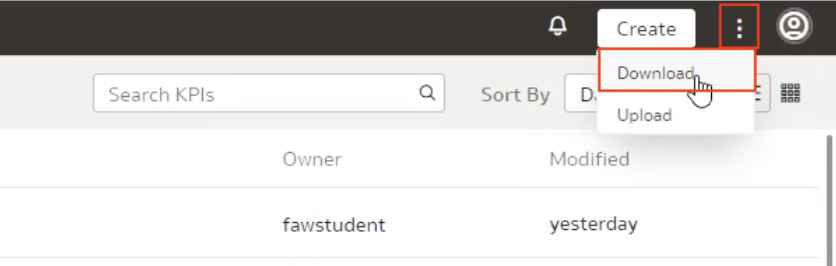
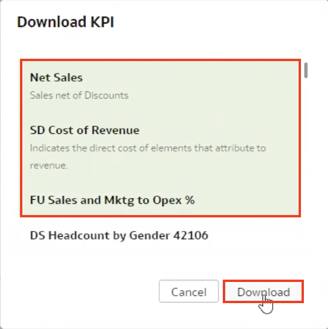
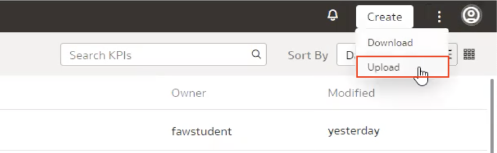
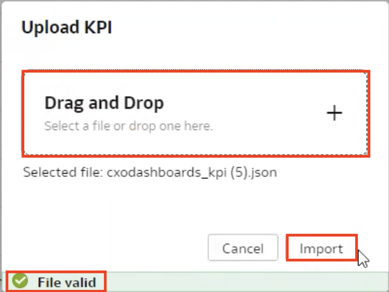
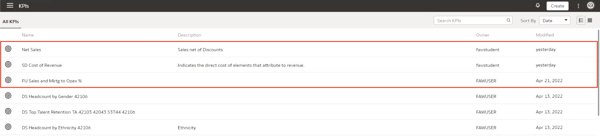

# How do I migrate KPIs from test to production in Fusion Analytics Warehouse (FAW)?

Duration: 2 minutes

Usually when working with decks or KPIs, you want to work on them in your test FAW environment so that you can explore your data without breaking anything. Once your decks and KPIs are finalized, you will then want to move them to your production environment and this Sprint will show you exactly how to move your KPIs from your test to production environment in Fusion Analytics Warehouse.

## Migrate KPIs from test to production
You must have the **Author** application role and the owner of the KPIs you want to migrate must exist in both test and production environment to successfully complete the following steps.

1. From your test environment's FAW **Home** page, navigate to the KPIs page by clicking the **Navigation menu** and selecting **KPIs**.

    

2. Click the **Page Menu** represented by the 3 dots on the top right of your page and select **Download**. This will display all the KPIs that you have created and are available for download.

    

3. Select the KPIs you want to migrate and click **Download**. This will create a JSON file and download it to your local machine. This is the file that we will upload into our production environment to complete the migration.

    

4. Login to your **production environment** and navigate to the KPIs page like we did in step 1. Click back on the **Page Menu** in the KPIs page and this time, select **Upload**.

    

5. **Drag and Drop** the JSON file we just downloaded. Once the file is validated, click **Import**.

    

6. You should now see the KPIs in your production environment.
    >**Note:** If you are unable to see the KPIs, verify that the owner of the KPI exists in both the test and the production environment.

    

Congratulations! You have just learned how to migrate your KPIs from a test to production environment in Fusion Analytics Warehouse.

## Learn More
* [Upload a KPI](https://docs.oracle.com/en/cloud/saas/analytics/21r3/fawug/upload-kpi.html)
