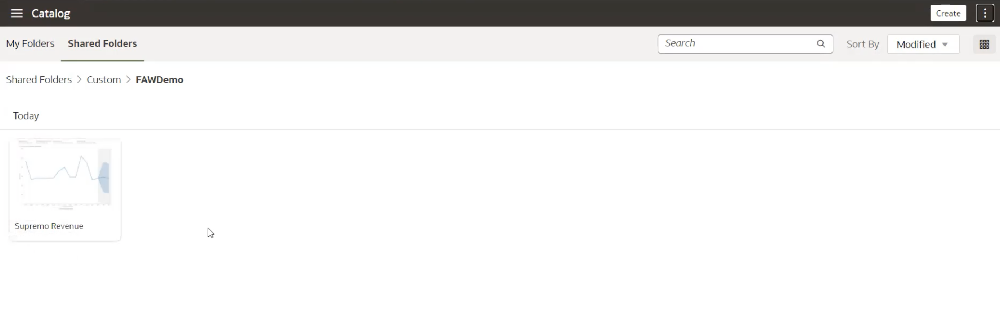

# How do I migrate DV workbooks from my test environment to my production environment in Fusion Analytics Warehouse (FAW)?
Duration: 5 minutes

When creating a new workbook, you may want to create them in your test environment using your sample data to explore different ways to present and visualize your analysis.  

When you are done creating your DV workbooks in your test environment with your sample data, you will want to migrate your workbooks into your production environment for use with your production data. The following steps will guide you on how to migrate DV workbooks from a test environment into a production environment in Fusion Analytics Warehouse.

## Migrate DV workbooks from test to production
>**Note:** The following steps assume that your production environment has the datasets and subject areas that the workbook is based on.

1. In your **test environment**, click on the **Projects** tab using the navigator menu and you will be directed to the catalog of your embedded OAC service included in your FAW environment.

  

2. Navigate to the specific analysis or workbook that you want to migrate to your production environment and click the **Options** menu. Select **Export** and your export options will appear.

  

3. Select the options you would like to enable. If you wish to encrypt your data, provide a password and click **Save**. This will download a .dva file of your workbook/analysis which we will import into our production environment.
    >**Note:** In most cases, you will leave the options to default because your production environment will have a production dataset that will be used.

  

  | Option        | Function      |
| ------------- |-------------|
| Include Data  |This option includes the datasets used from the test environment|
| Include Connection Credentials |If you have created database connections, this option includes those connection credentials into your production environment|
| Include Permissions|This option brings permissions and duty roles used in the test environment over to the production environment|
| Protect Password |This option encrypts your .dva file and protects it with a password|

4. In your **production environment**, navigate to the **Projects** tab like we did in step 1 and select the folder where you want to import the workbook/analysis. Click on the **Actions Menu** on the top right and select **Import Workbook/Flow** and you will be prompted to select the file you want you to import.

  

5. Select the .dva file we downloaded from our test environment and click **Import**.
    > **Note:** If you enabled 'Include Permissions' in step 3, select 'Import Permissions.'

  

6. Your DV workbook should now be imported in your production environment.
    > **Note:** Open the DV Workbook in your production environment to confirm all visuals and canvas have the required data.

  

Congratulations! You have successfully learned how to migrate your DV workbooks from your test to production environment.
