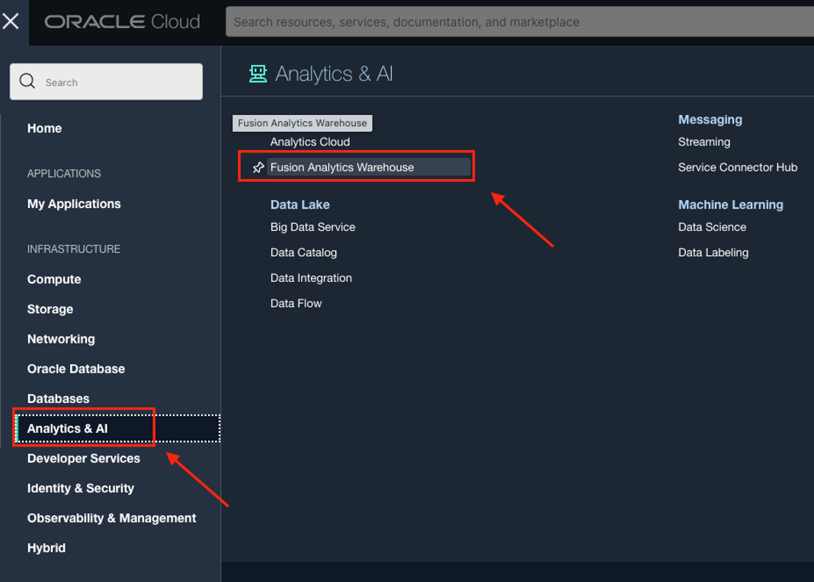
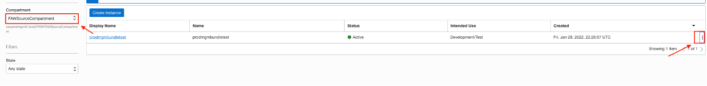
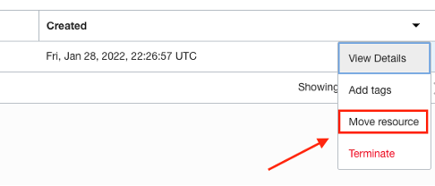
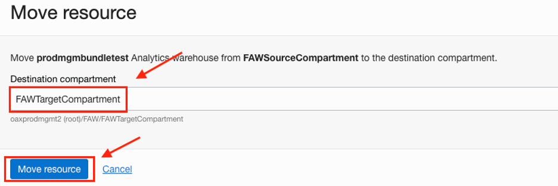
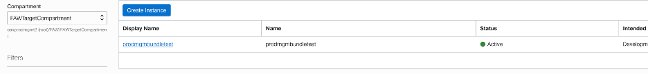

# How do I move a FAW instance across compartments in Fusion Analytics Warehouse (FAW)?

Duration: 1 minute

There may be scenarios where a FAW instance needs to be moved from one compartment to another compartment. One scenario could be that you created FAW in a default root compartment and you now want to move it to a different compartment.

## Move FAW to Another Compartment
>**Note:** You must have access to the OCI Console and have OCI Administrator privileges to successfully complete this Sprint.

1. Login to the [OCI Console](https://cloud.oracle.com) as an OCI Administrator.

2. From your OCI homepage, click the navigation menu on the top left and click **Analytics & AI**. Then click **Fusion Analytics Warehouse**.

  

3. Select the compartment where your FAW instance currently lives and click the three dots for your instance to open the actions menu.

  

4. Select **Move resource** in the sub menu.

  

5. Select the **Destination compartment** and click **Move resource**. This will update the status of your move to **Updating**.

  

6. Once the process is completed, the status will update to **Active** which indicates that your FAW instance has now moved to the destination compartment.

  

## Learn More
* [Move the Oracle Fusion Analytics Warehouse Instance to Another Compartment](https://docs.oracle.com/en/cloud/saas/analytics/22r3/fawag/move-oracle-fusion-analytics-warehouse-instance-another-compartment.html)

## Acknowledgements
* **Author** - Krishna Prasad Kotti, Principal Solutions Architect
* **Last Updated By/Date** - Krishna Prasad Kotti, September 2022
