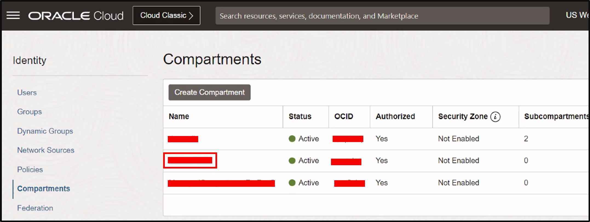
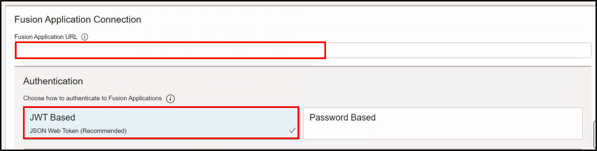
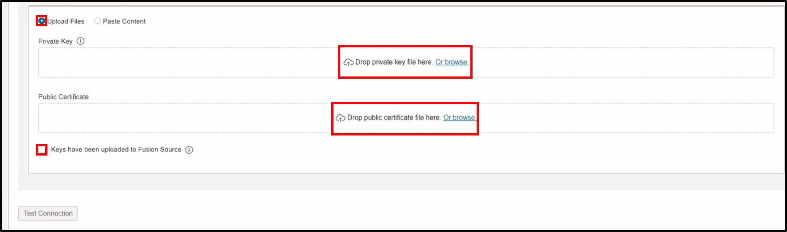
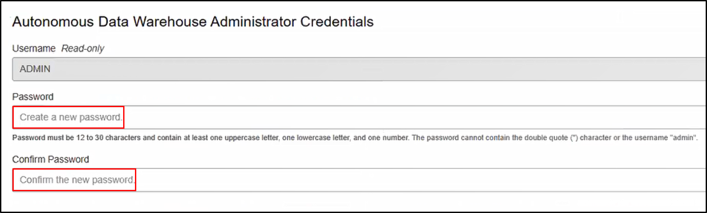
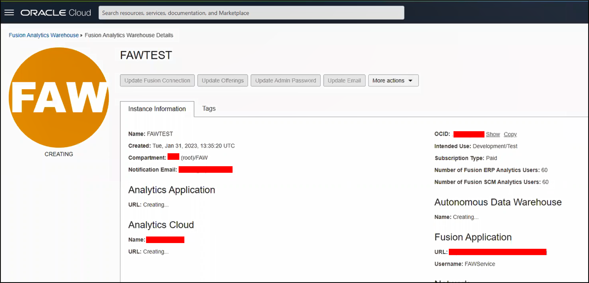
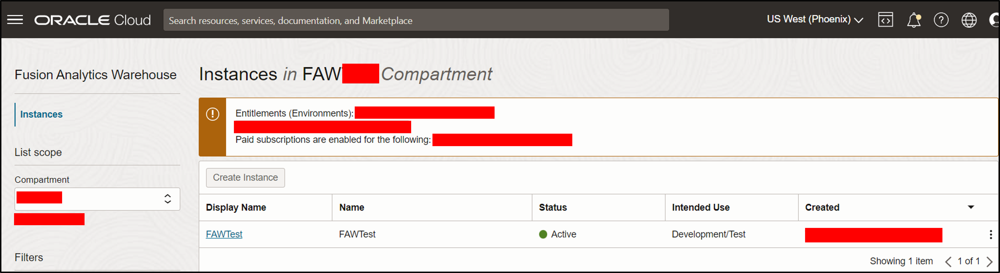

# How do I provision a Fusion Analytics Warehouse (FAW) instance?
Duration: 1 minute

This is the third of the three live labs series that will walk you through the steps to provision the Fusion Analytics instance. It is assumed that the Fusion Analytics subscription is activated, and you have completed the following two live labs in this series:
1. How do I synchronize Oracle Applications with Oracle Identity Cloud Service (IDCS)?
2. How do I federate the Oracle Identity Cloud Service (IDCS) for Fusion Analytics Warehouse (FAW)?

## Provision a FAW Instance

>**Note:** You must have access to the OCI Console as an **OCI Cloud Account Administrator** and **IDCS Administrator** to successfully complete this Sprint. You must also have the private key and public certificate described in this [blog](https://blogs.oracle.com/analytics/post/using-jwt-token-with-faw).

1. Sign into the OCI console using your identity provider.

2. Click the **Navigator** menu and select **Identity & Security**. Under **Identity**, click **Compartments**.

  

3. Within **Compartments**, click the **Create Compartment** button.

  

4. Enter the **Name** and **Description** of the compartment, and then click the **Create Compartment** button.

  

5. Upon clicking the create compartment button, the newly created compartment is listed.

  

6. Within the **Navigator** menu, click **Analytics & AI**. Within Analytics & AI, click **Fusion Analytics Warehouse**.

  

7. In the **Compartment** dropdown, **Choose a Compartment**.
    >**Note**: For this lab, a compartment named “FAW” was created and is chosen for instance creation.

  

8. On the **Instances** page, click the **Create Instance** button.

  

9. Enter the **Display Name** and **Name** of the instance to be created. Make sure the compartment displayed is the correct compartment.

  

10. Within the **Offerings** section, select **Development/Test** in the **Intended Use** dropdown.

    >**Note**: For creating a production instance, select Production in the Intended Use dropdown menu.

  

11. Scroll down to the **Fusion Application Connection** section and enter the **Fusion Application URL**. Next, select **JWT Based** authentication.

  

12. Select the **Upload Files** radio button. Upload the **Private Key** and **Public Certificate**, and then select the checkbox labeled “Keys have been uploaded to Fusion Source”.

  

13. Click the **Test Connection** button. Confirm the following message is displayed: “Fusion application credentials are valid”.

  

14. Scroll down to the **Autonomous Data Warehouse Administrator Credentials** section and
enter a Password for the “ADMIN” user. Next, enter the password confirmation.

    >**Note**: Store the above password for future use.

  

15. Enter the **Notification Email** address in the Notification Email input box. Upon instance creation, this email address will receive an email notification.

  

16. Click the **Create Instance** button.

  

17. The page should now display the “FAW” instance is
“CREATING”. Once the instance is created, you should get an email notification.

  

18. Upon receiving the email notification, follow step 6 and 7 to navigate to the instance. You should see the instance created with status “Active”.

  

## Acknowledgements
* **Author** - Sandeep Bade, Consulting Solutions Architect
* **Last Updated By/Date** - Sandeep Bade, April 2023
