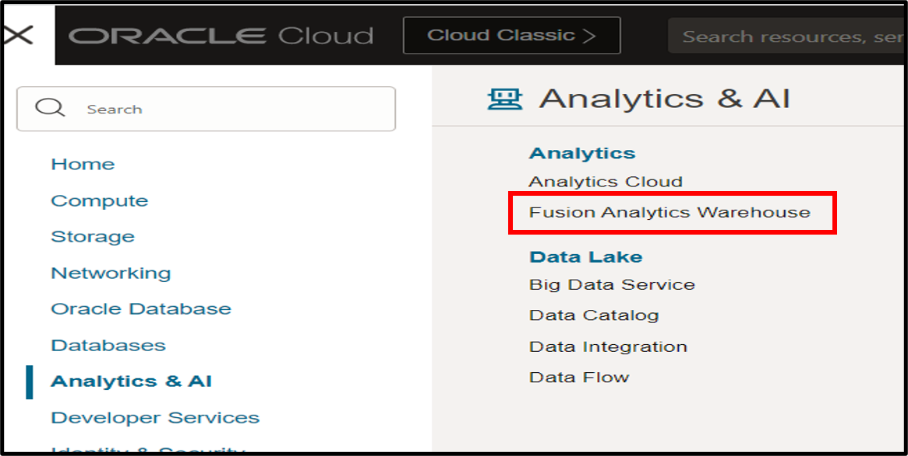
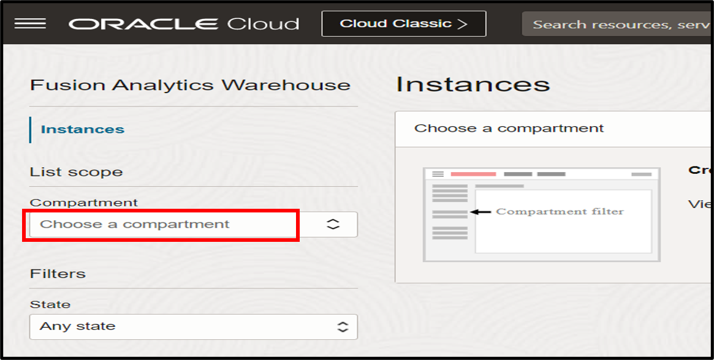
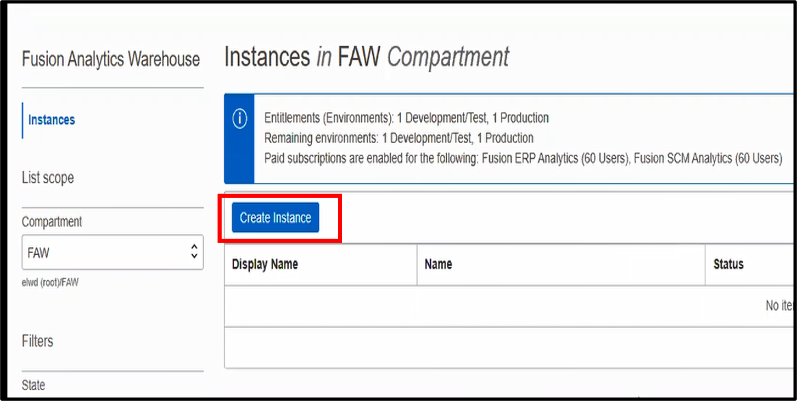
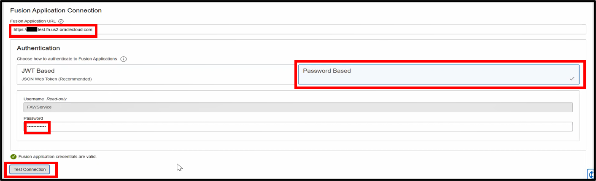
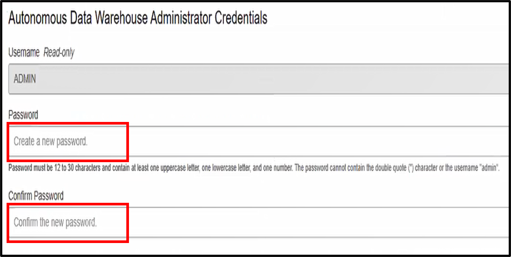
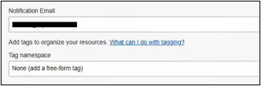
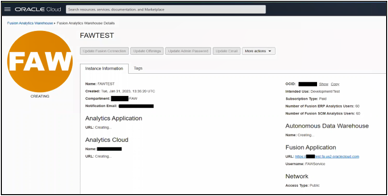
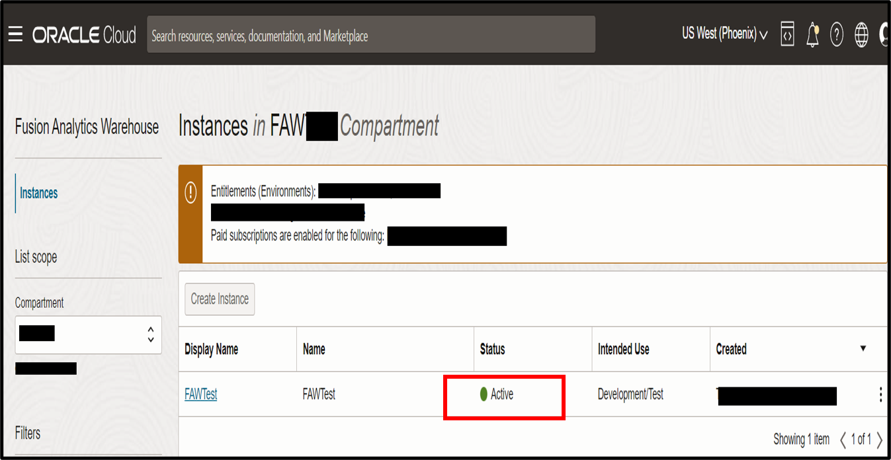

# How do I provision a Fusion Analytics Warehouse (FAW) instance?

Duration: 5 minutes

Fusion Analytics (FA) is a family of prebuilt, cloud native analytics applications for Oracle Cloud Applications that provides line-of-business users with ready-to-use insights to improve decision-making. This live lab will walk you through the steps to provision a Fusion Analytics instance. It is assumed that the FA service is activated.

## Provision a FAW instance

>**Note:** You must have access to the Oracle Cloud Infrastructure (OCI) console to successfully complete this Sprint.

1. **Sign in** OCI console where FA instance will be provisioned.

2. Click the **Navigator menu** and select **Analytics & AI**. Within Analytics & AI, click **Fusion Analytics Warehouse**.

  

3. In the Compartment dropdown, Choose a Compartment.

    >**Note**: For this lab, compartment named “FAW” was created and is chosen to create instance. You can create and select a different compartment.  

  

4. On the Instances page, click Create Instance.

  

5. Enter the Display Name and Name of the instance to be created. Make sure the Compartment displayed is the correct compartment.

  

6. In the Offerings section, select Development/Test in the Intended Use dropdown. For creating production instance, select “Production” in the Intended Use dropdown menu.

  

7. Enter the following: Fusion Application URL, Password for FAWService user, select Password Based Authentication and click Test Connection. Before proceeding to next step, make sure you see the “Fusion application credentials are valid” message.

    >**Note**:FAWService password can be reset in Fusion Application.

  

8. Enter the Password and enter Confirm Password for ADMIN user.

    >**Note**: In this step, you will be creating a new password to connect to the Autonomous Data Warehouse.

  

9. Enter the Notification Email. This email will receive an email notification after the instance is created.

  

10. Click Create Instance.

  

11. You should see a progress line.

  

12. The page should change to page showing the “FAW” instance is “CREATING”.

  

13. Once the instance is created, you should get a email notification.

14. Go back to the Fusion Analytics Warehouse instances page by following steps 1 and 2.

15. You should see the instance created with status “Active”.

  

## Learn More

* [Set Up Oracle Fusion Analytics Warehouse](https://docs.oracle.com/en-us/iaas/analytics-for-applications/doc/set-oracle-fusion-analytics-warehouse.html)

## Acknowledgements
* **Author** - Sandeep Bade, Consulting Solutions Architect
* **Last Updated By/Date** - Nagwang Gyamtso,  April 2023
