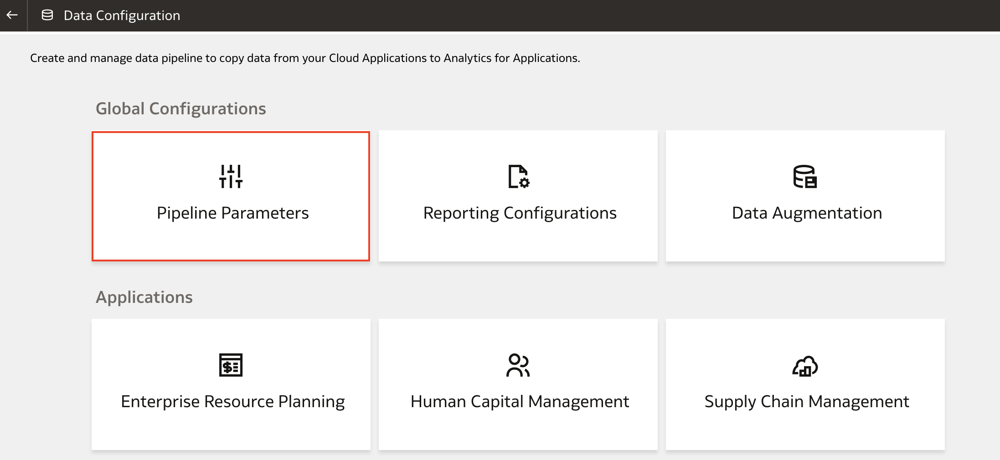

# How do I re-enable the data pipeline in Fusion Analytics Warehouse (FAW)?

Duration: 4 minutes

When working with FAW, there may be scenarios where your Data Pipeline has been disabled. One instance may be when the FAWService password is incorrect. After the underlying issue is fixed, one can re-enable the pipeline from within the Data Configuration settings in FAW.

## Re-Enable Data Pipeline
>**Note:** You must have the **Service Administrator** or **Functional Administrator** application roles to successfully complete this Sprint.

1. Login to your FAW instance which has the required application roles.

2. Click the **Navigation menu** and select **Console**.

  

3. Click **Data Configuration**.

  

4. Within Data Configuration, click on **Pipeline Parameters**.

    >**Note:** If the data pipeline has been disabled, you will see a notification banner as shown in the screenshot.

    

5. The Notification banner is displayed at the top and the Pipeline is in **disabled** state.

  

6. Click the **Data Pipeline Status** toggle and change the status to **Enabled**.

  

7. A confirmation window may appear, asking if you want to accept the data impact and save your change. If you are prompted, click **Accept Data Impact and Save**.

  

8. Your data pipeline has now been enabled. You will find that the banner is no longer visible.

  

## Acknowledgements
* **Author** - Krithika Raghavan, Director, Oracle Analytics
* **Last Updated By/Date** - Krithika Raghavan,  August 2022
