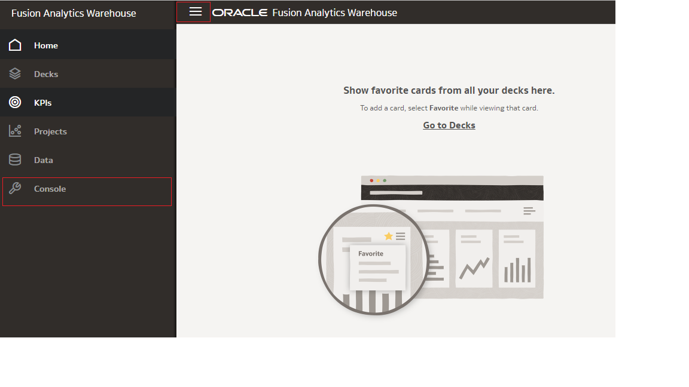
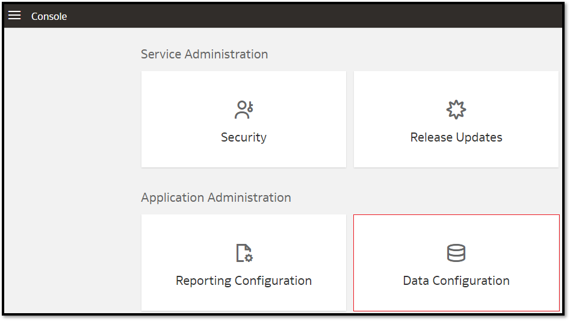
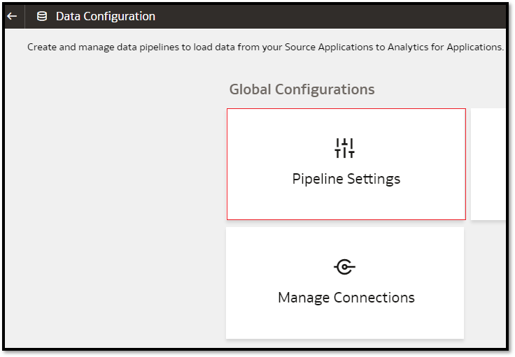
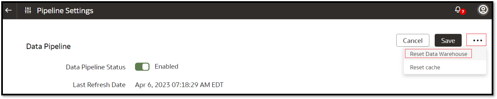
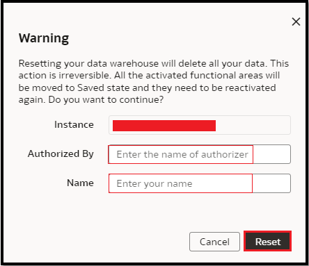
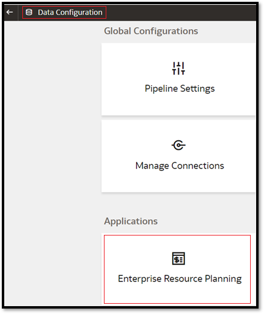
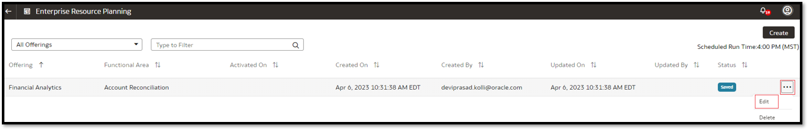
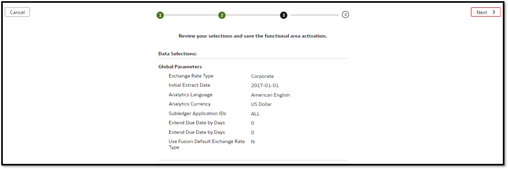

# How do I manually reactivate a Data Pipeline for a Functional Area in Fusion Analytics Warehouse (FAW)?
Duration: 3 minutes

As part of Oracle Fusion Analytics administration activities, when your Fusion source environment is refreshed from production to a test environment, you should reset the data warehouse to refresh data from new source environment. After resetting the data warehouse, you must reactivate all the data pipelines for the functional areas.

## Reactive a Data Pipeline

>**Note:** You must have access to the **FAW Service Administrator** application role to complete this Sprint.

1. In your Fusion Analytics Warehouse instance, click the **Navigation** menu and select **Console**.

  

2. Within the console, click **Data Configuration** under Application Administration.

  

3. Within the Data Configuration, click **Pipeline Settings** under Global Configurations.

  

4. On the Pipeline Parameters page, click the **Actions icon** and then click **Reset Data Warehouse**.

  

5. Review the warning message, provide the details, and then click **Reset**.

  

6. Navigate to **Data Configuration** page, click your service. For example, under Applications, click **Enterprise Resource Planning**.

  

7. Click the **Action** menu for the saved data pipeline for the functional area that you want to activate and click **Edit**.

  

8. Review the details of the data pipeline for the functional area and then click **Next**.

  

9. Select **Run Immediately** to create and run the data pipeline for the functional area immediately. Click **Finish**.

  

##Learn More
* [Activate a Data Pipeline for a Functional Area](https://docs.oracle.com/en/cloud/saas/analytics/23r1/fawag/activate-data-pipeline-functional-area.html)

## Acknowledgements
* **Author** - Prasad Kolli, CEAL
* **Last Updated By/Date** - Prasad Kolli, April 2023
