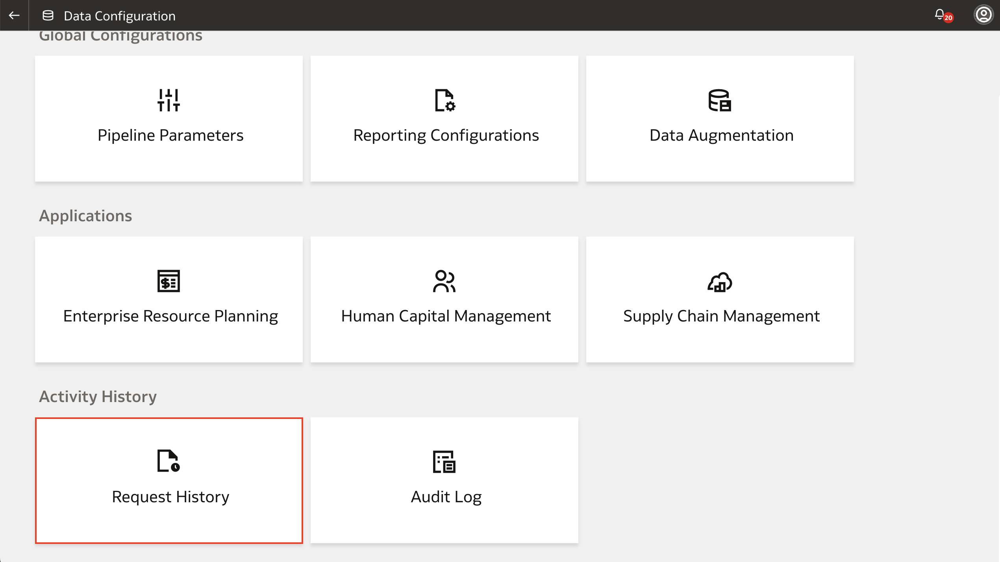

# How do I perform an on-demand data refresh for a functional area in Fusion Analytics Warehouse (FAW)?
Duration: 2 minutes

There are two ways you can refresh your data pipeline for a functional area: by scheduling a data refresh using the pipeline parameters or creating a manual refresh for a particular functional area. Refreshing a data pipeline ensures that your data is up-to-date and new data is loaded for your functional area. This Sprint will guide you on how to manually refresh an activated data pipeline to bring in new data for the selected functional area.

## Refresh a data pipeline
>**Note:** You must have the **Service Administrator** application role to successfully complete this Sprint.

1. Using the **Navigation** menu in  your FAW homepage, click **Console**.

  

2. Under **Application Administration**, click **Data Configuration**.

  

3. Under **Applications**, select the application that has the functional area that you want to refresh the data for. For this example, we'll select **Enterprise Resource Planning**.

  

4. Click the **Action** menu of the Functional Area you want to refresh the data pipeline for and click **Refresh Data**.

  

5. A dialogue box will appear warning you that refreshing a data pipeline that is actively being worked on may cause temporary inconsistencies. Heed this warning and click **Refresh Data**.

  

6. You will now see a notification that your refresh request has been submitted.

  

7. To view your data refresh request, navigate back to **Data Configuration** and and select **Request History** under **Activity History**.

  

8. Here, you'll see the list of all your request history and you'll notice that your **Refresh Data** has been scheduled.
    >**Note:** To verify that your data refresh has run successfully, click the related Sprint called "How do I verify that the data refresh schedule has been completed in FAW?"

  

## Learn More

* [Refresh a Data Pipeline for a Functional Area](https://docs.oracle.com/en/cloud/saas/analytics/22r2/fawag/refresh-data-pipeline-functional-area.html)

## Acknowledgements
* **Author** - Nagwang Gyamtso, Product Manager, Analytics Product Strategy
* **Last Updated By/Date** - Nagwang Gyamtso,  September 2022
