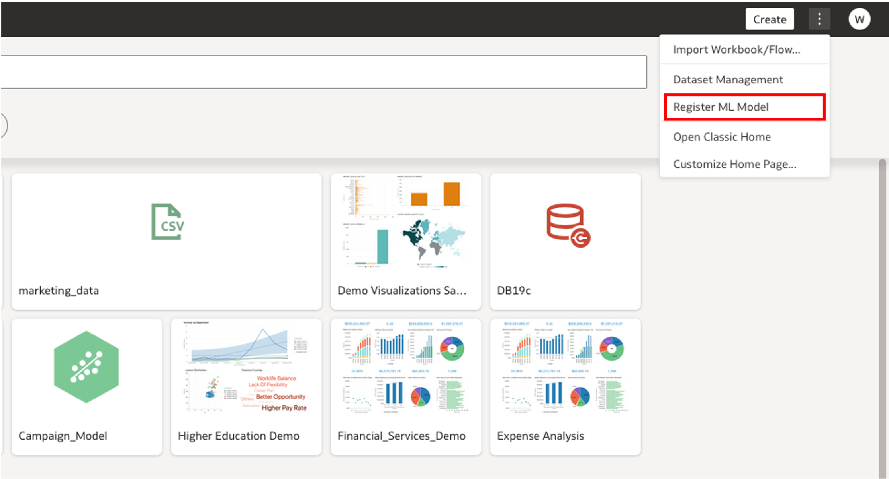
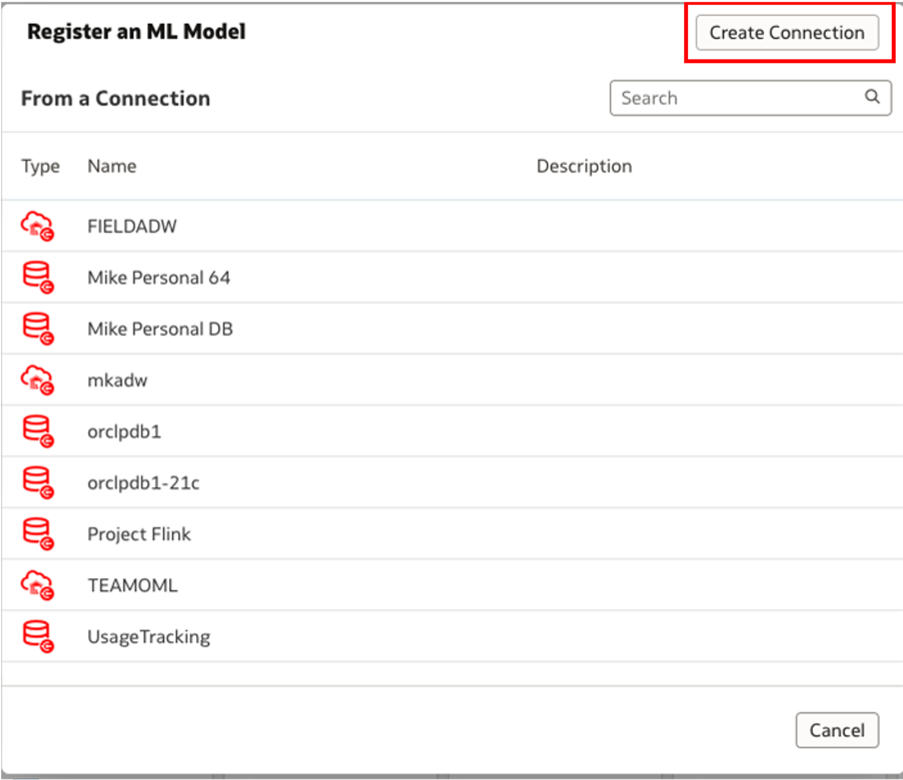
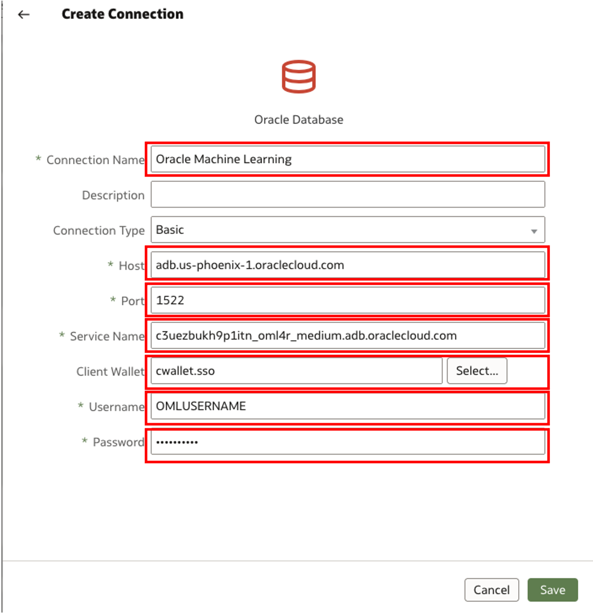
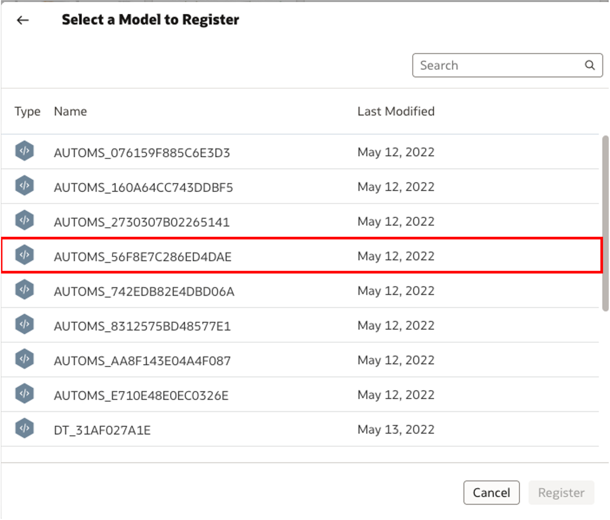
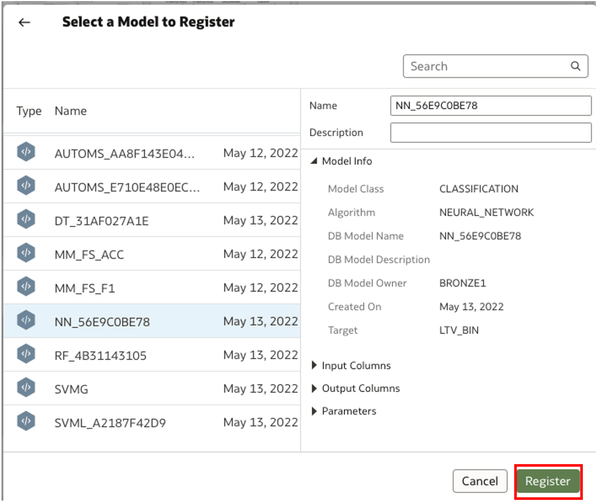

# How do I register a ML model from OML to OAC/OAS?
Duration: 3 minutes

From Oracle Machine Learning, a user can seamlessly apply models that they have built and use them in Oracle's analytics software, specifically Oracle Analytics Cloud and Oracle Analytics Server. Once the connection has been made from OML and OAC/OAS, users can integrate these models into visualizations, data flows, and multitude of other features. 

**Note:** You must have the DV Content Author role in order to complete the following steps.

## Connect to OML Instance from OAS/OAC 

1. First, open your OAS or OAC instance. In the top right corner of the homepage, click the button with three dots and select **Register ML Model**

    

2.  In this step, a connection will be made from OML to the OAS/OAC interface. Click on **Create Connection** in the top right corner. 
    
    

3.  Using the information from the connection string you copied from OCI, fill in the boxes with the corresponding information. For client wallet, make sure to use the wallet that you downloaded in step 6. For username and password, fill in the credentials used to sign into your OML instance. Then, click save. 

    

4. Once the connection has been made, you can choose the model that you would like to register from your OML instance. 

    

5. After clicking on the model, click the **Register** model button on the bottom right. 

    

Congratulations! You have applied a ML model from OML to OAC/OAS!

## Learn More

* [Oracle Learning](https://www.youtube.com/watch?v=quIUPzcCaOw)

## Acknowledgements
* **Author** - Bronze Martin, Solution Engineer, North America Specialist Hub
* **Last Updated By/Date** - Bronze Martin, August 2022