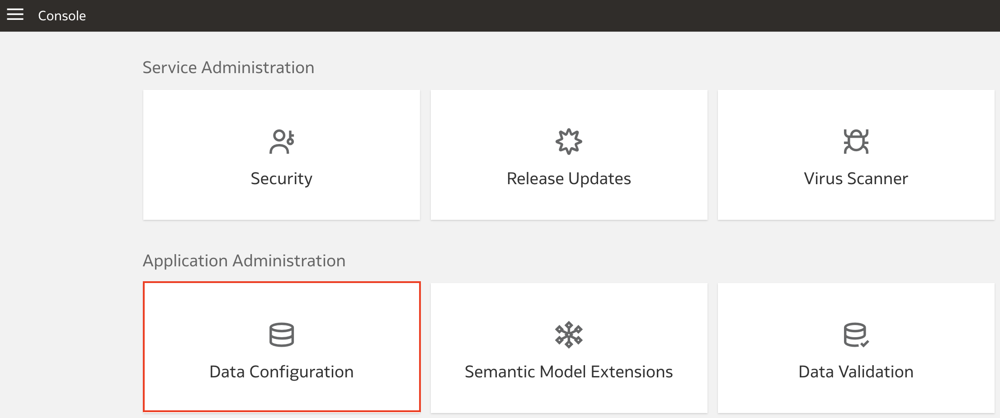

# How do I set up the reporting configurations for ERP in Fusion Analytics Warehouse (FAW)?

Duration: 2 minutes

When you want to specify how Enterprise Resource Planning data is presented on KPI decks, visualizations, dashboards, and reports, you must specify the parameters in the Reporting Configurations setting. This Sprint will guide you on how to set up the reporting configurations for ERP in Fusion Analytics Warehouse.

## Reporting configurations for Enterprise Resource Planning

>**Note:** You must have the **Functional Administrator** or **System Administrator** application role to successfully execute the following steps.

1. In your Fusion Analytics Warehouse homepage, click the **Navigation menu** and click **Console**.

    

2. Under Application Administration, click **Data Configuration**.

    

3. Within Data Configuration, click **Reporting Configurations**.

    

4. Under **Basic** configurations, click **Enterprise Resource Planning**. This is where you will specify values for your ERP reporting. Click the drop-down for **Calendar** and specify the reporting calendar you want to use in Oracle Analytics Cloud.

    

5. For **Chart of Accounts** select one or more chart of accounts to control the list of ledgers used for reporting.

    

6. For **Ledgers**, select the ledgers to use in the reporting later and in the security setup. Selecting **ALL** uses all the available ledgers that share the calendar and the selected chart of accounts.

    

7. **Ledgers Sets** is an **Optional** parameter which restricts the ledger sets in the reporting layer and in the security setup. The ledger sets in this option are the ones that share the same calendar and the chart of accounts selected in **Calendar** and **Chart of Accounts**.

    

8. **Allow Financial Category Upload** is also an **Optional** parameter which allows you to choose whether you want to enable the upload of financial categories in Fusion Analytics Warehouse and maintain the mapping independent of Oracle Analytics Cloud. This option is set to **No** by default which means that Fusion Analytics Warehouse uses the financial Category mapping defined in Oracle Analytics Cloud.

    

9. Click **Save** to apply your configurations.  

    

Congratulations, you have just learned how to set up the reporting configurations for HCM in Fusion Analytics Warehouse.

## Learn More

* [About the Reporting Configuration for Enterprise Resource Planning](https://docs.oracle.com/en/cloud/saas/analytics/22r2/fawag/reporting-configurations.html#GUID-C8BB5207-1B0A-4568-A4FD-9450BD28225D)

* [Set Up the Reporting Configurations for Enterprise Resource Planning](https://docs.oracle.com/en/cloud/saas/analytics/22r2/fawag/set-reporting-configurations-enterprise-resource-planning.html)

## Acknowledgements
* **Author** - Nagwang Gyamtso, Product Manager, Product Strategy
* **Last Updated By/Date** - Nagwang Gyamtso,  July 2022
