# How do I set up the reporting configurations for HCM in Fusion Analytics Warehouse (FAW)?
Duration: 2 minutes

Before you run your data pipeline for the functional areas in Fusion Analytics Warehouse, it is reccomended that you set up the report parameters for your data model file. The configuration can be done after the data pipeline is run but takes effect only after the incremental update. For HCM, you need to set up the reporting configurations so that you can specify how your data is presented in KPI decks, visualizations, dashboards, and reports. 

## Reporting configurations for Human Capital Management

>**Note:** You must have the **Functional Administrator** or **System Administrator** application role to successfully execute the following steps. 

1. In your Fusion Analytics Warehouse homepage, click the **Navigation menu** and click **Console**.

    

2. Under Application Administration, click **Data Configuration**.

    

3. Within Data Configuration, click **Reporting Configurations**.

    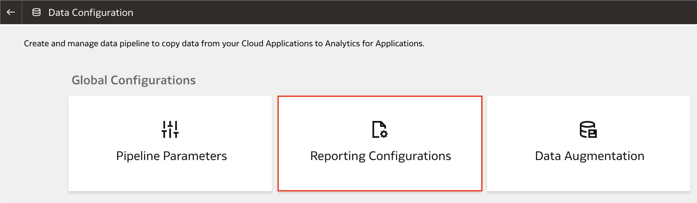

4. Under the Basic tab, click **Human Capital Management**. We will be specifying the parameters under Human Capital Management Analytics.

    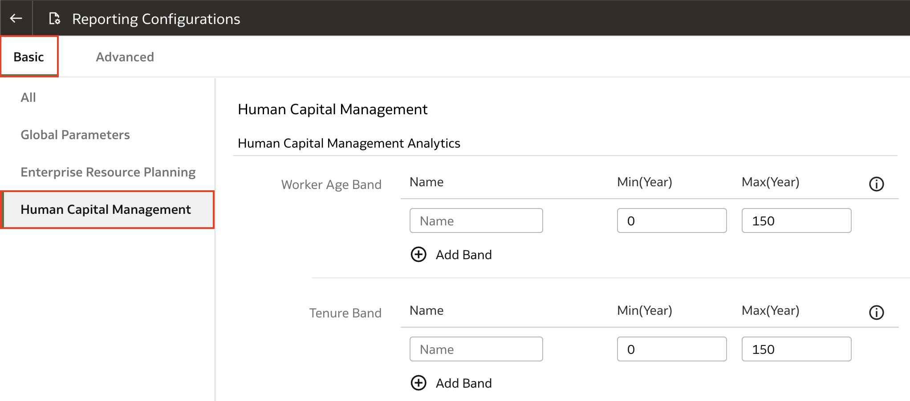

5. For **Worker Age Band**, specify the age range of the workers. KPIs and analyses related to the headcount of the workers use these age bands. For example, you can select less than 30, 30 to 50, and greater than 50 years for the age bands. 

    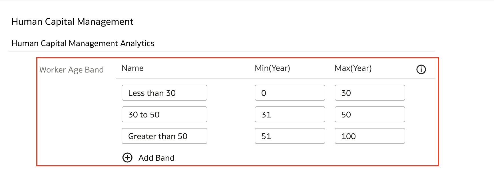

6. For **Tenure Band**, specify the grouping of employees by certain years like less than 5, 5 to 10, and greater than 10. This helps answer business questions like, "Show me the percentage of my employees who have served for more than 10 years".

    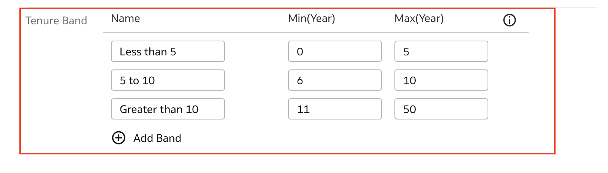

7. For **Performance Band**, specify the groupings of performance ratings of workers. For example, high, meidum, and low. This parameter will be used for performance related insights and help answer business questions such as, "Show me the top performers for the last two review periods."

    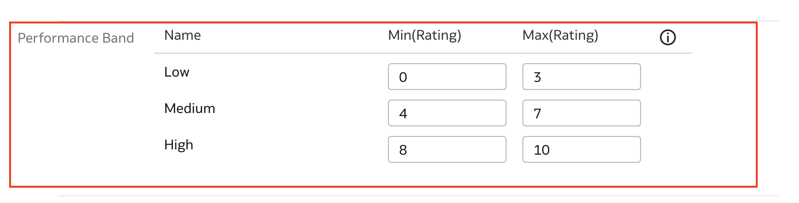

8. For **Potential Band**, select the grouping of potential ratings for employees. For example, you can configure the rating ranges to High, Medium, and Low. 

    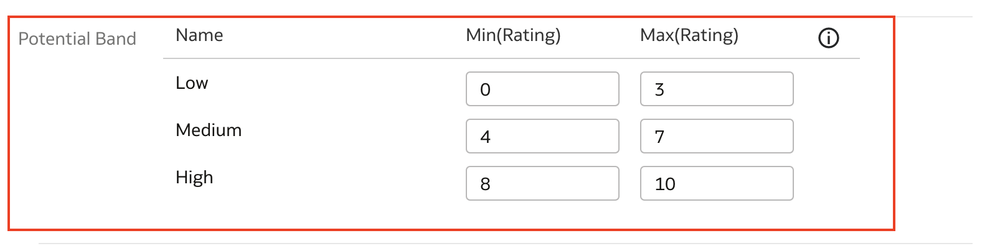

9. For **Compa-Ratio Band**, specify the grouping of employee compa-ratios. For example, you can specify Band 1 with a range of 0-80 and Band 2 with a range of 81-120.

    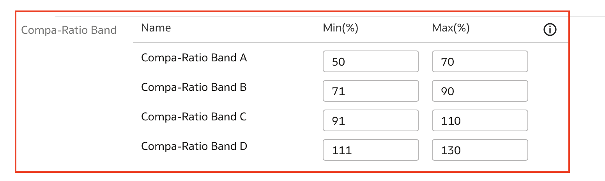

10. For **Risk of Loss Band**, select the grouping of risk of loss ratings. For example, you can configure rating ranges for High, Medium, and Low.

    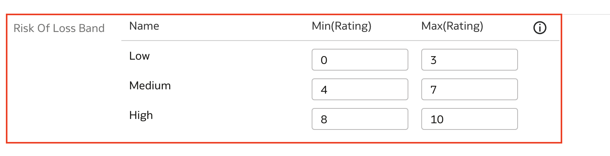

11. For **Impact of Loss Band**, specify the grouping of impact of loss ratings. For example, you can configure the rating ranges under High, Medium, and Low.

    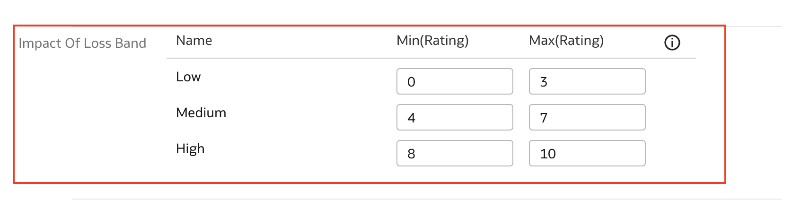

12. In the **Succession Management** section, specify the grouping of readiness levels of employees for career changes. You can select these values from the list of values. 

    >**Note:** You must carefully select unique single values under each of these.

    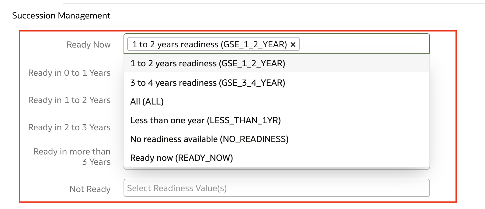

13. In the **Workforce Management** section, specify the reason for reorganization to be able to compute the headcount gain or losses based on the reorganization factor.

    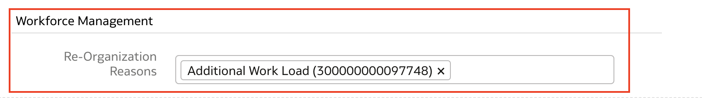

14. Click **Save**

    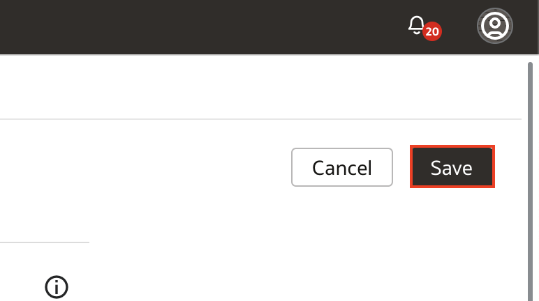

Congratulations, you have just learned when, why and how to set up the reporting configurations for HCM in Fusion Analytics Warehouse. 

## Learn More

* [About the Reporting Configuration for Human Capital Management](https://docs.oracle.com/en/cloud/saas/analytics/22r2/fawag/reporting-configurations.html#GUID-B57289FB-BD7E-4D3F-809F-CC38E6F564DC) 

