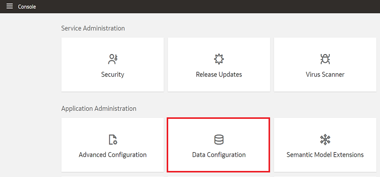
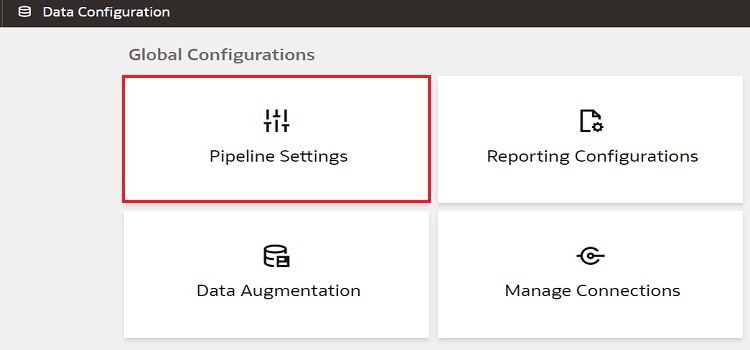
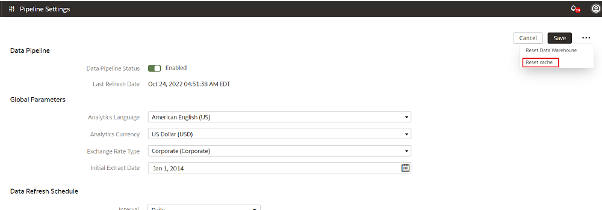
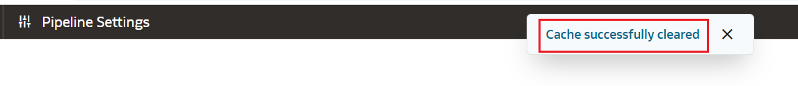

# How do I reset the cache for Data Augmentation?

Duration: 1 minute

The data augmentation source column information is cached in the browser cache and is maintained for a week. If your source has new columns and they don't display in the Data Augmentation wizard, then you can reset the browser cache and retry data augmentation.

## Reset Cache for Data Augmentation
You must have the **Service Administrator** role to successfully complete the following steps.

1. Sign in your FAW instance.

2. Click the **Navigator** menu and select **Console**.

  

3. Within **Application Administration**, click **Data Configuration**.

  

4. Under **Global Configurations**, click on **Pipeline Settings**.

    >**Note:** If you have multiple data source enabled, make sure you are selecting the right data source.

  

5. On the Pipeline Settings page, click on **Ellipsis** and select the **Reset cache** option.

  

6. A message will appear, indicating that the cache has been cleared successfully.

  

## Learn more
* [Reset the Cache](https://docs.oracle.com/en/cloud/saas/analytics/22r4/fawag/reset-cache.html)

## Acknowledgements
* **Author** - Sandeep Bade, CEAL
* **Last Updated By/Date** - Nagwang Gyamtso, February 2023
