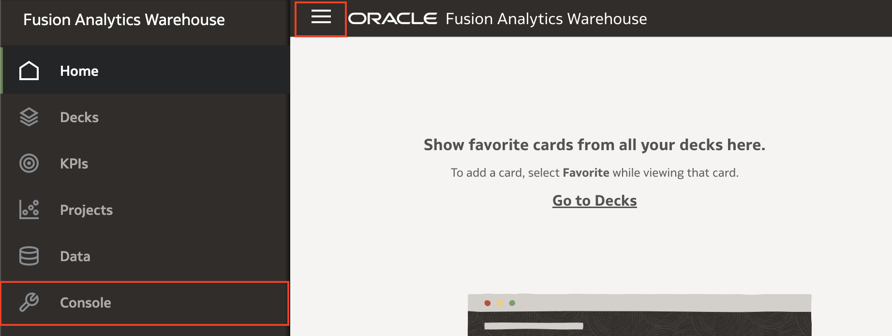

# How do I reset a data pipeline for a functional area in Fusion Analytics Warehouse (FAW)?
Duration: 1 minutes

You might want to reset your data pipeline if you change your Fusion Application source and want to perform a full load of the data from the new source.

## Reset a data pipeline
>**Note:** You must have the **Service Administrator** application role to successfully complete this Sprint.

1. Using the **Navigation** menu in  your FAW homepage, click **Console**.

  

2. Under **Application Administration**, click **Data Configuration**.

  

3. Under **Applications**, select the application that has the functional area that you want to reset the data for. For this example, we'll select **Enterprise Resource Planning**.

  

4. Click the **Action** menu of the Functional Area you want to reset the data pipeline for and click **Reset**.

  

5. A dialogue box will appear warning you that resetting the data pipeline will reload the data. Heed this warning and click **Reset**.

  

6. The status for the functional area we just reset the data for will change to **Reset Scheduled**.

  

7. Once the reset is complete, the status will update to **Reset Completed**.

## Learn More

* [Reset a Data Pipeline for a Functional Area](https://docs.oracle.com/en/cloud/saas/analytics/22r3/fawag/reset-data-pipeline-functional-area.html)

## Acknowledgements
* **Author** - Nagwang Gyamtso, Product Manager, Analytics Product Strategy
* **Last Updated By/Date** - Nagwang Gyamtso,  September 2022
