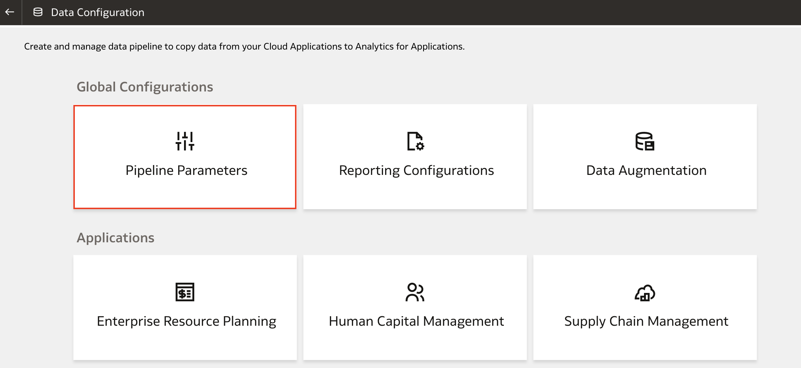
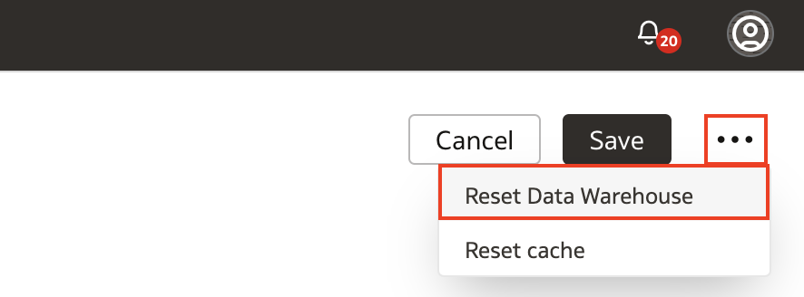
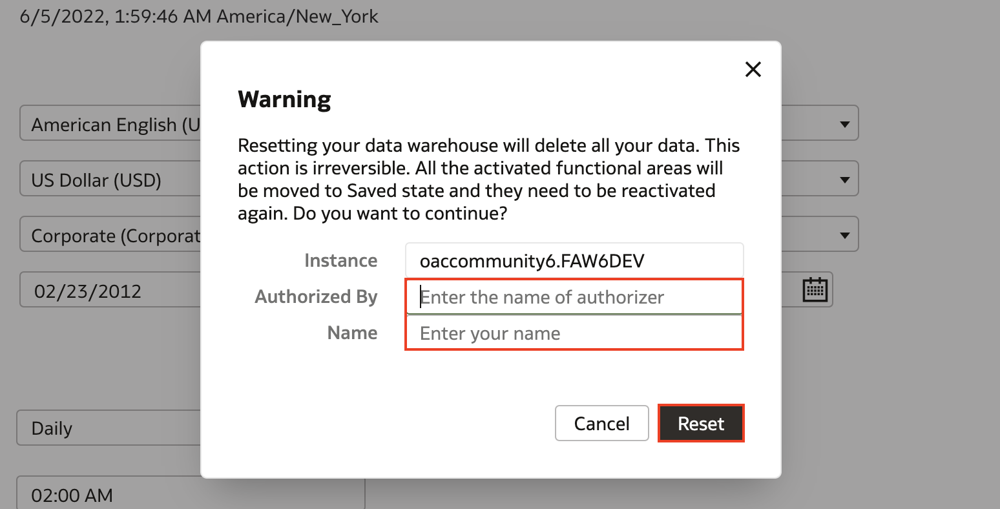

# How do I reset the data warehouse in Fusion Analytics Warehouse (FAW)?

Duration: 1 minute

When you reset the data warehouse, keep in mind that this action deletes all of your existing data from the data warehouse and you cannot undo this. The functional areas will also have to be reactivated after the reset is complete.

If you are unsure about when you would need to reset the data warehouse, here are a few scenarios:
* You updated your Fusion Application connection URL
* Your data source instance has been refreshed from another environment
* Your data has become corrupted

## Reset the Data Warehouse

1. In your Fusion Analytics Warehouse homepage, click the **Navigation menu** and click **Console**.

  

2. Under Application Administration, click **Data Configuration**.

  

3. Under **Global Configuration**, click **Pipeline Parameters**.

  

4. Click the **more options** button represented by the three dots on the top right and select **Reset Data Warehouse**.

  

5. Remember that resetting the data warehouse deletes all of the existing data in the data warehouse. Read the warning in the dialog box and after you acknowledge the message, enter the name of the person who authorized the data reset, your name, and click **Reset**.

  

## Learn More

* [Reset the Data Warehouse](https://docs.oracle.com/en/cloud/saas/analytics/22r2/fawag/reset-data-warehouse.html)

## Acknowledgements
* **Author** - Nagwang Gyamtso, Product Manager, Product Strategy
* **Last Updated By/Date** - Nagwang Gyamtso,  July 2022
