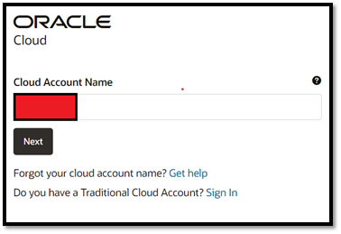
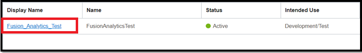
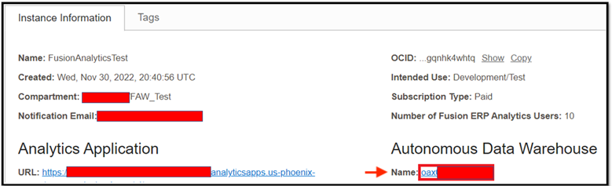
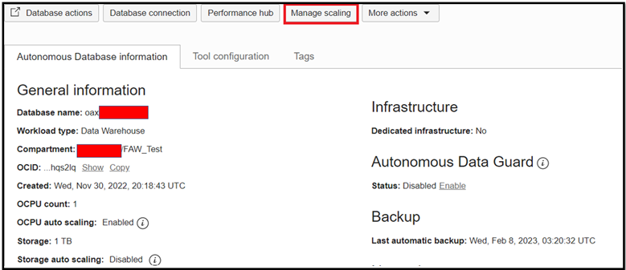
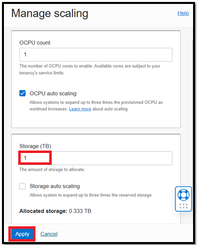

# How do I scale up the Autonomous Data Warehouse (ADW) storage for my Fusion Analytics Warehouse (FAW) instance?

Duration: 1 minute

Oracle Fusion Analytics Warehouse offers the ability to adjust the storage capacity of Oracle Autonomous Data Warehouse to accommodate larger source data volumes. This provides customers with the flexibility to scale their target data warehouse to meet the demands of their big data analysis needs.

## Scale Up ADW Storage for FAW
>**Note:** You must have the **OCI Administrator** application role and access to the OCI console in your Oracle Cloud account to execute the following steps.

1. Sign-in to your OCI cloud account.

    

2. Click the **Navigation** menu icon.

  

3. In the navigation options, click on **Analytics & AI**.

  

4. Click on **Fusion Analytics Warehouse** under Analytics.

  

5. Click on your instance name.

  

6. Click on the Autonomous Data Warehouse **Name** URL.

  

7. Click on the **Manage Scaling** button.

  

8. Enter the value in **Storage** field to scale up and click on **Apply**.

  

You have now successfully learned how to scale up the ADW storage for your Fusion Analytics Warehouse instance.

## Learn More
* [Scale Up Oracle Autonomous Data Warehouse Storage](https://docs.oracle.com/en/cloud/saas/analytics/23r1/fawag/scale-oracle-autonomous-data-warehouse-storage.html)

## Acknowledgements
* **Author** - Prasad Kolli, CEAL
* **Last Updated By/Date** - Nagwang Gyamtso,  February 2023
