# How do I synchronize Oracle Applications with Oracle Identity Cloud Service (IDCS)?

Duration: 5 minutes

Before provisioning a Fusion Analytics (FA) instance, you may need to:
1. Set up synchronization of Oracle Fusion Cloud Applications with Oracle Identity Cloud Service and
2. Federate the Oracle Identity Cloud Service Instance to your Oracle cloud infrastructure tenancy.

This is first of the three LiveLabs Sprints in the provisioning of FA instance. This Sprint will help you with the steps to complete the synchronization of Oracle Fusion Cloud Applications with Oracle Identity Cloud Service.

## Synchronize Oracle Applications with IDCS

>**Note:** You must be the **Fusion Application IDCS Administrator** to successfully complete this Sprint.

1. Sign in your IDCS instance.

    >**Note**: Use the IDCS instance that will be used to create federation and SSO for FA. Copy the IDCS url until "oraclecloud.com”, paste it in the text file, and then save the text file. We will use this url in the next LiveLab Sprint to create federation.

  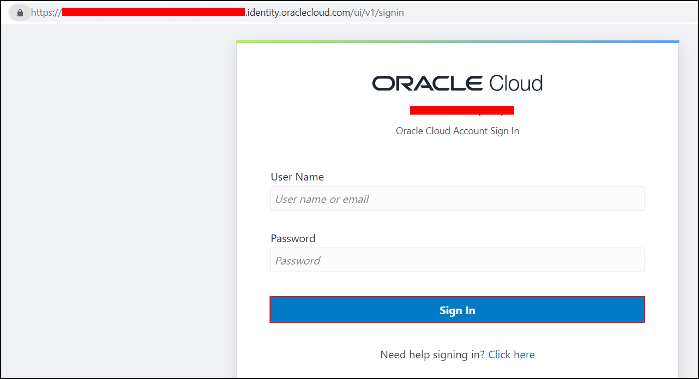

2. Click the **Navigator menu** and select **Oracle Cloud Services**.

  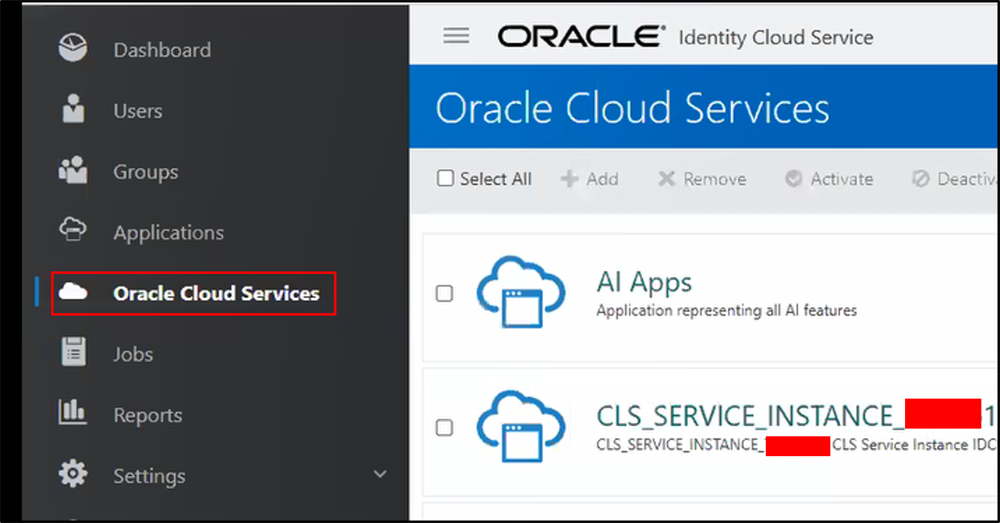

3. Within Oracle Cloud Services, click **Oracle Applications Cloud (Fusion)**.

    >**Note**: You may need to scroll down.

  

4. Within Oracle Applications Cloud (Fusion), click **Configuration**. Under **General Information**, copy the **Client ID**, paste it in the text file, and then save the text file. We will use this Client ID to create federation.

  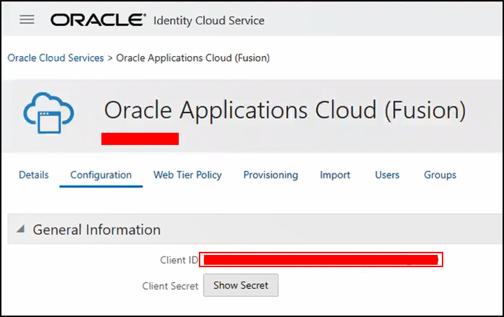

5. Click **Show Secret** and copy the **Client Secret**, paste it in the text file, and then save the text file. We will use this Client Secret to create federation. Then click **Close**.

  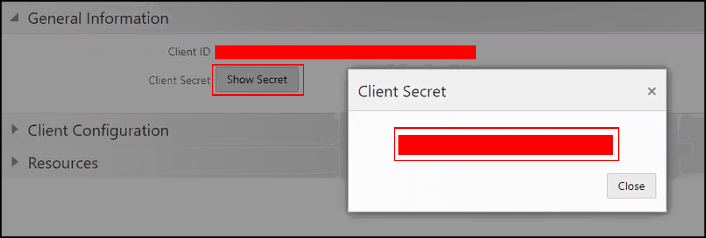

6. Within **Configuration**, expand **Client Configuration**.

  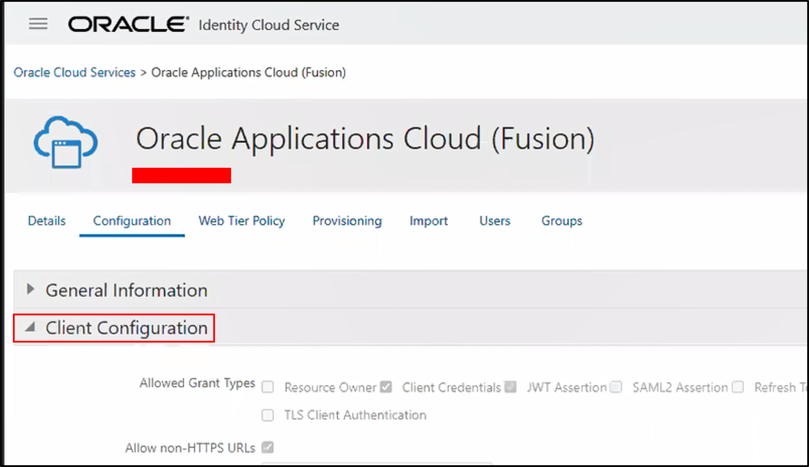

7. Within Client Configuration, scroll down and click **Add**.

  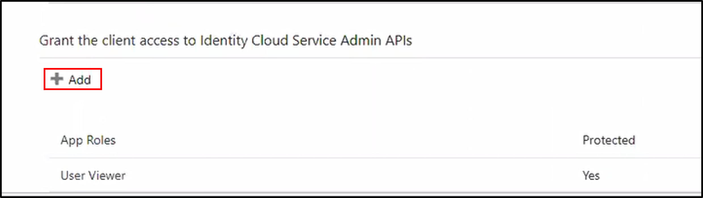

8. Within Add App Role, select **Application Administrator** checkbox.

  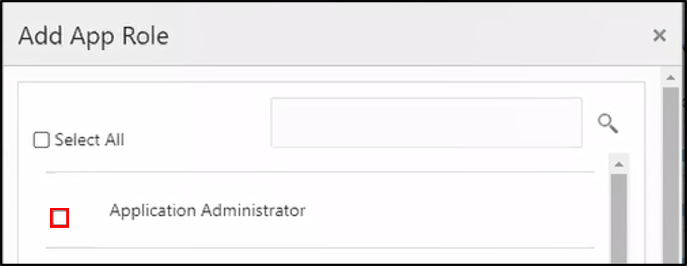

9. Scroll down and Select Identity Domain Administrator checkbox. Click **Add**.

  

10. Scroll up and click **Save**.

  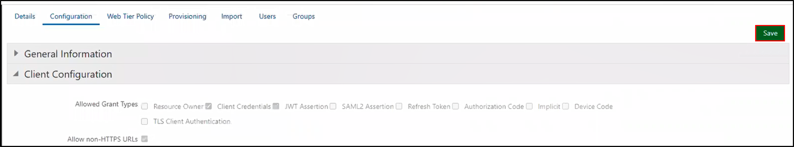

11. Click **OK** on the confirmation pop-up message.

  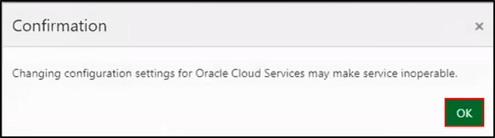

12. You should see a message **“Application Oracle Applications Cloud (Fusion) has been successfully updated”**.

  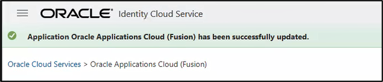

13. Within Oracle Applications Cloud (Fusion), click **Provisioning**. Under Provisioning, click **Enable Provisioning**.

  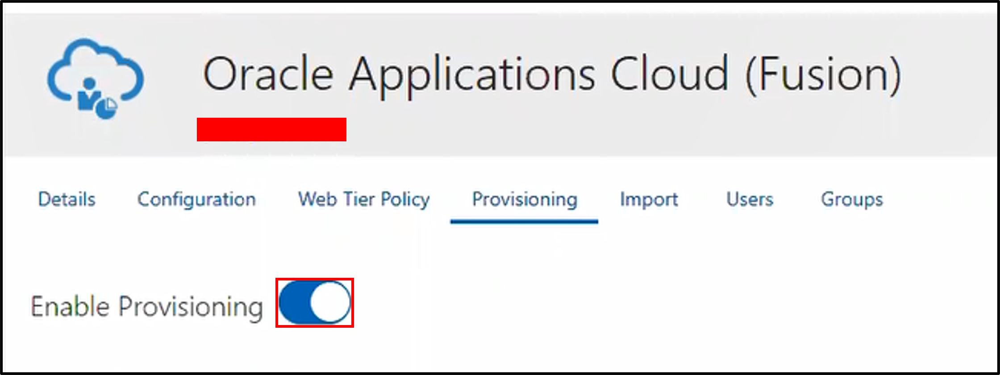

14. Within Provisioning and Select provisioning Operations, select **Authoritative Sync** checkbox.

  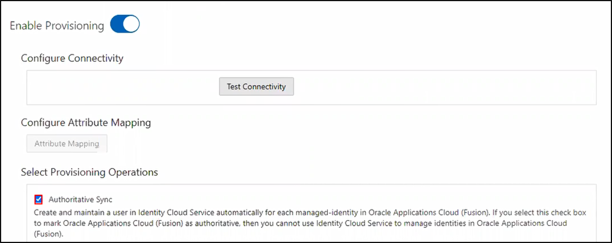

15. Scroll down and click **Enable Synchronization**.

  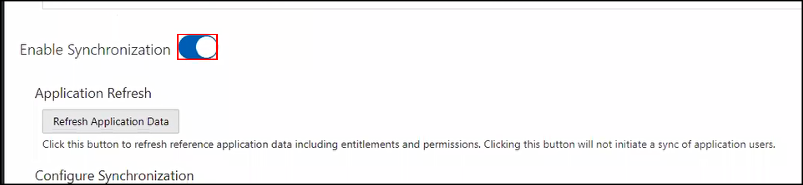

16. Scroll up to Configure Connectivity section and click **Test Connectivity**.

  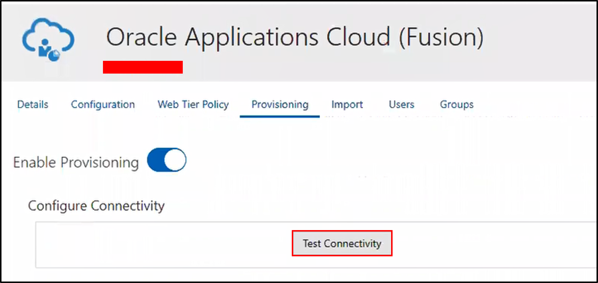

17. Click **OK** on the confirmation pop-up message.

  

18. Connection successful message is displayed.

  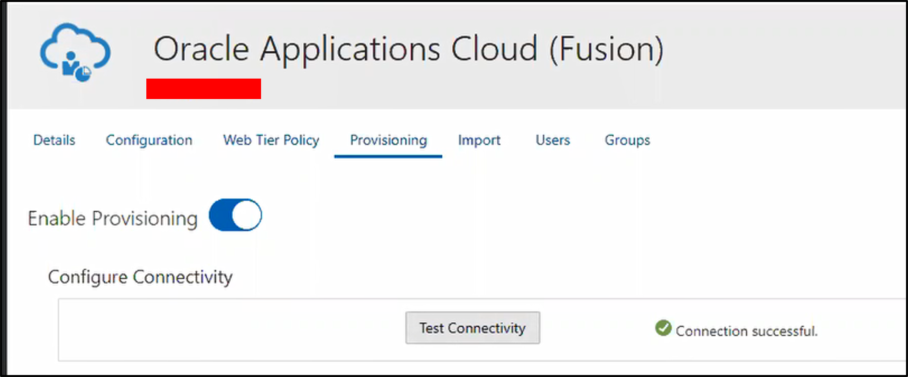

## Learn More

* [Set Up Synchronization of Oracle Fusion Cloud Applications with Oracle Identity Cloud Service](https://docs.oracle.com/en/cloud/saas/analytics/23r1/fawag/set-user-access-oracle-fusion-analytics-warehouse-using-single-sign.html#GUID-0F611F5A-F935-4C95-9CE2-B690F9029D70)

## Acknowledgements
* **Author** - Sandeep Bade, CEAL
* **Last Updated By/Date** - Sandeep Bade, April 2023
