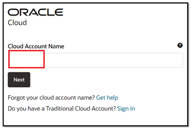
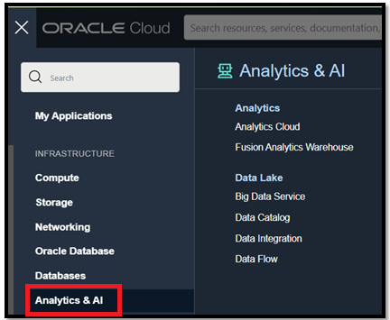
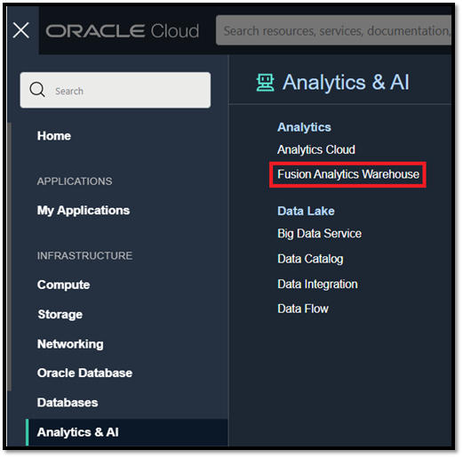
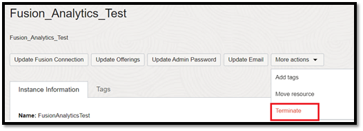
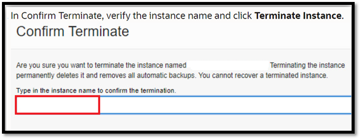
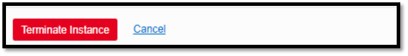

# How do I terminate a Fusion Analytics Warehouse (FAW) instance?
Duration: 1 minute

As part of Oracle Fusion Analytics administration activities, you can terminate instances that are active or have failed and you don't need them anymore. This feature provides the customers with capability to repurpose the instance based on the project implementation plan.

## Terminate a FAW Instance

>**Note:** You must have access to the OCI Console as an **OCI Service Administrator** to successfully complete this Sprint.

1. Sign in to your OCI cloud account.

  

2. Click the **Navigation menu** and select **Analytics & AI**.

  

3. Click on **Fusion Analytics Warehouse** under **Analytics**.

  

4. Click on the instance name under **Display Name**.

  

5. From the details page, click on the **More actions** drop down button and select **Terminate**.

  

6. In **Confirm Terminate** popup, type in the instance name.

  

7. Click **Terminate Instance**.

  

## Learn More

* [Bundle Your Application Artifacts](https://docs.oracle.com/en/cloud/saas/analytics/22r2/fawag/bundle-your-application-artifacts.html#GUID-596E4D3E-9E23-4A7C-ACF2-A57D8B4FB41C)

## Acknowledgements
* **Author** - Prasad Kolli, CEAL
* **Last Updated By/Date** - Nagwang Gyamtso,  March 2023
