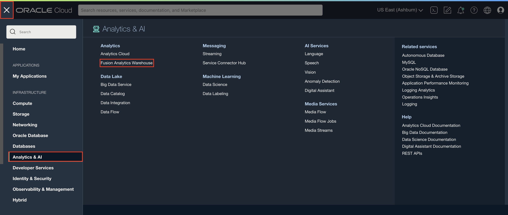
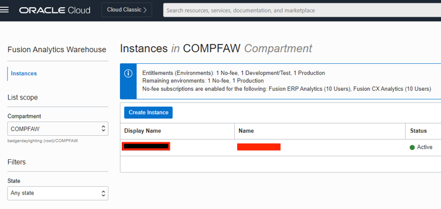
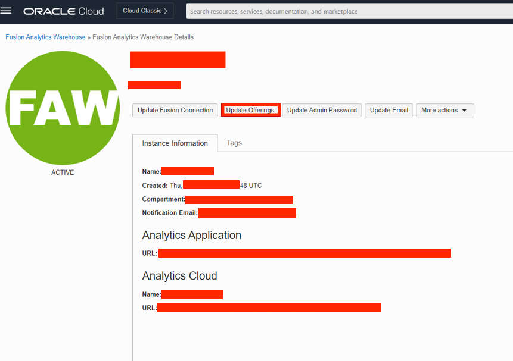
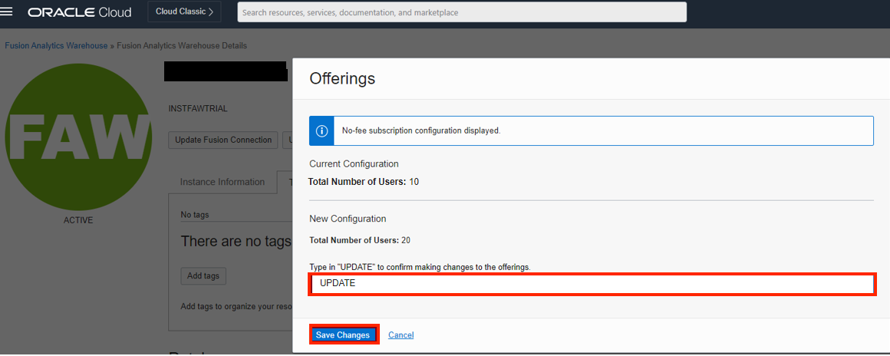
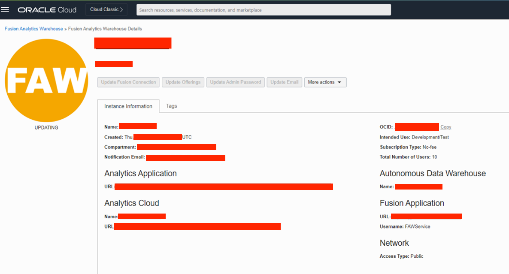
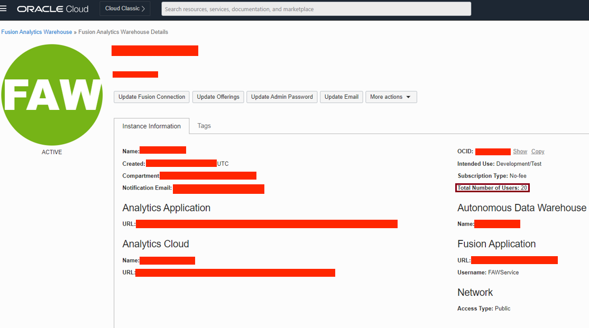

# How do I update the FAW offering in Fusion Analytics Warehouse (FAW)?

Duration: 2 minutes

There are several times when you might need to expand your FAW subscription whether that is to add more users or additional pillars. In such cases, offerings should be updated in Fusion Analytics Warehouse so that the expansion is reflected in your FAW environments.

## Update FAW offering
>**Note:** You must have **OCI Administrator** privileges to successfully complete this Sprint.

1. In your OCI console, click the hamburger menu. Then click **Analytics & AI** and select **Fusion Analytics Warehouse**.

  

2. Click the **Display Name** of the FAW instance you wish to update.

  

3. Click the **Update Offerings** tab.

  

4. Type in **Update** to confirm your update and select **Save Changes**.

  

5. The Orange FAW circle will signify that your status is updating.

  

6. The FAW status will turn green to signify that the update has completed. The total number of users has also been updated. Now you can activate the Data Pipeline in FAW for the new pillar.

  

## Learn More

* [Update the Offerings](https://docs.oracle.com/en-us/iaas/analytics-for-applications/doc/update-offerings.html)

## Acknowledgements
* **Author** - Navnit Mishra, Consulting Member Of Technical Staff, Analytics Customer Experience
* **Contributors** -  Abhishek Bajpai, Analytics Customer Experience
* **Last Updated By/Date** - Navnit Mishra,  September 2022
