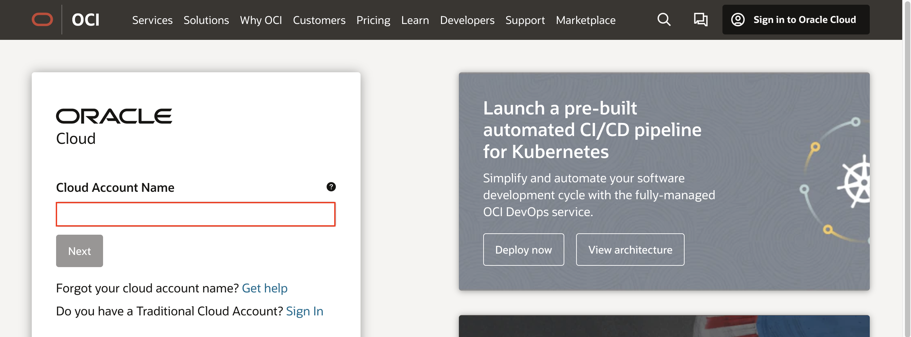
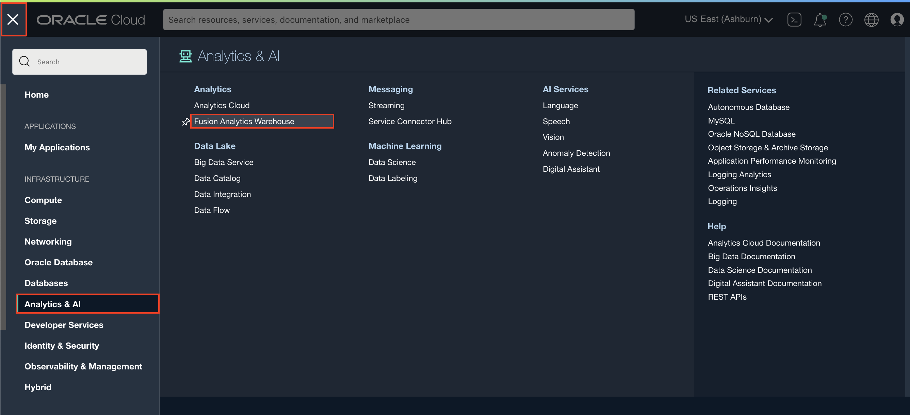
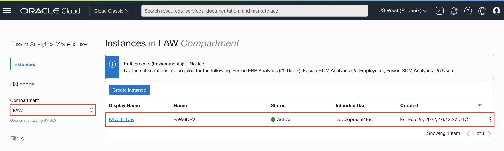
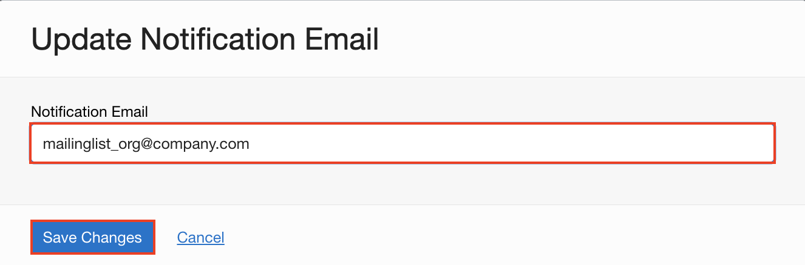

# How do I update the notification email for Fusion Analytics Warehouse (FAW)?
Duration: 1 minute

When you update your notification email for Fusion Analytics Warehouse, we recommend that you provide a mailing list instead of a single individual's email address. The reason for this is risk mitigation. If the one person who was listed to receive email notifications about system maintenance is on leave during the time emails are sent out, then you risk not being able to attend to critical system maintenance tasks.

## Update notification email

1. Sign in to your [Oracle Cloud Infrastructure Console](https://cloud.oracle.com/).

    

2. Within the Oracle Cloud Infrastructure console, click the **Navigation menu** and select **Analytics & AI**. Then under Analytics, select **Fusion Analytics Warehouse**.

    

3. Here, you will see a list of Fusion Analytics Warehouse instances you have provisioned. Select the FAW instance you want to update the Admin password for.

    >**Note:** You may need to navigate to the relevant compartment to find your FAW instances.

    

4. On the instance details page, click **Update Email**.

    

5. Enter the new email in the **Notification Email** section and click **Save Changes**.

    >**Note:** As a best practice, enter a mailing list email alias that includes multiple users if possible.

    

Congratulations, you have just learned how to update the notification email for FAW as well as a best practice to make sure email notifications are not missed by the team.

## Learn More

* [Update the Notification Email](https://docs.oracle.com/en/cloud/saas/analytics/22r2/fawag/update-notification-email.html)

## Acknowledgements

- Created By/Date - Nagwang Gyamtso, Product Manger, Product Strategy, July 2022

- Last Updated By - Nagwang Gyamtso, July 2022
