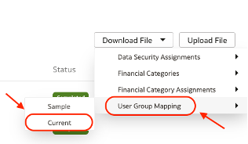

# How do I create a User Group Mapping report in Fusion Analytics Warehouse (FAW)?

Duration: 1 minute

There may be scenarios where you need to download the existing FAW User Group Mapping information to make modifications to your user group mappings. You can download the User Group Mapping, make changes such as adding or removing user group mappings and upload the new file to your environment.

## Move FAW to Another Compartment
>**Note:** You must have FAW Service Administrator and FAW Security Administrator privileges to successfully complete this Sprint.

1. Login to your Fusion Analytics instance as a service administrator.

2. From your homepage, click the **Navigation menu** and select **Console**.

  

3. Under **Application Administration**, select **Uploads**.

  

4. From the Uploads page, click **Download File**. Here you have the option to download Data Security Assignments, Financial Categories, Financial Category Assignments and User Group Mapping. Click **User Group Mapping** and select **Current**. This will download a .zip file which contains the User Group Mapping.

    >**Note:** You can update the .csv file and upload it to the same environment or you can upload it to your test or production environments.

  

## Learn More
* [Upload and Download User Group Mappings](https://docs.oracle.com/en/cloud/saas/analytics/22r1/fawag/manage-uploads-and-downloads.html#GUID-6B4A11EA-3168-423C-B126-934A179B14DF)

## Acknowledgements
* **Author** - Krishna Prasad Kotti, Principal Solutions Architect
* **Last Updated By/Date** - Krishna Prasad Kotti, October 2022
