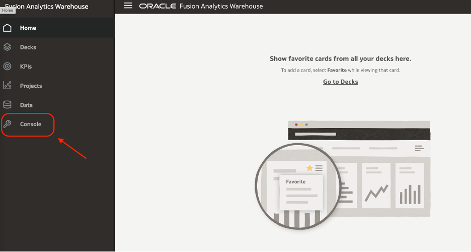
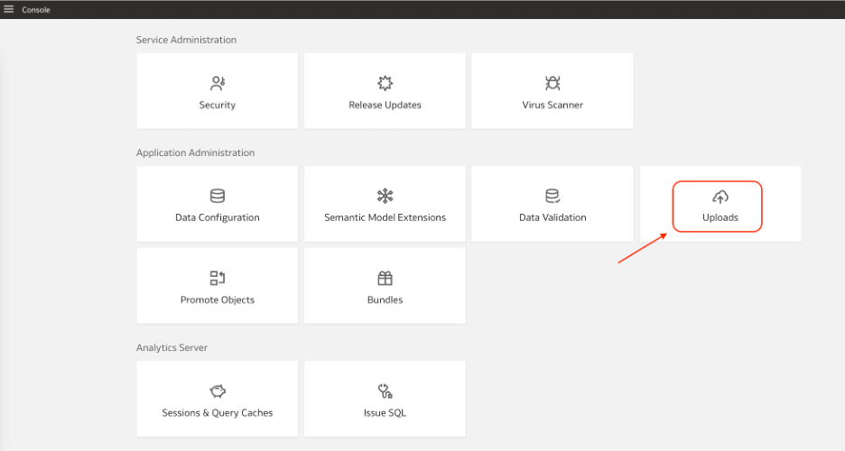

# How do I move a FAW instance across compartments in Fusion Analytics Warehouse (FAW)?

Duration: 1 minute

There may be scenarios where you need to download the existing FAW User Group Mapping information.

## Move FAW to Another Compartment
>**Note:** You must have FAW Service Administrator and FAW Security Administrator privileges to successfully complete this Sprint.

1. Login to your Fusion Analytics instance as a service administrator.

2. Click the Navigation menu and select Console.

  

3. Select **Uploads**.

  

4.

## Learn More
* [Move the Oracle Fusion Analytics Warehouse Instance to Another Compartment](https://docs.oracle.com/en/cloud/saas/analytics/22r3/fawag/move-oracle-fusion-analytics-warehouse-instance-another-compartment.html)

## Acknowledgements
* **Author** - Krishna Prasad Kotti, Principal Solutions Architect
* **Last Updated By/Date** - Krishna Prasad Kotti, September 2022
